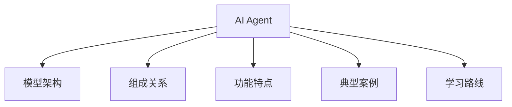
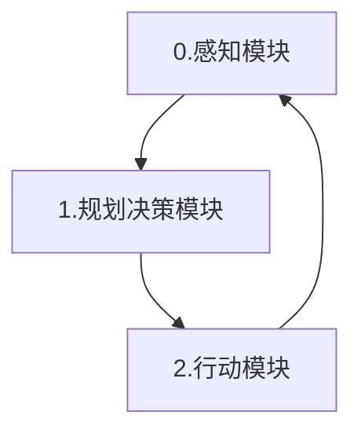
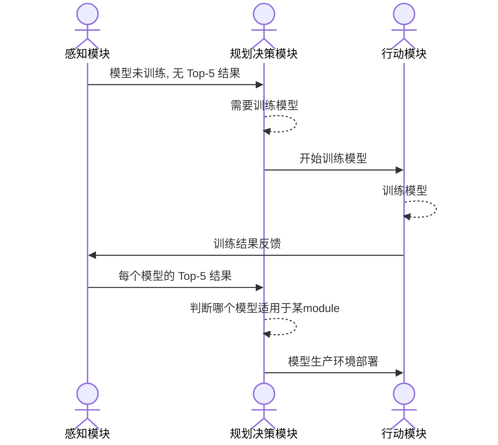
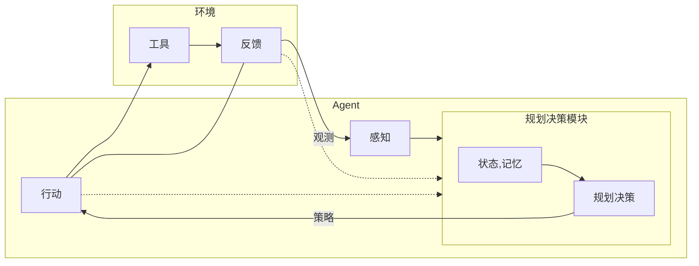
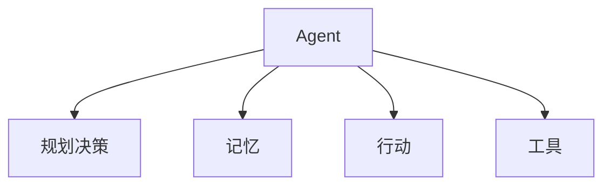
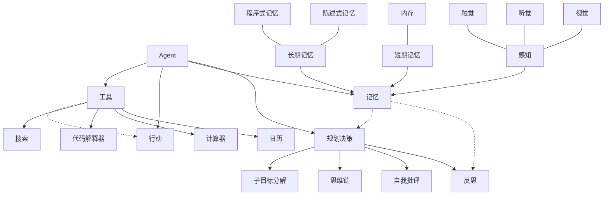

# 什么是 AI Agent

人工智能代理(Artificial Intelligence Agent), 也叫智能体, 是一种能够感知环境, 进行决策和执行动作的智能实体

人:

-   五官: 感知模块
-   大脑: 规划决策模块
-   肢体: 行动模块

人和动物的区别是会用工具

环境对人产生影响, 人做出感知决策响应, 使用工具得到结果

e.g.

ADC 里有多个模型, 但是每个模型都要在服务器上训练, 一开始每个模型都没训练过, 即**感知模块**并不知道哪个对应某 module 的 Top-5 高, 所以需要通过**规划决策模块**决定开始训练, 然后**行动模块**训练模型, 再把训练结果反馈给感知模块, 最后得到规划决策模块的分析结果

即

最关键的即大脑部分

而暂时忽略环境反馈和感知模块, 突出 LLM 的作用, 并增加记忆模块的作用

进一步强调细节, 比如记忆模块分成:

-   短期记忆
    -   短期记忆(上下文学习), 覆盖 20-30s 内的记忆
-   长期记忆
    -   长期记忆可以是几天到几十年, 由外部向量保存

这类似人类记忆分类, 感知也可以看作是一种记忆,

-   感知
    -   视觉
    -   听觉
    -   触觉
-   短期记忆
    -   就像内存, 受 transformer 上下文窗口长度的限制
-   长期记忆如硬盘
    -   外显式的陈述记忆(比如事实, 事件)
    -   内隐式的程序式记忆(比如通过学习得到的技能)

规划决策再细分

-   规划决策
    -   反思(避免重复性错误)
    -   自我批评(提高质量)
    -   思维链
    -   子目标分解(处理更复杂的任务)

工具模块, 强调 API 调用, 如日历, 计算器, 代码解释器, 搜索, etc.

通过多模态信息(文本, 图像, 音频, etc.) 提供 LLM 短期记忆, 结合自身模型中的长期记忆, 进行任务拆解, 并对错误进行反思和纠正, 最终做出了规划, 然后调用工具 API 实现行动

Agent = LLM + 记忆 + 规划决策 + 工具

# AI Agent 能做什么

比如

HuggingFace 上有很多模型, 但不知道该选什么, 怎么用

HuggingGPT 模型根据用户描述, 选择模型

1. 任务规划(Task Planning): 将用户的请求分解为多个任务, 字段报错任务类型, 模型 ID, 依赖项, 参数
2. 模型选择(Model Selection): AI Agent 根据模型 ID, 从模型列表中选择, 请求调用 API, 选择成对的模型进行训练
3. 任务执行(Task Execution): 执行特定模型(一对模型), 并记录结果(Top-5, 预测结果)
4. 响应生成(Response Generation): LLM 接收执行结果, 生成汇总

其实就是 HuggingGPT -> LLM as Controller -> HuggingFace

LLM 就是任务, 分解, 调度, 类似协同工作机制, 具有强迁移性(泛用能力)
