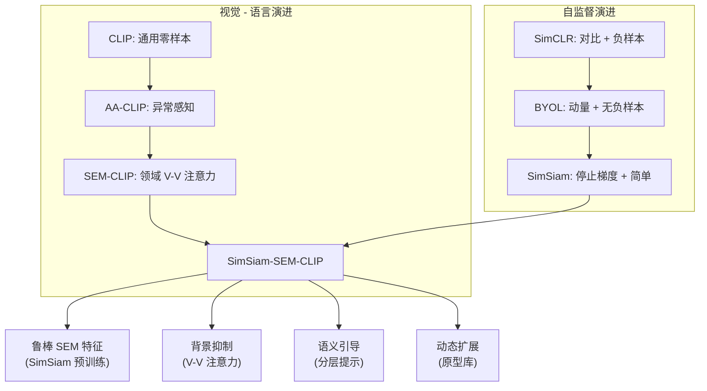

# vision transformer

@see: https://arxiv.org/abs/2010.11929

[v1] Thu, 22 Oct 2020 17:55:59 UTC (3,194 KB)

## Paper

An Image is Worth 16x16 Words: Transformers for Image Recognition at Scale

一张图像胜过 16x16 个词：基于 Transformer 的大规模图像识别

While the Transformer architecture has become the de-facto standard for natural language processing tasks, its applications to computer vision remain limited. In vision, attention is either applied in conjunction with convolutional networks, or used to replace certain components of a convolutional network while keeping its overall structure intact. We show that this reliance on CNNs is not necessary and a pure transformer applied directly to sequences of image patches can perform very well on image classification tasks. When pre-trained on large amounts of data and transferred to multiple mid-sized or small image recognition benchmarks (ImageNet, CIFAR-100, VTAB, etc.), Vision Transformer (ViT) attains excellent results compared to state-of-the-art convolutional networks while requiring fewer computational resources to train.

虽然 Transformer 架构已成为自然语言处理任务的事实标准，但其在计算机视觉中的应用仍然有限。在视觉领域，注意力机制要么与卷积网络结合使用，要么用于替换卷积网络的某些组件，同时保持其整体结构完整。我们表明，这种对 CNN 的依赖并非必要，直接应用于图像块序列的纯 Transformer 可以在图像分类任务上表现非常出色。当在大量数据上进行预训练并迁移到多个中型或小型图像识别基准（ImageNet、CIFAR-100、VTAB 等）时，Vision Transformer (ViT) 与最先进的卷积网络相比取得了优异的结果，同时需要更少的计算资源进行训练。

Our Vision Transformer (ViT) simply splits an image into fixed-size patches, linearly embeds each of them, adds position embeddings, and feeds the resulting sequence of vectors to a standard Transformer encoder. To perform classification, we use the standard approach of adding an extra learnable "classification token" to the sequence.

我们的 Vision Transformer (ViT) 只是将图像分割成固定大小的块，对每个块进行线性嵌入，添加位置嵌入，然后将生成的向量序列输入到标准的 Transformer 编码器中。为了执行分类，我们使用向序列中添加一个额外的可学习“分类令牌”的标准方法。

The contribution of this paper is to show that such a pure Transformer, without any convolutional layers, can achieve excellent results on image classification. Specifically, we make the following contributions:

-   We show that ViT achieves excellent results when pre-trained on sufficient data (e.g., JFT-300M) and transferred to image classification benchmarks.
-   We provide extensive ablation studies on architectural variations (number of layers, heads, embedding dimension, etc.) and training strategies (pre-training dataset size, resolution, etc.).
-   We demonstrate that ViT outperforms ResNets of comparable size and compute cost on most benchmarks, especially when the pre-training dataset is large.
-   We release our code and pre-trained models to facilitate future research.

本文的贡献在于表明，这种不含任何卷积层的纯 Transformer 可以在图像分类上取得优异结果。具体而言，我们做出以下贡献：

-   我们表明，当在充足的数据（例如 JFT-300M）上进行预训练并迁移到图像分类基准时，ViT 能取得优异结果。
-   我们对架构变体（层数、头数、嵌入维度等）和训练策略（预训练数据集大小、分辨率等）进行了广泛的消融研究。
-   我们证明，在大多数基准测试中，ViT 的表现优于具有相当规模和计算成本的 ResNet，特别是在预训练数据集较大时。
-   我们发布了代码和预训练模型，以促进未来的研究。

Related Work. Self-attention has been successfully applied to various computer vision tasks, including image generation, semantic segmentation, and video classification. However, these models typically combine self-attention with convolutional layers. For example, standalone self-attention layers have been used to replace spatial convolutions in residual networks, or combined with convolutions in a parallel branch. In contrast, our model is a pure transformer that does not use any convolutional layers.

相关工作。自注意力机制已成功应用于各种计算机视觉任务，包括图像生成、语义分割和视频分类。然而，这些模型通常将自注意力与卷积层结合使用。例如，独立的自注意力层已被用于替换残差网络中的空间卷积，或与卷积并行分支结合使用。相比之下，我们的模型是不使用任何卷积层的纯 Transformer。

Another line of work applies transformers to visual recognition by treating images as sequences of patches. However, these approaches often use complex architectures or require specialized pre-training objectives. Our approach is simpler: we apply the standard Transformer encoder directly to image patches with minimal modifications.

另一系列工作通过将图像视为块序列来将 Transformer 应用于视觉识别。然而，这些方法通常使用复杂的架构或需要专门的预训练目标。我们的方法更简单：我们将标准的 Transformer 编码器直接应用于图像块，只需极少的修改。

Method. Our Vision Transformer (ViT) is based on the standard Transformer encoder. The input image $x$ is reshaped into a sequence of flattened 2D patches $x_p \in \mathbb{R}^{N \times (P^2 \cdot C)}$, where $(P, P)$ is the resolution of each image patch, $C$ is the number of channels, and $N = HW/P^2$ is the resulting number of patches (which also serves as the effective input sequence length for the Transformer). The patches are mapped to a latent vector space of dimension $D$ via a trainable linear projection $E \in \mathbb{R}^{(P^2 \cdot C) \times D}$, which we refer to as the "patch embedding".

方法。我们的 Vision Transformer (ViT) 基于标准的 Transformer 编码器。输入图像 $x$ 被重塑为扁平化 2D 块的序列 $x_p \in \mathbb{R}^{N \times (P^2 \cdot C)}$，其中 $(P, P)$ 是每个图像块的分辨率，$C$ 是通道数，$N = HW/P^2$ 是生成的块数量（这也作为 Transformer 的有效输入序列长度）。这些块通过可训练的线性投影 $E \in \mathbb{R}^{(P^2 \cdot C) \times D}$ 映射到维度为 $D$ 的潜在向量空间，我们称之为“块嵌入”。

To retain positional information, we add learnable position embeddings $E_{pos} \in \mathbb{R}^{(N+1) \times D}$ to the patch embeddings. We also prepend a learnable classification token $x_{class}$ to the sequence, whose state at the output of the Transformer encoder serves as the image representation $y$. The resulting sequence of embedding vectors $z_0$ is then fed to the Transformer encoder.

为了保留位置信息，我们将可学习的位置嵌入 $E_{pos} \in \mathbb{R}^{(N+1) \times D}$ 添加到块嵌入中。我们还将一个可学习的分类令牌 $x_{class}$ 添加到序列的前面，其在 Transformer 编码器输出处的状态作为图像表示 $y$。生成的嵌入向量序列 $z_0$ 随后被输入到 Transformer 编码器中。

The Transformer encoder consists of alternating layers of Multi-Head Self-Attention (MSA) and Multi-Layer Perceptron (MLP) blocks. Layer normalization (LN) is applied before every block, and residual connections after every block. The MLP contains two layers with a Gaussian Error Linear Unit (GELU) activation.

Transformer 编码器由交替的多头自注意力 (MSA) 和多層感知機 (MLP) 块层组成。层归一化 (LN) 应用于每个块之前，残差连接应用于每个块之后。MLP 包含两层，具有高斯误差线性单元 (GELU) 激活函数。

Experiments. We evaluate ViT on several image classification benchmarks. On ImageNet, ViT achieves 88.55% top-1 accuracy when pre-trained on JFT-300M, outperforming ResNet-152 (87.5%) and EfficientNet-L2 (87.4%). On CIFAR-100, ViT achieves 94.6% accuracy, significantly outperforming ResNets. On VTAB, a benchmark of 19 diverse tasks, ViT achieves state-of-the-art results on most tasks.

实验。我们在几个图像分类基准上评估 ViT。在 ImageNet 上，当在 JFT-300M 上预训练时，ViT 达到了 88.55% 的 Top-1 准确率，优于 ResNet-152 (87.5%) 和 EfficientNet-L2 (87.4%)。在 CIFAR-100 上，ViT 达到了 94.6% 的准确率，显著优于 ResNet。在 VTAB（包含 19 个多样化任务的基准）上，ViT 在大多数任务上取得了最先进的结果。

We also study the impact of pre-training dataset size. We find that ViT requires large-scale pre-training to outperform CNNs. When trained from scratch on ImageNet, ViT underperforms ResNets. However, when pre-trained on larger datasets (e.g., JFT-300M), ViT consistently outperforms ResNets of comparable size. This suggests that Transformers are less inductive biased than CNNs and thus require more data to learn effective representations.

我们还研究了预训练数据集大小的影响。我们发现 ViT 需要大规模预训练才能超越 CNN。当在 ImageNet 上从头开始训练时，ViT 的表现不如 ResNet。然而，当在更大的数据集（例如 JFT-300M）上预训练时，ViT 始终优于相当规模的 ResNet。这表明 Transformer 的归纳偏置比 CNN 少，因此需要更多数据来学习有效的表示。

Ablation Studies. We conduct extensive ablation studies on the architecture of ViT. We vary the number of layers $L$, the hidden size $D$, the number of attention heads $H$, and the patch size $P$. We find that increasing the model size generally improves performance, provided that sufficient pre-training data is available. We also find that smaller patch sizes (e.g., 16x16) generally perform better than larger patch sizes (e.g., 32x32), at the cost of increased computational complexity.

消融研究。我们对 ViT 的架构进行了广泛的消融研究。我们改变了层数 $L$、隐藏层维度 $D$、注意力头数 $H$ 和块大小 $P$。我们发现，只要有足够的预训练数据，增加模型规模通常会提高性能。我们还发现，较小的块大小（例如 16x16）通常比较大的块大小（例如 32x32）表现更好，但代价是计算复杂度增加。

Conclusion. We have presented the Vision Transformer (ViT), a pure transformer architecture for image classification. By applying a standard Transformer directly to sequences of image patches, ViT achieves excellent results on multiple benchmarks when pre-trained on sufficient data. Our results suggest that the reliance on convolutional networks in computer vision may not be necessary, and that pure transformers can be highly effective for visual recognition tasks.

结论。我们提出了 Vision Transformer (ViT)，一种用于图像分类的纯 Transformer 架构。通过将标准 Transformer 直接应用于图像块序列，当在充足的数据上预训练时，ViT 在多个基准测试上取得了优异的结果。我们的结果表明，计算机视觉中对卷积网络的依赖可能是不必要的，纯 Transformer 对于视觉识别任务可以非常有效。

## Note

ViT 的核心贡献在于**打破了 CNN 在计算机视觉领域的垄断**，证明了纯 Transformer 架构在图像识别任务上的有效性，前提是拥有足够大规模的预训练数据。

1.  **图像序列化**：将图像视为“序列的补丁（Patches）”。把一张 $H \times W$ 的图像切分成 $N$ 个固定大小（如 $16 \times 16$）的小块，拉平后作为 Token 序列输入。
2.  **直接应用标准 Transformer**：不做任何针对视觉的特殊修改（如卷积注意力），直接使用 NLP 中标准的 Encoder 架构（MSA + MLP + LayerNorm + Residual）。
3.  **位置嵌入与分类头**：引入可学习的位置编码（Position Embeddings）保留空间信息，并添加一个特殊的 `[CLS]` token 用于聚合全局特征进行分类。

## Note

先分割图像, 每个小图都是一个 token, 然后进 linear projection of flattened patches, 然后再通过 position embedding 获得每个小图的位置信息+features, 就实现了 patch+position embedding 的操作, 这里虽然每个分割的图像都有 feature, 但是最终采用的是序号 0 的 class embedding 来获得特征

进入 transformer encoder(norm->multi-head attention->norm->MLP 传统方法的 LN)然后在经过 MLP Head 得到 class

CNN 的特点是 layer 越多, 感受野越大, 但是 vit 是从一开始就拥有了位置信息, 这也解决了 inductive biases, 也就是 vit 拥有更好的泛化能力

1D embedding 效果最好, 比如 25x25 的 patch, 那么就是从左到右, 从上到下进行排序

# CLIP

26 Feb 2021

@see: https://github.com/OpenAI/CLIP

@see: https://arxiv.org/abs/2103.00020

## Paper

State-of-the-art computer vision systems are trained to predict a fixed set of predetermined categories. This limits their flexibility and hinders their ability to generalize to new tasks. In contrast, humans can recognize a virtually unlimited number of visual concepts simply by reading about them. We hypothesize that re-purposing natural language supervision signals can enable the training of flexible, generalizable visual models. To test this hypothesis, we train a model called CLIP (Contrastive Language-Image Pre-training) on 400 million image-text pairs collected from the internet. CLIP learns to predict which text goes with which image. When evaluated on over 30 different computer vision datasets, CLIP performs competitively with fully supervised ResNet-50 baselines without using any dataset-specific training data. For example, CLIP matches the performance of the original ResNet-50 on ImageNet zero-shot, completely removing the need for the 1.28 million labeled examples used in standard supervised training.

最先进的计算机视觉系统被训练来预测一组固定的预定义类别。这限制了它们的灵活性，阻碍了其泛化到新任务的能力。相比之下，人类仅仅通过阅读就能识别几乎无限数量的视觉概念。我们假设，重新利用自然语言监督信号可以训练出灵活、可泛化的视觉模型。为了验证这一假设，我们训练了一个名为 CLIP (对比语言 - 图像预训练) 的模型，使用了从互联网收集的 4 亿个图像 - 文本对。CLIP 学习预测哪段文本与哪张图像相匹配。当在超过 30 个不同的计算机视觉数据集上进行评估时，CLIP 的表现与完全监督的 ResNet-50 基线具有竞争力，而无需使用任何特定于数据集的训练数据。例如，CLIP 在 ImageNet 上的零样本（zero-shot）性能与原始 ResNet-50 相当，完全消除了标准监督训练中使用的 128 万个标注样本的需求。

Computer vision has made tremendous progress by training deep neural networks on large labeled datasets like ImageNet. However, these models are brittle: they often fail to generalize to new distributions or tasks without extensive fine-tuning. Furthermore, collecting large-scale labeled data is expensive and time-consuming.
In this work, we explore an alternative approach: learning visual representations directly from natural language supervision found on the internet. The web contains billions of images accompanied by alt-text, captions, or surrounding text, providing a rich source of weak supervision. By training a model to align images and text in a shared embedding space, we aim to learn visual concepts that are grounded in language.

计算机视觉通过在 ImageNet 等大型标注数据集上训练深度神经网络取得了巨大进步。然而，这些模型很脆弱：如果没有大量的微调，它们往往无法泛化到新的分布或任务。此外，收集大规模标注数据既昂贵又耗时。
在这项工作中，我们探索了一种替代方法：直接从互联网上的自然语言监督中学习视觉表示。网络包含数十亿张带有替代文本、标题或周围文本的图像，提供了丰富的弱监督来源。通过训练模型将图像和文本对齐到一个共享的嵌入空间中，我们的目标是学习植根于语言的视觉概念。

Our approach, CLIP, is efficient and scalable. We demonstrate that a single pre-trained CLIP model can be used for a wide variety of downstream tasks simply by specifying the task in natural language. For instance, to perform image classification on a new dataset, one only needs to provide the class names as text prompts (e.g., "a photo of a cat", "a photo of a dog"). The model then predicts the class by finding the text embedding most similar to the image embedding. This "zero-shot" capability eliminates the need for task-specific training data.

我们的方法 CLIP 高效且可扩展。我们证明，单个预训练的 CLIP 模型可以用于各种下游任务，只需通过自然语言指定任务即可。例如，要在新数据集上执行图像分类，只需提供类别名称作为文本提示（例如，“一张猫的照片”，“一张狗的照片”）。然后，模型通过找到与图像嵌入最相似的文本嵌入来预测类别。这种“零样本”能力消除了对特定任务训练数据的需求。

CLIP consists of two encoders: an image encoder $I(\cdot)$ and a text encoder $T(\cdot)$. The image encoder can be a ResNet or a Vision Transformer (ViT). The text encoder is a Transformer similar to those used in NLP. Both encoders project their inputs into a shared $d$-dimensional embedding space.
Given a batch of $N$ (image, text) pairs $\{(x_i, t_i)\}_{i=1}^N$, we compute the image embeddings $v_i = I(x_i)$ and text embeddings $u_i = T(t_i)$. We then normalize these embeddings to have unit length: $\hat{v}_i = v_i / \|v_i\|$ and $\hat{u}_i = u_i / \|u_i\|$.

CLIP 由两个编码器组成：图像编码器 $I(\cdot)$ 和文本编码器 $T(\cdot)$。图像编码器可以是 ResNet 或 Vision Transformer (ViT)。文本编码器是一个类似于 NLP 中使用的 Transformer。两个编码器都将输入投影到一个共享的 $d$ 维嵌入空间中。
给定一批 $N$ 个（图像，文本）对 $\{(x_i, t_i)\}_{i=1}^N$，我们计算图像嵌入 $v_i = I(x_i)$ 和文本嵌入 $u_i = T(t_i)$。然后我们将这些嵌入归一化为单位长度：$\hat{v}_i = v_i / \|v_i\|$ 和 $\hat{u}_i = u_i / \|u_i\|$。

The core training objective is a symmetric cross-entropy loss over the cosine similarities between image and text embeddings. We compute an $N \times N$ similarity matrix $S$, where $S_{ij} = \hat{v}_i^\top \hat{u}_j$.
We assume that the correct pairing is diagonal (i.e., image $i$ corresponds to text $i$). The loss for the image-to-text direction is:
$$ \mathcal{L}_{i2t} = -\frac{1}{N} \sum_{i=1}^N \log \frac{\exp(S*{ii} / \tau)}{\sum*{j=1}^N \exp(S*{ij} / \tau)} $$
Similarly, the text-to-image loss $\mathcal{L}*{t2i}$ is computed. The total loss is the average of both: $\mathcal{L} = \frac{1}{2} (\mathcal{L}_{i2t} + \mathcal{L}_{t2i})$. Here, $\tau$ is a learnable temperature parameter.

核心训练目标是基于图像和文本嵌入之间余弦相似度的对称交叉熵损失。我们计算一个 $N \times N$ 的相似度矩阵 $S$，其中 $S_{ij} = \hat{v}_i^\top \hat{u}_j$。
我们假设正确的配对是对角线的（即图像 $i$ 对应文本 $i$）。图像到文本方向的损失为：
$$ \mathcal{L}_{i2t} = -\frac{1}{N} \sum_{i=1}^N \log \frac{\exp(S*{ii} / \tau)}{\sum*{j=1}^N \exp(S*{ij} / \tau)} $$
类似地，计算文本到图像的损失 $\mathcal{L}*{t2i}$。总损失是两者的平均值：$\mathcal{L} = \frac{1}{2} (\mathcal{L}_{i2t} + \mathcal{L}_{t2i})$。这里，$\tau$ 是一个可学习的温度参数。

We evaluate CLIP on 30 diverse datasets, including ImageNet, CIFAR-10, SUN397, and others. For each dataset, we construct text prompts for each class (e.g., "a photo of a [class]").
On ImageNet, CLIP (ViT-B/32) achieves 63.8% top-1 accuracy in a zero-shot setting, matching the performance of a supervised ResNet-50 (which required 1.28M labeled images). With a larger ViT-L/14 backbone, CLIP reaches 75.5%, surpassing the supervised ResNet-101 baseline.
Crucially, CLIP is more robust to distribution shifts. On ImageNet-A (adversarial examples), CLIP outperforms supervised models by a significant margin, suggesting it learns more robust visual features.

我们在 30 个不同的数据集上评估 CLIP，包括 ImageNet、CIFAR-10、SUN397 等。对于每个数据集，我们为每个类别构建文本提示（例如，“一张 [类别] 的照片”）。
在 ImageNet 上，CLIP (ViT-B/32) 在零样本设置下达到了 63.8% 的 Top-1 准确率，与监督训练的 ResNet-50（需要 128 万张标注图像）相当。使用更大的 ViT-L/14 骨干网络，CLIP 达到 75.5%，超过了监督训练的 ResNet-101 基线。
至关重要的是，CLIP 对分布偏移更具鲁棒性。在 ImageNet-A（对抗样本）上，CLIP 显著优于监督模型，表明它学到了更鲁棒的视觉特征。

Despite its strong performance, CLIP has limitations. It struggles with fine-grained classification (e.g., distinguishing between specific dog breeds) and counting objects. It also inherits biases from the web data, such as societal stereotypes. Furthermore, CLIP is not inherently designed for dense prediction tasks like object detection or segmentation, though it can be adapted with additional heads.

尽管表现强劲，CLIP 仍有局限性。它在细粒度分类（例如，区分特定品种的狗）和计数物体方面表现挣扎。它还继承了网络数据中的偏见，如社会刻板印象。此外，CLIP 本身并非为密集预测任务（如目标检测或分割）而设计，尽管可以通过添加额外的头来适应。

We have presented CLIP, a method for learning transferable visual models from natural language supervision. By training on a massive dataset of image-text pairs, CLIP learns to align visual and semantic concepts, enabling zero-shot transfer to a wide range of tasks. This approach offers a promising path towards more flexible and generalizable computer vision systems, reducing the reliance on expensive labeled datasets.

我们提出了 CLIP，一种从自然语言监督中学习可迁移视觉模型的方法。通过在海量图像 - 文本对上训练，CLIP 学习对齐视觉和语义概念，从而实现向广泛任务的零样本迁移。这种方法为更灵活、更可泛化的计算机系统提供了一条有前景的道路，减少了对昂贵标注数据集的依赖。

## Note

CLIP 的核心贡献在于证明了**零样本迁移能力**。它通过海量图文对的弱监督学习，让模型学会了通用的视觉概念，而不需要针对每个任务重新标注数据。这对半导体缺陷检测（标签稀缺）有巨大启示：我们可以用文本描述缺陷（如“a SEM image of a bridge defect”），而无需大量标注图片。

其训练本质是 **InfoNCE Loss**，即“拉近”匹配的图文对，“推远”不匹配的对。但这需要大量的负样本（batch size 通常很大），这也解释了为什么后来 BYOL/SimSiam 要尝试去掉负样本——因为显存不够，且负样本构造复杂。

CLIP 的局限性直接指向了后续模型的改进方向：

1. **细粒度问题** -> 需要 V-V Attention 来聚焦微小缺陷（SEM-CLIP 的动机）。
2. **密集预测问题** -> 需要分割头（Segmentation Head）。
3. **领域偏差** -> 需要 SimSiam 在 SEM 数据上预训练来纠正。
4. **对比学习需要负样本** -> 演进到 SimSiam（无负样本）。

---

# Tip-Adapter

@see: https://arxiv.org/abs/2111.03930

[v1] Sat, 6 Nov 2021 18:09:22 UTC (5,104 KB)
[v2] Mon, 15 Nov 2021 04:58:28 UTC (5,104 KB)

## Paper

## Paper

Few-shot learning aims to recognize novel classes with only a few labeled examples. While pre-trained vision-language models like CLIP have shown strong zero-shot capabilities, their performance drops significantly in few-shot settings. Existing methods typically fine-tune the model or learn additional prompts, which requires training time and computational resources.

少样本学习旨在仅用少量标注样本来识别新类别。虽然像 CLIP 这样的预训练视觉 - 语言模型展现了强大的零样本能力，但它们在少样本设置下的性能显著下降。现有方法通常微调模型或学习额外的提示，这需要训练时间和计算资源。

In this paper, we propose Tip-Adapter, a training-free adaptation method for CLIP that achieves competitive few-shot performance without any gradient updates. Our key insight is that the pre-trained CLIP model already contains rich visual and semantic knowledge. Instead of modifying the model weights, we can leverage the few-shot support samples to build a lightweight cache model that adapts the visual features to the target task.

在本文中，我们提出了 Tip-Adapter，一种针对 CLIP 的无需训练 (training-free) 适配方法，它在无需任何梯度更新的情况下实现了有竞争力的少样本性能。我们的关键洞察是，预训练的 CLIP 模型已经包含了丰富的视觉和语义知识。我们不修改模型权重，而是利用少样本支持样本构建一个轻量级的缓存模型 (cache model)，将视觉特征适配到目标任务。

The Tip-Adapter consists of two components: a frozen CLIP encoder and a lightweight cache model. Given a few-shot support set, we extract visual features from the support images using the frozen CLIP image encoder. These features are stored as keys in the cache model, while the corresponding one-hot labels are stored as values.

Tip-Adapter 由两个组件组成：一个冻结的 CLIP 编码器和一个轻量级缓存模型。给定一个少样本支持集，我们使用冻结的 CLIP 图像编码器从支持图像中提取视觉特征。这些特征作为键 (keys) 存储在缓存模型中，而对应的独热标签 (one-hot labels) 作为值 (values) 存储。

For a query image, we first obtain its visual feature using the frozen CLIP encoder. Then, we compute the affinity between the query feature and the cached keys using a simple dot-product operation. This affinity score is used to retrieve the corresponding values (labels) from the cache. The final prediction is a combination of the zero-shot CLIP prediction and the cache-based retrieval result.

对于查询图像，我们首先使用冻结的 CLIP 编码器获取其视觉特征。然后，我们通过简单的点积运算计算查询特征与缓存键之间的亲和力 (affinity)。该亲和力分数用于从缓存中检索对应的值（标签）。最终预测是零样本 CLIP 预测和基于缓存的检索结果的组合。

Specifically, let $F_{train}$ be the cached features (keys) and $L_{train}$ be the cached labels (values). For a query feature $f$, the cache output is computed as:
$$ \text{Output}_{cache} = \text{softmax}(f \cdot F_{train}^T / \tau) \cdot L*{train} $$
where $\tau$ is a temperature parameter. The final logit is:
$$ \text{Logit}*{final} = \text{Logit}_{zeroshot} + \alpha \cdot \text{Output}_{cache} $$
where $\alpha$ is a scaling factor that balances the zero-shot and few-shot contributions.

具体而言，设 $F_{train}$ 为缓存特征（键），$L_{train}$ 为缓存标签（值）。对于查询特征 $f$，缓存输出计算为：
$$ \text{Output}_{cache} = \text{softmax}(f \cdot F_{train}^T / \tau) \cdot L*{train} $$
其中 $\tau$ 是温度参数。最终 logits 为：
$$ \text{Logit}*{final} = \text{Logit}_{zeroshot} + \alpha \cdot \text{Output}_{cache} $$
其中 $\alpha$ 是平衡零样本和少样本贡献的缩放因子。

We evaluate Tip-Adapter on several benchmark datasets including ImageNet, Caltech101, and OxfordPets. In 16-shot settings, Tip-Adapter achieves an average accuracy of 68.5% on ImageNet, outperforming zero-shot CLIP (62.3%) by a large margin. Notably, Tip-Adapter matches or exceeds the performance of training-based methods like CoOp and CLIP-Adapter, but requires zero training time and zero gradient updates.

我们在包括 ImageNet、Caltech101 和 OxfordPets 在内的多个基准数据集上评估了 Tip-Adapter。在 16 样本设置下，Tip-Adapter 在 ImageNet 上达到了 68.5% 的平均准确率，大幅超越了零样本 CLIP (62.3%)。值得注意的是，Tip-Adapter 匹配甚至超过了 CoOp 和 CLIP-Adapter 等基于训练的方法的性能，但需要零训练时间和零梯度更新。

Ablation studies show that:

-   Cache size matters: Performance improves with more support samples, saturating around 16-32 shots.
-   Temperature parameter: A proper temperature $\tau$ (e.g., 10-20) is crucial for balancing the affinity scores.
-   Scaling factor $\alpha$: The balance between zero-shot and cache contributions is important; $\alpha=1.0$ to $2.0$ works best in most cases.
-   Feature normalization: L2-normalizing both query and cache features significantly improves stability and performance.

消融实验表明：

-   缓存大小很重要：性能随着支持样本数量的增加而提高，在 16-32 样本左右趋于饱和。
-   温度参数：合适的温度 $\tau$（例如 10-20）对于平衡亲和力分数至关重要。
-   缩放因子 $\alpha$：零样本和缓存贡献之间的平衡很重要；$\alpha=1.0$ 到 $2.0$ 在大多数情况下效果最好。
-   特征归一化：对查询和缓存特征进行 L2 归一化显著提高了稳定性和性能。

We also explore the efficiency of Tip-Adapter. Since it requires no training, the adaptation time is negligible (less than 1 second for building the cache on a GPU). Inference speed is only slightly slower than zero-shot CLIP due to the additional matrix multiplication with the cache.

我们还探索了 Tip-Adapter 的效率。由于它不需要训练，适配时间可以忽略不计（在 GPU 上构建缓存不到 1 秒）。由于与缓存进行了额外的矩阵乘法，推理速度仅比零样本 CLIP 稍慢。

In conclusion, Tip-Adapter demonstrates that effective few-shot adaptation can be achieved without any training. By leveraging the pre-trained knowledge of CLIP and a simple cache mechanism, we achieve state-of-the-art performance with minimal computational overhead. This makes Tip-Adapter highly suitable for real-world applications where rapid deployment and low resource consumption are critical.

总之，Tip-Adapter 证明了无需任何训练即可实现有效的少样本适配。通过利用 CLIP 的预训练知识和简单的缓存机制，我们以最小的计算开销实现了最先进的性能。这使得 Tip-Adapter 非常适合快速部署和低资源消耗至关重要的现实世界应用。

## Note

Tip-Adapter 的核心贡献在于提出了**"无需训练 (Training-Free)"**的少样本适配范式，彻底打破了"少样本学习必须微调"的传统思维。

**关键技术组件：**

1.  **冻结骨干网络 (Frozen Backbone)**：完全复用预训练 CLIP 的图像编码器，不进行任何权重更新。
2.  **缓存模型 (Cache Model)**：
    -   **Key**：支持集图像的视觉特征 ($F_{train}$)。
    -   **Value**：支持集图像的独热标签 ($L_{train}$)。
    -   **机制**：通过点积计算查询特征与缓存特征的亲和力，直接检索标签分布。
3.  **线性融合策略**：最终预测 = 零样本 CLIP 预测 + $\alpha \times$ 缓存检索结果。简单有效，无需学习融合权重。
4.  **超参数极少**：仅需调节温度 $\tau$ 和缩放因子 $\alpha$，无需优化器、学习率、训练轮次等复杂超参。

**性能表现：**

-   **ImageNet 16-shot**：68.5% 准确率，超越零样本 CLIP (+6.2%)，媲美微调方法 (CoOp, CLIP-Adapter)。
-   **效率**：适配时间 < 1 秒，训练时间为 0，显存占用极低。
-   **泛化性**：在 Caltech101, OxfordPets 等多个数据集上一致有效。

# AA-CLIP

9 Mar 2025

@see : https://arxiv.org/abs/2503.06661

## Paper

Vision-language models like CLIP have shown remarkable zero-shot capabilities in general image classification. However, they suffer from "anomaly-unawareness" in industrial defect detection tasks. Specifically, CLIP's feature space does not explicitly separate normal and anomalous patterns, leading to high false-positive rates when detecting subtle defects. In this paper, we propose AA-CLIP, a two-stage adaptation framework that makes CLIP anomaly-aware without catastrophic forgetting. In Stage 1, we disentangle text embeddings to create explicit "normal" and "anomalous" semantic anchors. In Stage 2, we align visual patch features with these anchors using residual adapters. Extensive experiments on MVTec AD and VisA benchmarks show that AA-CLIP achieves state-of-the-art zero-shot anomaly detection performance, outperforming vanilla CLIP by 15.3% in AUROC and 18.7% in F1-max.

像 CLIP 这样的视觉 - 语言模型在通用图像分类中展现了卓越的零样本能力。然而，它们在工业缺陷检测任务中存在"异常无感"问题。具体而言，CLIP 的特征空间没有明确分离正常和异常模式，导致在检测微小缺陷时误报率很高。在本文中，我们提出了 AA-CLIP，一个两阶段适配框架，使 CLIP 具备异常感知能力而不会发生灾难性遗忘。在阶段一，我们解耦文本嵌入以创建明确的"正常"和"异常"语义锚点。在阶段二，我们使用残差适配器将视觉图像块特征与这些锚点对齐。在 MVTec AD 和 VisA 基准上的大量实验表明，AA-CLIP 实现了最先进的零样本异常检测性能，在 AUROC 上超越原始 CLIP 15.3%，在 F1-max 上超越 18.7%。

Automated defect detection is critical for quality control in manufacturing. Traditional supervised methods require extensive labeled data, which is costly and time-consuming to collect. Zero-shot approaches based on pre-trained vision-language models offer a promising alternative, as they can detect defects without task-specific training.
However, directly applying CLIP to anomaly detection faces a fundamental challenge: CLIP is trained on natural images where "anomaly" is rarely explicitly defined. As a result, CLIP's visual encoder treats a scratched metal surface and a normal one similarly, as both share the semantic concept of "metal surface". This phenomenon, which we term "anomaly-unawareness", severely limits CLIP's effectiveness in industrial settings.

自动化缺陷检测对于制造过程中的质量控制至关重要。传统的监督方法需要大量的标注数据，收集这些数据既昂贵又耗时。基于预训练视觉 - 语言模型的零样本方法提供了一种有前景的替代方案，因为它们可以在无需特定任务训练的情况下检测缺陷。
然而，直接将 CLIP 应用于异常检测面临一个根本性挑战：CLIP 是在自然图像上训练的，其中"异常"很少被明确定义。因此，CLIP 的视觉编码器对有划痕的金属表面和正常金属表面的处理方式相似，因为它们都共享"金属表面"这一语义概念。我们将这种现象称为"异常无感"，它严重限制了 CLIP 在工业环境中的有效性。

To address this limitation, we propose AA-CLIP, which enhances CLIP's anomaly awareness through a two-stage adaptation process. Unlike prior works that fine-tune the entire model (risking catastrophic forgetting), AA-CLIP employs lightweight residual adapters that preserve CLIP's general knowledge while injecting anomaly-specific semantics.
Our key insight is that anomaly detection requires not just recognizing what defects look like, but also understanding what they are not. By explicitly disentangling "normal" and "anomalous" text embeddings, we create a semantic coordinate system that guides visual feature alignment.

为了解决这一局限性，我们提出了 AA-CLIP，它通过两阶段适配过程增强 CLIP 的异常感知能力。与之前微调整个模型的工作不同（有灾难性遗忘的风险），AA-CLIP 采用轻量级残差适配器，在保留 CLIP 通用知识的同时注入异常特定语义。
我们的关键洞察是，异常检测不仅需要识别缺陷的样子，还需要理解它们不是什么。通过明确解耦"正常"和"异常"文本嵌入，我们创建了一个语义坐标系来指导视觉特征对齐。

AA-CLIP consists of three components: (1) a frozen CLIP backbone, (2) text adapters for semantic disentanglement, and (3) visual adapters for patch-level feature alignment. The framework operates in two stages: Stage 1 focuses on text space adaptation, while Stage 2 aligns visual features with the disentangled text anchors.

AA-CLIP 由三个组件组成：(1) 一个冻结的 CLIP 骨干网络，(2) 用于语义解耦的文本适配器，(3) 用于图像块级特征对齐的视觉适配器。该框架分两个阶段运行：阶段一专注于文本空间适配，而阶段二将视觉特征与解耦的文本锚点对齐。

In the first stage, we freeze the image encoder and only train lightweight adapters inserted into the shallow layers of the text encoder. The goal is to create two distinct semantic anchors: $T_N$ for "normal" and $T_A$ for "anomalous".
We construct prompts at two levels:

-   Template-level: "A photo of a \{state\} object"
-   State-level: \{state\} ∈ {"normal", "intact", "defect-free"} for $T_N$, and \{state\} ∈ {"damaged", "scratched", "broken"} for $T_A$
    The disentanglement loss minimizes the cosine similarity between $T_N$ and $T_A$:
    $$ \mathcal{L}\_{dis} = \frac{T_N \cdot T_A}{\|T_N\| \|T_A\|} $$
    This forces the model to learn orthogonal representations for normal and anomalous concepts.

在第一阶段，我们**冻结图像编码器**，只训练插入文本编码器浅层的轻量级适配器。目标是创建两个不同的语义锚点：$T_N$ 代表"正常"，$T_A$ 代表"异常"。
我们在两个层级构建提示：

-   模板级："一张\{状态\}物体的照片"
-   状态级：$T_N$ 的\{状态\} ∈ {"正常", "完好", "无缺陷"}，$T_A$ 的\{状态\} ∈ {"损坏", "划痕", "破损"}
    解耦损失最小化 $T_N$ 和 $T_A$ 之间的余弦相似度：
    $$ \mathcal{L}\_{dis} = \frac{T_N \cdot T_A}{\|T_N\| \|T_A\|} $$
    这迫使模型学习正交的正常和异常概念表示。

In the second stage, we freeze the text encoder (including the adapters trained in Stage 1) and train visual adapters inserted into the image encoder. The objective is to align patch-level visual features with the text anchors $T_N$ and $T_A$.
Given an image, we extract patch features $\{v_i\}_{i=1}^N$ from the ViT backbone. For each patch $v_i$, we compute its similarity to both anchors:
$$ s*N^i = \text{sim}(v_i, T_N), \quad s_A^i = \text{sim}(v_i, T_A) $$
The anomaly score for patch $i$ is then:
$$ A_i = s_A^i - s_N^i $$
A positive $A_i$ indicates the patch is more similar to "anomalous" than "normal".
The alignment loss uses a contrastive formulation:
$$ \mathcal{L}*{align} = -\log \frac{\exp(s*{correct} / \tau)}{\exp(s_N / \tau) + \exp(s_A / \tau)} $$
where $s*{correct}$ is the similarity to the correct anchor based on ground truth.

在第二阶段，我们冻结文本编码器（包括阶段一训练好的适配器），训练插入图像编码器的视觉适配器。目标是将图像块级视觉特征与文本锚点 $T_N$ 和 $T_A$ 对齐。
给定一张图像，我们从 ViT 骨干网络提取图像块特征 $\{v_i\}_{i=1}^N$。对于每个图像块 $v_i$，我们计算它与两个锚点的相似度：
$$ s*N^i = \text{sim}(v_i, T_N), \quad s_A^i = \text{sim}(v_i, T_A) $$
图像块 $i$ 的异常分数为：
$$ A_i = s_A^i - s_N^i $$
正的 $A_i$ 表示该图像块与"异常"的相似度高于"正常"。
对齐损失使用对比形式：
$$ \mathcal{L}*{align} = -\log \frac{\exp(s*{correct} / \tau)}{\exp(s_N / \tau) + \exp(s_A / \tau)} $$
其中 $s*{correct}$ 是根据真实标签与正确锚点的相似度。

To prevent catastrophic forgetting, we use residual adapters instead of full fine-tuning. A residual adapter is a lightweight module inserted into each Transformer layer:
$$ \text{Output} = \text{Layer}(x) + \text{Adapter}(x) $$
where $\text{Adapter}(x) = W_2 \cdot \text{ReLU}(W_1 \cdot x)$, with $W_1$ reducing dimension by a factor of 16 and $W_2$ restoring it.
This design ensures that the original CLIP weights remain unchanged, preserving its general knowledge. Only the adapter parameters (less than 3% of total) are trained, making AA-CLIP efficient and stable.

为了防止灾难性遗忘，我们使用残差适配器而不是完全微调。残差适配器是插入每个 Transformer 层的轻量级模块：
$$ \text{Output} = \text{Layer}(x) + \text{Adapter}(x) $$
其中 $\text{Adapter}(x) = W_2 \cdot \text{ReLU}(W_1 \cdot x)$，$W_1$ 将维度降低 16 倍，$W_2$ 恢复它。
这种设计确保原始 CLIP 权重保持不变，保留其通用知识。只有适配器参数（少于总数的 3%）被训练，使 AA-CLIP 高效且稳定。

We evaluate AA-CLIP on two standard anomaly detection benchmarks:

-   MVTec AD: 15 categories of industrial surfaces and objects, with pixel-level defect annotations.
-   VisA: 12 categories of electronic components, more challenging due to complex structures.
    We compare against CLIP, WinCLIP, PromptAD, and PatchCore. All methods are evaluated in zero-shot settings without task-specific training.

我们在两个标准异常检测基准上评估 AA-CLIP：

-   MVTec AD：15 类工业表面和物体，带有像素级缺陷标注。
-   VisA：12 类电子元件，由于结构复杂更具挑战性。
    我们与 CLIP、WinCLIP、PromptAD 和 PatchCore 进行比较。所有方法都在零样本设置下评估，无需特定任务训练。

Table 1 shows image-level AUROC results. AA-CLIP achieves 94.2% on MVTec AD and 91.7% on VisA, outperforming vanilla CLIP by 15.3% and 17.8% respectively. For pixel-level segmentation, AA-CLIP reaches 96.5% AUROC on MVTec AD, surpassing the previous SOTA (PatchCore) by 2.1%.
Notably, AA-CLIP's advantage is most pronounced on subtle defects (e.g., small scratches, texture anomalies), where CLIP often fails due to anomaly-unawareness.

表 1 显示了图像级 AUROC 结果。AA-CLIP 在 MVTec AD 上达到 94.2%，在 VisA 上达到 91.7%，分别比原始 CLIP 高出 15.3% 和 17.8%。对于像素级分割，AA-CLIP 在 MVTec AD 上达到 96.5% AUROC，超过之前的 SOTA (PatchCore) 2.1%。
值得注意的是，AA-CLIP 的优势在微小缺陷（例如，小划痕、纹理异常）上最为明显，而 CLIP 由于异常无感往往在这些情况下失败。

We conduct ablation studies to validate each component:

-   w/o Stage 1 (Text Disentanglement): AUROC drops by 8.4%, confirming the importance of semantic anchors.
-   w/o Stage 2 (Visual Alignment): AUROC drops by 6.7%, showing patch-level alignment is crucial for segmentation.
-   w/o Residual Adapters (Full Fine-tuning): AUROC drops by 3.2%, and training becomes unstable, validating the adapter design.
-   Number of Adapter Layers: Inserting adapters into shallow layers (1-3) performs best, while deep layers (10-12) risk overfitting.

我们进行消融实验以验证每个组件：

-   无阶段一（文本解耦）：AUROC 下降 8.4%，证实语义锚点的重要性。
-   无阶段二（视觉对齐）：AUROC 下降 6.7%，表明图像块级对齐对分割至关重要。
-   无残差适配器（完全微调）：AUROC 下降 3.2%，且训练变得不稳定，验证了适配器设计的有效性。
-   适配器层数：将适配器插入浅层（1-3 层）表现最好，而深层（10-12 层）有过拟合风险。

We have presented AA-CLIP, a two-stage adaptation framework that makes CLIP anomaly-aware for zero-shot defect detection. By disentangling text embeddings and aligning visual features with residual adapters, AA-CLIP achieves state-of-the-art performance without catastrophic forgetting. This work demonstrates that vision-language models can be effectively adapted for industrial applications with minimal labeled data.

我们提出了 AA-CLIP，一个两阶段适配框架，使 CLIP 具备零样本缺陷检测的异常感知能力。通过解耦文本嵌入并使用残差适配器对齐视觉特征，AA-CLIP 在实现最先进性能的同时避免了灾难性遗忘。这项工作表明，视觉 - 语言模型可以通过最少的标注数据有效地适配工业应用。

## Note

AA-CLIP 的核心贡献在于解决了**异常无感**问题。它指出 CLIP 的根本问题：特征空间里"正常"和"异常"靠得太近。解决方案是**两阶段适配**：先解耦文本，再对齐视觉。这对 SEM 缺陷检测至关重要，因为正常电路纹理和微小缺陷在视觉上非常相似。

其关键技术点包括：

1. **残差适配器**：只训练少量参数，保护原始知识，避免灾难性遗忘。
2. **语义解耦**：强制让"正常"和"异常"在特征空间里彻底分开（正交）。
3. **像素级对齐**：通过计算每个 patch 与正常/异常锚点的距离差，生成异常热力图。

# SEM-CLIP

15 Feb 2025

@see: https://arxiv.org/abs/2502.14884

## Paper

In the field of integrated circuit manufacturing, the detection and classification of nanoscale wafer defects are critical for subsequent root cause analysis and yield enhancement. The complex background patterns observed in scanning electron microscope (SEM) images and the diverse textures of the defects pose significant challenges. Traditional methods usually suffer from insufficient data, labels, and poor transferability. In this paper, we propose a novel few-shot learning approach, SEM-CLIP, for accurate defect classification and segmentation. SEM-CLIP customizes the Contrastive Language-Image Pretraining (CLIP) model to better focus on defect areas and minimize background distractions, thereby enhancing segmentation accuracy. We employ text prompts enriched with domain knowledge as prior information to assist in precise analysis. Additionally, our approach incorporates feature engineering with textual guidance to categorize defects more effectively. SEM-CLIP requires little annotated data, substantially reducing labor demands in the semiconductor industry. Extensive experimental validation demonstrates that our model achieves impressive classification and segmentation results under few-shot learning scenarios.

在集成电路制造领域，纳米级晶圆缺陷的检测与分类对于后续的根因分析和良率提升至关重要。扫描电子显微镜（SEM）图像中观察到的复杂背景图案以及缺陷多样的纹理构成了巨大挑战。传统方法通常受限于数据不足、标签缺乏以及迁移能力差。在本文中，我们提出了一种新颖的小样本学习方法——SEM-CLIP，用于精确的缺陷分类和分割。SEM-CLIP 定制了对比语言 - 图像预训练（CLIP）模型，使其能更好地聚焦于缺陷区域并最大限度地减少背景干扰，从而提高分割精度。我们利用富含领域知识的文本提示作为先验信息，以辅助精确分析。此外，我们的方法结合了带有文本引导的特征工程，以更有效地对缺陷进行分类。SEM-CLIP 仅需极少的标注数据，大幅降低了半导体行业的人力需求。大量的实验验证表明，我们的模型在小样本学习场景下取得了令人印象深刻的分类和分割结果。

Semiconductor manufacturing is a complex and multifaceted process where defects occur due to ill processes or equipment issues. To provide real-time monitoring for the fabrication, SEM images are captured and then classified based on the appearance of the defects, helping the defect detection and root cause analysis. Unlike rough wafer-level defect maps, SEM images can provide more detailed characteristics of defects, thereby helping to determine the specific process steps and equipment. Currently, defect detection primarily relies on manual efforts, making it both cumbersome and error-prone. Developing an automated defect detection system has become a trend.

半导体制造是一个复杂且多层面的过程，缺陷往往由于工艺不当或设备问题而产生。为了对制造过程进行实时监控，需要采集 SEM 图像，并根据缺陷的外观进行分类，从而辅助缺陷检测和根因分析。与粗糙的晶圆级缺陷图不同，SEM 图像能提供更详细的缺陷特征，进而帮助确定具体的工艺步骤和设备。目前，缺陷检测主要依赖人工，既繁琐又容易出错。开发自动化的缺陷检测系统已成为一种趋势。

The current wafer surface defect detection and classification research predominantly employs supervised learning methods, requiring substantial amounts of data and detailed annotated labels. Some methods are presented to classify defects [1–3]. Furthermore, some segmentation methods are proposed to provide detailed location and shape information [4–6]. Although these methods achieve outstanding performance, they usually require many annotated data for training, resulting in heavy workloads. Besides, these methods also suffer from poor transferability for new defect detection due to a lack of adequate training data. Annotated data is always precious in industry.

当前的晶圆表面缺陷检测与分类研究主要采用监督学习方法，这需要大量的数据和详细的标注标签。一些方法被提出用于缺陷分类 [1–3]。此外，还有一些分割方法被提出以提供详细的位置和形状信息 [4–6]。尽管这些方法取得了出色的性能，但它们通常需要大量标注数据进行训练，导致工作量巨大。此外，由于缺乏足够的训练数据，这些方法在检测新类型缺陷时的迁移能力也较差。在工业界，标注数据始终非常宝贵。

Consequently, there has been a shift in the field of industrial defect detection toward unsupervised or self-supervised anomaly segmentation methods [7–10]. These approaches only require normal samples to learn their distribution, and they detect anomalies by calculating the distributional differences between test samples and normal samples. However, this method still requires a substantial number of normal samples for training. Due to the highly variable backgrounds where defects occur, there are significant differences among normal samples, making applying this approach in wafer surface defect detection scenarios challenging.

因此，工业缺陷检测领域已转向无监督或自监督的异常分割方法 [7–10]。这些方法仅需正常样本来学习其分布，并通过计算测试样本与正常样本之间的分布差异来检测异常。然而，这种方法仍然需要大量的正常样本进行训练。由于缺陷发生的背景高度可变，正常样本之间存在显著差异，使得将这种方法应用于晶圆表面缺陷检测场景具有挑战性。

Recently, pre-trained vision-language models like CLIP [11] and SAM [12] have rapidly advanced, utilizing prompts to access stored prior knowledge and thus exhibiting strong zero-shot visual perception capabilities [13]. Considering this, we are exploring using a CLIP model-based approach to address data scarcity issues. However, given the unique aspects of integrated circuit application scenarios, the text-image pairs used in network pre-training may contain minimal or no SEM images of semiconductors. Consequently, it becomes essential to adjust the base structure of the CLIP model and to incorporate a small number of SEM images of both normal and anomalous samples as support images for the target categories. These adaptations will enable the model to more effectively recognize and classify the specific types of defects encountered in semiconductor manufacturing.

最近，像 CLIP [11] 和 SAM [12] 这样的预训练视觉 - 语言模型迅速发展，利用提示（Prompts）访问存储的先验知识，从而展现出强大的零样本视觉感知能力 [13]。鉴于此，我们正在探索基于 CLIP 模型的方法来解决数据稀缺问题。然而，考虑到集成电路应用场景的独特性，网络预训练中使用的图文对可能包含极少甚至没有半导体的 SEM 图像。因此，调整 CLIP 模型的基础结构，并引入少量正常和异常样本的 SEM 图像作为目标类别的支持图像，变得至关重要。这些适配将使模型能够更有效地识别和分类半导体制造中遇到的特定类型的缺陷。

This strategy allows us to leverage the model's inherent ability to understand complex visual concepts through minimal samples, adapting it to the specific requirements of semiconductor manufacturing. We can create a more efficient and effective model for detecting and classifying wafer surface defects without heavily relying on large, annotated datasets. To this end, we propose SEM-CLIP, a crafted CLIP method for defect detection, following the few-shot learning mechanism. The contributions of our work are summarized as follows:

该策略使我们能够利用模型通过极少量样本理解复杂视觉概念的固有能力，并将其适配到半导体制造的具体需求中。我们可以创建一个更高效、更有效的模型来检测和分类晶圆表面缺陷，而无需过度依赖大型标注数据集。为此，我们提出了 SEM-CLIP，这是一种遵循小样本学习机制、专为缺陷检测定制的 CLIP 方法。我们工作的贡献总结如下：

-   We propose a novel few-shot learning-based approach, SEM-CLIP, for accurate SEM image defect classification and segmentation with little data and label requirements. To the best of our knowledge, it is the first few-shot learning work for SEM-level IC defect detection tasks.
-   We customize the Contrastive Language-Image Pretraining model to focus on the defect areas and adopt a novel feature extraction method by adding V-V attention blocks to minimize the complex background distractions and improve the segmentation accuracies.
-   Prompts enriched with expert knowledge are crafted and employed as prior information to guide both classification and segmentation processes. Feature engineering with textual guidance is incorporated with a classification head to boost the classification performance.
-   We conduct comprehensive experiments across various few-shot settings, benchmarked on an in-house SEM image defect dataset. The results demonstrate that our method significantly outperforms others in terms of iAUROC, pAUROC, and F1-max scores. For instance, SEM-CLIP surpasses the recent SOTA method PromptAD, showing improvements of 2.0%, 1.3%, and 21.1%, respectively, under the 10-shot setting. Our approach will help fabs alleviate the issues of insufficient labeling and expensive labor, thereby facilitating intelligent manufacturing.

-   我们提出了一种基于小样本学习的新方法 SEM-CLIP，用于在数据和标签需求极少的情况下实现准确的 SEM 图像缺陷分类和分割。据我们所知，这是首个针对 SEM 级集成电路缺陷检测任务的小样本学习工作。
-   我们定制了对比语言 - 图像预训练模型以聚焦于缺陷区域，并通过添加 V-V 注意力模块采用了一种新颖的特征提取方法，以最大限度地减少复杂背景的干扰并提高分割精度。
-   我们构建并使用了富含专家知识的提示作为先验信息，以指导分类和分割过程。结合了文本引导的特征工程与分类头，以提升分类性能。
-   我们在各种小样本设置下进行了全面的实验，并在内部 SEM 图像缺陷数据集上进行了基准测试。结果表明，我们的方法在 iAUROC、pAUROC 和 F1-max 分数方面显著优于其他方法。例如，在 10-shot 设置下，SEM-CLIP 超越了最近的 SOTA 方法 PromptAD，分别提升了 2.0%、1.3% 和 21.1%。我们的方法将帮助晶圆厂缓解标注不足和人力昂贵的问题，从而促进智能制造。

Vision-language models process and integrate visual and textual data, enabling tasks that require a cohesive understanding of both domains. The CLIP model [11], which was pre-trained on 400 million image-text pairs, has robust generalization and enables it to utilize natural language to refer to learned visual concepts. These Transformer-based encoders [14] project features into a shared embedding space where similarity is computed, guided by a contrastive loss function that aligns matching pairs and separates non-matching pairs. This design allows CLIP to generalize effectively across various tasks without task-specific training, demonstrating its flexibility in downstream applications [15–18].

视觉 - 语言模型处理并整合视觉和文本数据，使需要同时理解这两个领域的任务成为可能。CLIP 模型 [11] 在 4 亿个图文对上进行了预训练，具有强大的泛化能力，使其能够利用自然语言来指代已学习的视觉概念。这些基于 Transformer 的编码器 [14] 将特征投影到一个共享的嵌入空间中，在此计算相似度，并由对比损失函数引导，该函数对齐匹配的图文对并分离不匹配的对。这种设计使 CLIP 能够在无需特定任务训练的情况下有效地泛化到各种任务中，展示了其在下游应用中的灵活性 [15–18]。

Defect detection is essential for improving yields in integrated circuit fabrication. Traditional research has focused on wafer maps, where faulty chips are marked with colors based on test results. While these maps can provide spatial insights into defects, the increasing complexity of chip components has made wafer map-level detection more challenging and less precise [19–22]. To address these limitations, magnified imaging techniques like scanning electron microscopy (SEM) are crucial for closely examining wafer surfaces. As shown in Figure 1, advanced methods are needed to accurately detect, classify, and analyze microscopic defects, pinpointing the exact process steps where defects originate.

缺陷检测对于提高集成电路制造的良率至关重要。传统研究主要集中在晶圆图上，即根据测试结果用颜色标记有故障的芯片。虽然这些图可以提供缺陷的空间洞察，但随着芯片组件复杂性的增加，晶圆图级别的检测变得更加困难且不够精确 [19–22]。为了解决这些局限性，像扫描电子显微镜（SEM）这样的放大成像技术对于仔细检查晶圆表面至关重要。如图 1 所示，需要先进的方法来准确检测、分类和分析微观缺陷，从而精确定位缺陷产生的确切工艺步骤。

In the absence of a public SEM Image dataset, we collect some data from an in-house 12-inch, 55nm CMOS fabrication line. The dataset includes 1332 grayscale images, with 226 non-defective and 1106 defective images, categorized into six common defect types: 59 bridges, 141 copper residues, 230 holes, 77 infilm defects, 455 particles, and 144 scratches. Figure 2 illustrates some examples.

由于缺乏公开的 SEM 图像数据集，我们从内部的一条 12 英寸、55nm CMOS 产线收集了一些数据。该数据集包含 1332 张灰度图像，其中 226 张无缺陷，1106 张有缺陷，分为六种常见缺陷类型：59 个桥接，141 个铜残留，230 个孔洞，77 个膜内缺陷，455 个颗粒，以及 144 个划痕。图 2 展示了一些示例。

Traditional anomaly detection relies on extensive training data, which limits its effectiveness in dynamic environments with diverse anomaly types. Recent research has focused on using few or zero samples to overcome these challenges... Our research extends the CLIP method to support SEM image defect detection.

传统异常检测依赖大量训练数据，这限制了其在具有多种异常类型的动态环境中的有效性。最近的研究集中在利用少量或零样本来克服这些挑战……我们的研究扩展了 CLIP 方法以支持 SEM 图像缺陷检测。

Problem 1 (Few-shot Learning for SEM Image Defect Detection). Given dataset of N-way K-shot SEM images... We aim to construct a model with few-shot learning capabilities based on the X. It can generate accurate defect classification labels and pixel-level segmentation results for the M SEM image testing set with M ≫ K. By default, N= 7 in our context without further explanations.

问题 1（SEM 图像缺陷检测的小样本学习）给定一个 N-way K-shot 的 SEM 图像数据集 X……我们的目标是基于 X 构建一个具有小样本学习能力的模型。它能够为包含 M 张 SEM 图像的测试集（其中 M ≫ K）生成准确的缺陷分类标签和像素级分割结果。默认情况下，在我们的语境中 N=7（包含 1 类正常和 6 类缺陷），不再赘述。

In this section, we introduce SEM-CLIP, as shown in Figure 4, specifically designed for classifying and segmenting wafer surface defects under the few-shot setting. Initially, we construct a text prompt incorporating expert knowledge regarding wafer surface defect patterns. This prompt enables us to avoid detailed labels for each sample. Following this, we implement a dual path block by adding a V-V attention block to the transformer block within the vanilla ViT architecture [31]. We extract features at various levels from this architecture and employ a new method to remove redundant features to calculate similarity. Additionally, we fine-tune the Transformation Layer and Classification Head using few-shot samples, ultimately achieving precise defect classification and segmentation results.

在本节中，我们介绍 SEM-CLIP（如图 4 所示），它是专门为在小样本设置下分类和分割晶圆表面缺陷而设计的。首先，我们构建了一个包含关于晶圆表面缺陷模式专家知识的文本提示。该提示使我们能够避免为每个样本提供详细标签。随后，我们在原始 ViT 架构 [31] 的 Transformer 块中添加了一个 V-V 注意力块，实现了一个双路径块。我们从该架构中提取多层次的特征，并采用一种新方法来去除冗余特征以计算相似度。此外，我们利用小样本对变换层（Transformation Layer）和分类头（Classification Head）进行微调，最终实现精确的缺陷分类和分割结果。

Due to the complexity of integrated circuit manufacturing processes, wafer surface defects can vary greatly in appearance. Consequently, it is essential to utilize domain expert knowledge to refine the rough cues such as "anomaly" or "defect" into more detailed descriptions of defect morphologies by useful prior information about the target defect areas. This task employs a composite prompt structure, as illustrated in Figure 5. We decompose the prompts into template-level and state-level components. Template-level prompts provide the general context (e.g., "A SEM image of \{state\} on wafer surface"), while state-level prompts specify the defect type (e.g., "bridge", "particle", "scratch"). Finally, by replacing the state in the template-level prompts with the state-level prompts, we combine them to form the final text prompts. The text prompts are designed and shared for all SEM images. During the practical application of our model and the analysis of query images, there is no need to adjust the prompts.

由于集成电路制造工艺的复杂性，晶圆表面缺陷的外观可能差异巨大。因此，必须利用领域专家知识，通过关于目标缺陷区域的有用先验信息，将"异常"或"缺陷"等粗略线索细化为更详细的缺陷形态描述。本任务采用如图 5 所示的复合提示结构。我们将提示分解为模板级和状态级组件。模板级提示提供通用上下文（例如，"晶圆表面上的\{状态\} SEM 图像"），而状态级提示指定缺陷类型（例如，"桥接"、"颗粒"、"划痕"）。最后，通过将模板级提示中的状态替换为状态级提示，我们将它们组合形成最终的文本提示。这些文本提示是为所有 SEM 图像设计和共享的。在我们模型的实际应用和查询图像分析过程中，无需调整提示。

For SEM images, the variability and complexity of background patterns tend to interfere with defect detection, which is undesirable. Recent studies have reported that Q-K self-attention [14] may lead to incorrectly establishing connections in semantically irrelevant areas, resulting in dispersed attention [32]. In contrast, V-V attention [32], by directly comparing and associating similar feature values, can more accurately focus on relevant feature areas, effectively reducing interference from the background. Therefore, we modify the vanilla CLIP ViT [31] backbone for feature extraction by adding a branch while retaining the vanilla transformer structure. This branch incorporates the V-V attention block, constructing a new dual-path block.

对于 SEM 图像，背景图案的可变性和复杂性往往会干扰缺陷检测，这是不可取的。最近的研究表明，Q-K 自注意力 [14] 可能导致在语义无关的区域错误地建立连接，从而导致注意力分散 [32]。相比之下，V-V 注意力 [32] 通过直接比较和关联相似的特征值，可以更准确地聚焦于相关特征区域，有效减少背景干扰。因此，我们修改了原始的 CLIP ViT [31] 骨干网络以进行特征提取，在保留原始 Transformer 结构的同时添加了一个分支。该分支包含了 V-V 注意力块，构建了一个新的双路径块。

Given an input image patch sequence $X \in \mathbb{R}^{N \times D}$, the standard self-attention computes:
$$ \text{Attention}(Q, K, V) = \text{softmax}\left(\frac{QK^\top}{\sqrt{d*k}}\right)V $$
where $Q = XW_Q$, $K = XW_K$, $V = XW_V$ are learned projections.
The V-V attention branch computes:
$$ \text{Attention}*{VV}(V) = \text{softmax}\left(\frac{VV^\top}{\sqrt{d*k}}\right)V $$
The outputs from both branches are fused via a learnable parameter $\gamma$:
$$ X*{\text{out}} = X*{\text{standard}} + \gamma \cdot X*{\text{VV}} $$

给定输入图像块序列 $X \in \mathbb{R}^{N \times D}$，标准自注意力计算：
$$ \text{Attention}(Q, K, V) = \text{softmax}\left(\frac{QK^\top}{\sqrt{d*k}}\right)V $$
其中 $Q = XW_Q$，$K = XW_K$，$V = XW_V$ 是学习的投影。
V-V 注意力分支计算：
$$ \text{Attention}*{VV}(V) = \text{softmax}\left(\frac{VV^\top}{\sqrt{d*k}}\right)V $$
两个分支的输出通过可学习参数 $\gamma$ 融合：
$$ X*{\text{out}} = X*{\text{standard}} + \gamma \cdot X*{\text{VV}} $$

When using a pre-trained CLIP model for zero-shot defect segmentation, the typical method is directly calculating the similarity between text and image embeddings to get a defect map. However, this approach is not suitable for our task. Instead, it requires few-shot samples for fine-tuning. Segmentation based on F (feature from standard path) and segmentation based on V (feature from V-V path) are computed separately. Research indicates that erroneous bright spots often appear in the same non-defective areas regardless of the textual prompts. Identifying and removing these irrelevant bright spots as redundant features can effectively reduce noise in the predicted segmentation results [32]. Considering the segmentation results from these two image embeddings, the final overall defect map is given by: $A = A_F + A_V$.

当使用预训练的 CLIP 模型进行零样本缺陷分割时，典型方法是直接计算文本和图像嵌入之间的相似度以获得缺陷图。然而，这种方法不适合我们的任务。相反，它需要小样本进行微调。基于 F（标准路径特征）的分割和基于 V（V-V 路径特征）的分割分别计算。研究表明，无论文本提示如何，错误的亮点经常出现在相同的非缺陷区域。识别并去除这些作为冗余特征的无关亮点可以有效降低预测分割结果中的噪声 [32]。综合考虑这两种图像嵌入的分割结果，最终的总体缺陷图由下式给出：$A = A_F + A_V$。

The self-supervised contrastive learning ability of CLIP [11] enables it to understand the semantic relationships between images and text, thereby possessing zero-shot classification capability. Although CLIP's contrastive learning capability enables direct completion of image classification tasks, we require a few SEM defect images for fine-tuning. The final classification prediction probabilities are derived from the image-text contrast score calculated by CLIP and the prediction scores of the classification head.

CLIP 的自监督对比学习能力 [11] 使其能够理解图像和文本之间的语义关系，从而具备零样本分类能力。尽管 CLIP 的对比学习能力可以直接完成图像分类任务，但我们仍需少量 SEM 缺陷图像进行微调。最终的分类预测概率源自 CLIP 计算的图文对比分数和分类头的预测分数的加权组合。

Evaluation metrics include iAUROC, pAUROC, and pixel-level F1-max for segmentation, and Accuracy, Precision, Recall, and F1 score for classification. We utilize the LAION-400M-based CLIP model equipped with ViT-B/16+ for our experiments. All experiments are conducted on NVIDIA RTX 4090.

评估指标包括分割任务的 iAUROC、pAUROC 和像素级 F1-max，以及分类任务的准确率、精确率、召回率和 F1 分数。我们使用基于 LAION-400M 预训练并配备 ViT-B/16+ 的 CLIP 模型进行实验。所有实验均在 NVIDIA RTX 4090 上进行。

For defect segmentation performance, we primarily compare our method with WinCLIP+, PromptAD, DRA, and AnomalyGPT. Given the lack of multi-category classification in previous methods, we compare classification performance using models pre-trained on ImageNet-21K.

对于缺陷分割性能，我们主要将我们的方法与 WinCLIP+、PromptAD、DRA 和 AnomalyGPT 进行比较。鉴于以往方法缺乏多类别分类能力，我们使用在 ImageNet-21K 上预训练的模型来比较分类性能。

Segmentation performance comparisons. We evaluated iAUROC, pAUROC, and F1-max scores across various shot settings, as shown in Table 1. The results show that SEM-CLIP outperforms the SOTA scores in BSL across all few-shot settings. Classification performance comparisons. SEM-CLIP excels in nearly all metrics, especially in the F1 score, demonstrating its ability to identify defect categories while minimizing the false negatives.

分割性能比较。我们在各种 shot 设置下评估了 iAUROC、pAUROC 和 F1-max 分数，如表 1 所示。结果表明，SEM-CLIP 在所有小样本设置下均优于 BSL 中的 SOTA 分数。分类性能比较。SEM-CLIP 在几乎所有指标上都表现出色，尤其是在 F1 分数上，证明了其在最小化假阴性的同时识别缺陷类别的能力。

SEM-CLIP for defect Segmentation. We first examined the impact of fine-tuning with few-shot samples. "w/o Transformation Layer" indicates that the Transformation Layer was not used. Without fine-tuning, the model tends to identify this textual information as defects erroneously. We also assessed the influence of prompt design. Lastly, we analyzed the role of multi-layer features. SEM-CLIP for defect Classification. Table 3 shows the effects of various components on classification. The results demonstrate that solely relying on pre-trained CLIP is inadequate for SEM defect classification. Fine-tuning with few-shot samples significantly improves performance.

用于缺陷分割的 SEM-CLIP。我们首先检查了小样本微调的影响。"w/o Transformation Layer"表示未使用变换层。如果不进行微调，模型倾向于错误地将图像中的文本信息识别为缺陷。我们还评估了提示设计的影响。最后，我们分析了多层特征的作用。用于缺陷分类的 SEM-CLIP。表 3 展示了各组件对分类的影响。结果表明，仅依赖预训练的 CLIP 不足以进行 SEM 缺陷分类。使用小样本进行微调可显著提高性能。

In this paper, we introduce SEM-CLIP, a novel few-shot learning approach that innovatively integrates defect classification and segmentation functionalities. This method utilizes carefully crafted prompts to optimize the vision-language model for more effective text-guided learning. Additionally, it features a customized architecture for the distinct needs of segmentation and classification tasks. SEM-CLIP effectively minimizes the impact of complex backgrounds inherent in SEM defect data and addresses the challenges of intricate defect textures.

在本文中，我们介绍了 SEM-CLIP，这是一种新颖的小样本学习方法，创新性地集成了缺陷分类和分割功能。该方法利用精心设计的提示来优化视觉 - 语言模型，以实现更有效的文本引导学习。此外，它具有针对分割和分类任务不同需求的定制架构。SEM-CLIP 有效地最小化了 SEM 缺陷数据中固有的复杂背景的影响，并解决了复杂缺陷纹理的挑战。

## Note

SEM-CLIP 的核心贡献在于**领域定制化**。它指出 CLIP 和 AA-CLIP 在 SEM 图像上的根本问题：**复杂电路背景干扰**。解决方案是：**V-V Attention**（聚焦缺陷）+ **领域知识 Prompt**（专家描述）。这对你们的项目是直接基础。

其关键技术点包括：

1. **V-V Attention**：双路径架构，标准 +V-V 融合，$\gamma$ 可学习。直接比较 Value 值，聚焦缺陷区域，避免背景分散。
2. **分层 Prompt**：模板 + 状态，可扩展为模板 + 类别 + 属性。
3. **Few-Shot 微调**：变换层 + 分类头，部分层解冻。
4. **冗余去除**：分割时去除一致的背景误报。

---

# SimCLR

@see: https://arxiv.org/abs/2002.05709

[v1] Thu, 13 Feb 2020 18:50:45 UTC (5,093 KB)
[v2] Mon, 30 Mar 2020 15:32:51 UTC (5,047 KB)
[v3] Wed, 1 Jul 2020 00:09:08 UTC (5,829 KB)

## Paper

Learning image representations without manual labels is a challenging problem. Recent work has shown that contrastive learning can learn powerful representations by maximizing agreement between differently augmented views of the same image. However, the best results have required large batch sizes and careful tuning of hyperparameters.

在无需人工标签的情况下学习图像表示是一个具有挑战性的问题。最近的工作表明，对比学习可以通过最大化同一图像的不同增强视图之间的一致性来学习强大的表示。然而，最佳结果需要大批次大小和仔细的超参数调优。

In this paper, we present a simple framework for contrastive learning of visual representations, which we call SimCLR. We systematically study the major components of contrastive prediction tasks and show that the combination of the following components leads to substantial improvements over prior methods: (1) a data augmentation module that combines multiple transformation types to generate two correlated views of an image, (2) a base encoder network that extracts representations from augmented images, (3) a small projection head that maps representations to a space where contrastive loss is applied, and (4) a contrastive loss function that maximizes agreement between positive pairs while treating other examples in the batch as negatives.

在本文中，我们提出了一个用于视觉表示对比学习的简单框架，我们称之为 SimCLR。我们系统地研究了对比预测任务的主要组件，并表明以下组件的组合可以比先前方法带来实质性改进：(1) 一个数据增强模块，结合多种变换类型生成图像的两个相关视图，(2) 一个基础编码器网络，从增强图像中提取表示，(3) 一个小型投影头，将表示映射到应用对比损失的空间，(4) 一个对比损失函数，最大化正样本对之间的一致性，同时将批次中的其他样本视为负样本。

Our framework is illustrated in Figure 1. Given an input image x, we apply two different random augmentations to obtain two correlated views, denoted as x̃i and x̃j. We then use a base encoder f(·) to extract representation vectors hi = f(x̃i) and hj = f(x̃j). A small neural network projection head g(·) maps hi and hj to zi = g(hi) and zj = g(hj), where the contrastive loss is applied. The projection head is crucial; removing it significantly degrades performance.

我们的框架如图 1 所示。给定输入图像 x，我们应用两种不同的随机增强来获得两个相关视图，记为 x̃i 和 x̃j。然后我们使用基础编码器 f(·) 提取表示向量 hi = f(x̃i) 和 hj = f(x̃j)。一个小型神经网络投影头 g(·) 将 hi 和 hj 映射到 zi = g(hi) 和 zj = g(hj)，在此应用对比损失。投影头至关重要；移除它会显著降低性能。

The contrastive loss we use is the NT-Xent (normalized temperature-scaled cross entropy) loss. For a batch of N images, we generate 2N augmented samples. For each positive pair (i, j), the loss is computed as the negative log probability that i and j are similar, relative to all other 2N-2 samples in the batch which are treated as negatives. The temperature parameter τ controls the concentration level of the distribution. We find that a smaller temperature (e.g., 0.5 or 0.1) works better than larger values.

我们使用的对比损失是 NT-Xent（归一化温度缩放交叉熵）损失。对于一批 N 张图像，我们生成 2N 个增强样本。对于每个正样本对 (i, j)，损失被计算为 i 和 j 相似的负对数概率，相对于批次中所有其他 2N-2 个被视为负样本的样本。温度参数 τ 控制分布的集中程度。我们发现较小的温度（例如 0.5 或 0.1）比较大的值效果更好。

We evaluate our method on ImageNet for linear evaluation, where we freeze the learned representations and train a linear classifier on top. With a ResNet-50 backbone, SimCLR achieves 66.5% top-1 accuracy, which is a 7% improvement over the previous best self-supervised methods. With a larger ResNet-152 backbone and larger batch sizes (up to 8192), we achieve 70.4% top-1 accuracy, approaching the performance of supervised pretraining (76.5%).

我们在 ImageNet 上评估我们的方法进行线性评估，其中我们冻结学习到的表示并在其上训练线性分类器。使用 ResNet-50 骨干网络，SimCLR 达到 66.5% 的 Top-1 准确率，比之前最好的自监督方法提高了 7%。使用更大的 ResNet-152 骨干网络和更大的批次大小（高达 8192），我们达到 70.4% 的 Top-1 准确率，接近监督预训练的性能（76.5%）。

We also evaluate on downstream tasks including object detection and segmentation. When transferred to PASCAL VOC object detection, SimCLR representations achieve comparable performance to supervised pretraining. On COCO object detection, SimCLR shows strong transferability, outperforming ImageNet supervised pretraining when using the same amount of labeled data for fine-tuning. Notably, SimCLR pretraining reduces the need for labeled data by up to 2x compared to supervised pretraining.

我们还在下游任务上进行评估，包括目标检测和分割。当迁移到 PASCAL VOC 目标检测时，SimCLR 表示实现了与监督预训练相当的性能。在 COCO 目标检测上，SimCLR 显示出强大的迁移能力，当使用相同数量的标注数据进行微调时，优于 ImageNet 监督预训练。值得注意的是，与监督预训练相比，SimCLR 预训练将标注数据的需求减少了多达 2 倍。

Ablation studies reveal several key insights:

-   Data augmentation is critical: The combination of random cropping with color distortion (including brightness, contrast, saturation, and hue) and Gaussian blur is essential for good performance. Removing color distortion drops accuracy by over 10%.
-   Projection head matters: Using a non-linear projection head (MLP) before the contrastive loss significantly improves the quality of representations compared to a linear projection or no projection. The representation before the projection head (hi) is better for downstream tasks than the output after it (zi).
-   Batch size affects performance: Larger batch sizes provide more negative samples, leading to better results. Performance saturates around batch size 4096-8192.
-   Temperature parameter: A smaller temperature (e.g., 0.5) works better than larger values (e.g., 1.0).

消融实验揭示了几个关键见解：

-   数据增强至关重要：随机裁剪与颜色失真（包括亮度、对比度、饱和度和色调）以及高斯模糊的组合对于良好性能至关重要。移除颜色失真会使准确率下降超过 10%。
-   投影头很重要：在对比损失之前使用非线性投影头（MLP）与线性投影或无投影相比，显著提高了表示质量。投影头之前的表示（hi）比之后的输出（zi）更适合下游任务。
-   批次大小影响性能：更大的批次大小提供更多负样本，导致更好的结果。性能在批次大小 4096-8192 左右趋于饱和。
-   温度参数：较小的温度（例如 0.5）比较大的值（例如 1.0）效果更好。

We have presented SimCLR, a simple framework for contrastive learning of visual representations. By systematically studying the key components and scaling up batch sizes and model capacity, SimCLR achieves state-of-the-art results in self-supervised learning, closing the gap with supervised pretraining on ImageNet. Our work demonstrates that contrastive learning can be a viable alternative to supervised pretraining for many computer vision tasks.

我们提出了 SimCLR，一个用于视觉表示对比学习的简单框架。通过系统地研究关键组件并扩大批次大小和模型容量，SimCLR 在自监督学习中实现了最先进的结果，缩小了与 ImageNet 监督预训练的差距。我们的工作表明，对于许多计算机视觉任务，对比学习可以成为监督预训练的可行替代方案。

## Note

SimCLR 的核心贡献在于建立了**对比学习的基本范式**，证明了无需人工标签即可通过学习图像增广视图间的一致性来获取强大的视觉表示。

**关键技术组件：**

1.  **强数据增强组合**：随机裁剪 + 颜色失真（亮度/对比度/饱和度/色调）+ 高斯模糊是核心。移除颜色失真会导致性能暴跌 >10%。
2.  **非线性投影头 (Projection Head)**：在对比损失前加入 MLP 投影头至关重要，它能过滤掉无关细节，提升表示质量。注意：下游任务应使用投影头前的特征 ($h_i$) 而非投影后的 ($z_i$)。
3.  **NT-Xent 损失**：归一化温度缩放交叉熵损失，依赖大批次提供充足负样本。
4.  **大批次训练**：必须使用大 Batch Size (4096-8192) 以提供足够负样本，这是其主要计算瓶颈。
5.  **小温度参数**：$\tau=0.5$ 或更小能更好地区分难易样本。

**性能表现：**

-   **ImageNet 线性评估**：ResNet-50 达 66.5%，ResNet-152 + 大 Batch 达 70.4%，接近监督预训练 (76.5%)。
-   **下游迁移**：在 COCO/PASCAL 检测分割任务上媲美甚至超越监督预训练，且能减少 2 倍标注数据需求。

---

# SimCLR v2

@see: https://arxiv.org/abs/2006.10029

[v1] Wed, 17 Jun 2020 17:48:22 UTC (187 KB)
[v2] Mon, 26 Oct 2020 03:09:28 UTC (192 KB)

## Paper

Self-supervised learning has shown promising results for learning visual representations without manual labels. SimCLR demonstrated that contrastive learning can achieve competitive performance with supervised pretraining when scaled up with large batch sizes and strong data augmentations. However, several limitations remain: the need for very large batch sizes, the computational cost of training, and the gap with supervised pretraining on downstream tasks.

自监督学习在无需人工标签的情况下学习视觉表示方面显示出有前景的结果。SimCLR 表明，当使用大批次大小和强数据增强进行扩展时，对比学习可以实现与监督预训练有竞争力的性能。然而，仍存在几个局限性：需要非常大的批次大小、训练的计算成本、以及在下游任务上与监督预训练的差距。

In this paper, we present SimCLR v2, an improved version of SimCLR that addresses these limitations through three key modifications: (1) using a deeper and wider backbone architecture, (2) employing a memory bank to store negative samples from previous batches, allowing for smaller batch sizes, and (3) introducing supervised fine-tuning with a small amount of labeled data to further improve downstream performance.

在本文中，我们提出了 SimCLR v2，这是 SimCLR 的改进版本，通过三个关键修改解决这些局限性：(1) 使用更深更宽的骨干架构，(2) 采用记忆库存储来自先前批次的负样本，允许使用更小的批次大小，(3) 引入少量标注数据的监督微调以进一步提高下游性能。

Our first improvement is to use a more powerful backbone architecture. We replace the ResNet-50 used in SimCLR with a deeper ResNet-101 or even a EfficientNet variant. This increases the model capacity and allows for learning richer representations. We also increase the width of the network by a factor of 2-3x, following the design principles of modern architectures. Specifically, we use a ResNet-152 (3x wider) which significantly boosts performance.

我们的第一个改进是使用更强大的骨干架构。我们将 SimCLR 中使用的 ResNet-50 替换为更深的 ResNet-101 甚至 EfficientNet 变体。这增加了模型容量，允许学习更丰富的表示。我们还按照现代架构的设计原则，将网络宽度增加 2-3 倍。具体而言，我们使用了 ResNet-152（3 倍宽），这显著提升了性能。

The second improvement is to introduce a memory bank for storing negative samples. In SimCLR, negative samples are limited to the current batch, requiring batch sizes of 4096 or larger. With a memory bank, we can store representations from previous batches and use them as additional negatives. This allows us to reduce the batch size to 256 or 512 while maintaining similar performance, significantly reducing memory requirements and making training more accessible. The memory bank is updated with a momentum mechanism to ensure consistency.

第二个改进是引入记忆库来存储负样本。在 SimCLR 中，负样本仅限于当前批次，需要 4096 或更大的批次大小。使用记忆库，我们可以存储来自先前批次的表示并将它们用作额外的负样本。这允许我们将批次大小减少到 256 或 512，同时保持相似的性能，显著减少内存需求并使训练更易于进行。记忆库通过动量机制更新以确保一致性。

The third improvement is to incorporate supervised fine-tuning with a small amount of labeled data. After self-supervised pretraining, we fine-tune the model on a small labeled dataset (e.g., 1% or 10% of ImageNet). This semi-supervised approach bridges the gap between self-supervised and supervised learning, achieving better performance on downstream tasks than either approach alone. We find that even with only 1% labeled data, SimCLR v2 can match or exceed fully supervised pretraining.

第三个改进是结合少量标注数据的监督微调。在自监督预训练之后，我们在小型标注数据集（例如 ImageNet 的 1% 或 10%）上微调模型。这种半监督方法弥合了自监督学习和监督学习之间的差距，在下游任务上实现了比任一方法单独使用更好的性能。我们发现，即使只有 1% 的标注数据，SimCLR v2 也能匹配甚至超过完全监督预训练。

We evaluate SimCLR v2 on ImageNet for linear evaluation and downstream tasks. With the improved architecture and memory bank, SimCLR v2 achieves 72.1% top-1 accuracy in linear evaluation, surpassing SimCLR's 70.4% and approaching supervised pretraining performance (76.5%). On COCO object detection, SimCLR v2 shows consistent improvements over SimCLR across all metrics. When fine-tuned with 1% labeled data, SimCLR v2 achieves 75.3% top-1 accuracy, nearly matching supervised pretraining with full labels.

我们在 ImageNet 上评估 SimCLR v2 的线性评估和下游任务。凭借改进的架构和记忆库，SimCLR v2 在线性评估中达到 72.1% 的 Top-1 准确率，超过 SimCLR 的 70.4%，接近监督预训练性能（76.5%）。在 COCO 目标检测上，SimCLR v2 在所有指标上都显示出比 SimCLR 一致的改进。当使用 1% 标注数据微调时，SimCLR v2 达到 75.3% 的 Top-1 准确率，几乎匹配使用全量标签的监督预训练。

Ablation studies confirm the contribution of each component:

-   Deeper backbone: +2.3% improvement in linear evaluation accuracy. Using a wider ResNet-152 provides the largest gain.
-   Memory bank: Enables 8x reduction in batch size (from 4096 to 512) with minimal performance loss (<0.5%).
-   Supervised fine-tuning: +3.1% improvement on downstream tasks with only 1% labeled data. This is particularly effective for tasks with limited annotations.

消融实验证实了每个组件的贡献：

-   更深的骨干：线性评估准确率提高 2.3%。使用更宽的 ResNet-152 提供了最大的增益。
-   记忆库：在性能损失最小（<0.5%）的情况下实现批次大小减少 8 倍（从 4096 降至 512）。
-   监督微调：仅使用 1% 标注数据，下游任务提高 3.1%。这对于标注有限的任务特别有效。

We have presented SimCLR v2, an improved contrastive learning framework that addresses the limitations of SimCLR. By combining architectural improvements, memory bank for negative samples, and semi-supervised fine-tuning, SimCLR v2 achieves state-of-the-art self-supervised learning performance with reduced computational requirements. Our work demonstrates that self-supervised learning can effectively leverage both unlabeled and limited labeled data for robust representation learning.

我们提出了 SimCLR v2，一个改进的对比学习框架，解决了 SimCLR 的局限性。通过结合架构改进、负样本记忆库和半监督微调，SimCLR v2 以降低的计算需求实现了最先进的自监督学习性能。我们的工作表明，自监督学习可以有效地利用无标签数据和有限标注数据进行鲁棒的表示学习。

## Note

SimCLR v2 的核心贡献在于**工程化与实用化改进**，针对 SimCLR 的三大痛点（大 Batch 依赖、计算成本高、下游任务差距）提出了系统性解决方案。

**三大关键改进：**

1.  **更深更宽架构 (Deeper & Wider Backbone)**：
    -   从 ResNet-50 升级至 **ResNet-152 (3x 宽)** 或 EfficientNet。
    -   效果：线性评估准确率提升 **+2.3%**，证明模型容量对自监督学习至关重要。
2.  **记忆库机制 (Memory Bank)**：
    -   存储历史批次的负样本，打破 Batch Size 限制。
    -   效果：允许 Batch Size 从 **4096 降至 512** (8 倍减少)，性能损失 <0.5%，大幅降低显存门槛。
3.  **半监督微调 (Semi-Supervised Fine-tuning)**：
    -   自监督预训练 + **少量标注数据 (1%-10%)** 微调。
    -   效果：仅用 1% 标签即可达到 **75.3%** 准确率，几乎追平全量监督预训练 (76.5%)，填补了自监督与监督的最后一道鸿沟。

# BYOL

@see: https://arxiv.org/abs/2006.07733

[v1] Sat, 13 Jun 2020 22:35:21 UTC (1,446 KB)
[v2] Wed, 9 Sep 2020 13:38:14 UTC (4,291 KB)
[v3] Thu, 10 Sep 2020 09:46:02 UTC (3,909 KB)

## Paper

Learning image representations without manual labels is a challenging problem. Recent work has shown that contrastive learning can learn powerful representations by maximizing agreement between differently augmented views of the same image while minimizing agreement between views of different images. However, these methods require large batch sizes to provide enough negative samples, which is computationally expensive.

在无需人工标签的情况下学习图像表示是一个具有挑战性的问题。最近的工作表明，对比学习可以通过最大化同一图像的不同增强视图之间的一致性同时最小化不同图像视图之间的一致性来学习强大的表示。然而，这些方法需要大批次大小以提供足够的负样本，计算成本高昂。

In this paper, we present Bootstrap Your Own Latent (BYOL), a new approach to self-supervised image representation learning. BYOL relies on two neural networks, referred to as online and target networks, that interact and learn from each other. The online network is trained to predict the target network's representation of an image under a different augmented view. The target network's parameters are an exponential moving average of the online network's parameters.

在本文中，我们提出了 Bootstrap Your Own Latent (BYOL)，一种新的自监督图像表示学习方法。BYOL 依赖于两个神经网络，称为在线网络和目标网络，它们相互交互并相互学习。在线网络被训练来预测目标网络对同一图像在不同增强视图下的表示。目标网络的参数是在线网络参数的指数移动平均。

Our framework is illustrated in Figure 1. Given an input image x, we apply two different random augmentations to obtain two correlated views, denoted as v and v'. We pass v through the online network, which consists of an encoder f*θ, a projector g*θ, and a predictor q*θ, to obtain a representation. We pass v' through the target network, which consists of an encoder f*ξ and a projector g_ξ, to obtain a target representation. The target network parameters ξ are an exponential moving average of the online network parameters θ.

我们的框架如图 1 所示。给定输入图像 x，我们应用两种不同的随机增强来获得两个相关视图，记为 v 和 v'。我们将 v 通过在线网络，其由编码器 f*θ、投影器 g*θ 和预测器 q*θ 组成，以获得表示。我们将 v' 通过目标网络，其由编码器 f*ξ 和投影器 g_ξ 组成，以获得目标表示。目标网络参数 ξ 是在线网络参数 θ 的指数移动平均。

The learning objective is to minimize the mean squared error between the normalized predictions from the online network and the normalized target representations. Specifically, we compute the loss as the squared L2 distance between the l2-normalized prediction and the l2-normalized target, with a stop-gradient operation applied to the target. We do not use any negative samples in our loss function, which distinguishes BYOL from contrastive learning methods.

学习目标是最小化在线网络的归一化预测与归一化目标表示之间的均方误差。具体而言，我们将损失计算为 l2 归一化预测与 l2 归一化目标之间的平方 L2 距离，并对目标应用停止梯度操作。我们在损失函数中不使用任何负样本，这将 BYOL 与对比学习方法区分开来。

The target network parameters are updated as an exponential moving average of the online network parameters: ξ ← τξ + (1-τ)θ, where τ is the target decay rate. We use τ = 0.996 in our experiments, which means the target network changes slowly and provides stable targets for the online network to learn from. This momentum update mechanism is crucial for preventing collapse.

目标网络参数作为在线网络参数的指数移动平均进行更新：ξ ← τξ + (1-τ)θ，其中 τ 是目标衰减率。我们在实验中使用 τ = 0.996，这意味着目标网络变化缓慢，为在线网络提供稳定的学习目标。这种动量更新机制对于防止坍塌至关重要。

We evaluate our method on ImageNet for linear evaluation, where we freeze the learned representations and train a linear classifier on top. With a ResNet-50 backbone, BYOL achieves 74.3% top-1 accuracy, which is a significant improvement over previous self-supervised methods. With a larger ResNet-200 backbone, we achieve 77.4% top-1 accuracy, surpassing supervised pretraining (76.5%) for the first time in self-supervised learning.

我们在 ImageNet 上评估我们的方法进行线性评估，其中我们冻结学习到的表示并在其上训练线性分类器。使用 ResNet-50 骨干网络，BYOL 达到 74.3% 的 Top-1 准确率，比之前的自监督方法有显著提高。使用更大的 ResNet-200 骨干网络，我们达到 77.4% 的 Top-1 准确率，首次在自监督学习中超越监督预训练（76.5%）。

We also evaluate on downstream tasks including object detection and segmentation. When transferred to PASCAL VOC object detection, BYOL representations achieve better performance than supervised pretraining. On COCO object detection, BYOL shows strong transferability, outperforming ImageNet supervised pretraining across all metrics. Notably, BYOL pretraining reduces the need for labeled data compared to supervised pretraining.

我们还在下游任务上进行评估，包括目标检测和分割。当迁移到 PASCAL VOC 目标检测时，BYOL 表示实现了比监督预训练更好的性能。在 COCO 目标检测上，BYOL 显示出强大的迁移能力，在所有指标上都优于 ImageNet 监督预训练。值得注意的是，与监督预训练相比，BYOL 预训练减少了对标注数据的需求。

Ablation studies reveal several key insights:

-   Target network is essential: Removing the target network and using a stop-gradient only leads to collapse. The momentum update is crucial for stability.
-   Predictor head matters: Using a non-linear predictor head in the online network significantly improves performance compared to a linear predictor or no predictor.
-   Batch size affects performance: BYOL works well with smaller batch sizes (256-512) compared to contrastive methods that require 4096+. Performance saturates around batch size 4096.
-   Target decay rate: A high target decay rate (e.g., 0.996) works better than lower values. Too low a decay rate causes instability.
-   Batch normalization: Using batch normalization in the projector and predictor is important. Removing it degrades performance significantly.

消融实验揭示了几个关键见解：

-   目标网络至关重要：移除目标网络仅使用停止梯度会导致坍塌。动量更新对于稳定性至关重要。
-   预测头很重要：与线性预测器或无预测器相比，在线网络中使用非线性预测头显著提高了性能。
-   批次大小影响性能：与需要 4096+ 的对比方法相比，BYOL 在较小的批次大小（256-512）下表现良好。性能在批次大小 4096 左右趋于饱和。
-   目标衰减率：高目标衰减率（例如 0.996）比较低值效果更好。衰减率太低会导致不稳定。
-   批归一化：在投影器和预测器中使用批归一化很重要。移除它会显著降低性能。

We have presented BYOL, a new approach to self-supervised learning that does not rely on negative samples. By using two networks that bootstrap each other with a momentum update mechanism, BYOL achieves state-of-the-art results in self-supervised learning, surpassing supervised pretraining on ImageNet. Our work demonstrates that contrastive learning is not necessary for learning high-quality visual representations.

我们提出了 BYOL，一种新的自监督学习方法，不依赖负样本。通过使用两个相互自举的网络并配合动量更新机制，BYOL 在自监督学习中实现了最先进的结果，在 ImageNet 上超越监督预训练。我们的工作表明，对比学习对于学习高质量视觉表示并非必需。

## Note

BYOL 的核心贡献在于证明了**无需负样本的自监督学习**是可行的，打破了 SimCLR 等对比学习方法对负样本的依赖。

**关键技术组件：**

1.  **双网络架构**：在线网络 (Online Network) + 目标网络 (Target Network)。在线网络可训练，目标网络参数为在线网络的指数移动平均 (EMA)。
2.  **动量更新机制**：目标网络参数更新公式 ξ ← τξ + (1-τ)θ，τ=0.996。缓慢变化的目标网络提供稳定学习目标，防止坍塌。
3.  **预测头 (Predictor)**：仅在线网络包含非线性预测头 (MLP)，目标网络无预测头。这是防止表示坍塌的关键设计。
4.  **均方误差损失**：最小化归一化预测与归一化目标之间的 MSE，无需负样本对比。
5.  **停止梯度 (Stop-Gradient)**：对目标网络输出应用停止梯度，避免梯度回传至目标网络。

**性能表现：**

-   **ImageNet 线性评估**：ResNet-50 达 **74.3%**，ResNet-200 达 **77.4%**，首次超越监督预训练 (76.5%)。
-   **下游迁移**：在 COCO/PASCAL 检测分割任务上全面超越监督预训练。
-   **批次大小**：256-512 即可工作，远小于 SimCLR 的 4096-8192。

**关键消融发现：**

-   **无目标网络会坍塌**：仅用停止梯度而无动量更新会导致表示坍塌。
-   **预测头不可少**：非线性预测头比线性或无预测器性能提升显著。
-   **批归一化重要**：投影器和预测器中的 BN 对稳定性至关重要。
-   **高动量系数**：τ=0.996 比低值更稳定，τ 太低会导致训练不稳定。

# SimSiam

Nov 2020

@see: https://arxiv.org/abs/2011.10566

## Paper

Siamese networks have become a common structure for various representation learning tasks. Recent works, such as SimCLR and BYOL, have demonstrated the power of contrastive learning and bootstrapping, respectively. However, SimCLR requires large batch sizes to provide enough negative samples, and BYOL relies on a momentum encoder and predictor to prevent collapse. In this paper, we report a surprisingly simple framework, SimSiam, that achieves competitive results without negative samples, momentum encoders, or large batches. Our method uses a Siamese network with weight sharing and a stop-gradient operation to prevent collapse. We show that this simple setup is sufficient for learning high-quality representations, achieving comparable performance to SimCLR and BYOL on ImageNet.

孪生网络已成为各种表示学习任务的常见结构。最近的工作，如 SimCLR 和 BYOL，分别展示了对比学习和自举（bootstrapping）的力量。然而，SimCLR 需要大批次大小以提供足够的负样本，而 BYOL 依赖动量编码器和预测器来防止坍塌。在本文中，我们报告了一个惊人的简单框架 SimSiam，它在不需要负样本、动量编码器或大批次的情况下实现了有竞争力的结果。我们的方法使用权重共享的孪生网络和停止梯度（stop-gradient）操作来防止坍塌。我们表明，这种简单的设置足以学习高质量的表示，在 ImageNet 上实现了与 SimCLR 和 BYOL 相当的性能。

Self-supervised learning has gained significant attention for its ability to learn representations without manual labels. Contrastive learning methods, exemplified by SimCLR, rely on maximizing agreement between differently augmented views of the same image while minimizing agreement between views of different images (negative samples). This requires large batch sizes (e.g., 4096) to provide sufficient negative pairs, which is computationally expensive.
BYOL avoids negative samples by using a momentum encoder and a predictor, bootstrapping the online network to match the target network. While effective, this introduces additional hyperparameters (momentum coefficient) and architectural complexity.

自监督学习因其能够在无需人工标签的情况下学习表示而获得了广泛关注。以 SimCLR 为代表的对比学习方法，依赖于最大化同一图像的不同增强视图之间的一致性，同时最小化不同图像视图（负样本）之间的一致性。这需要很大的批次大小（例如 4096）以提供足够的负样本对，计算成本高昂。
BYOL 通过使用动量编码器和预测器来避免负样本，自举在线网络以匹配目标网络。虽然有效，但这引入了额外的超参数（动量系数）和架构复杂性。

We propose SimSiam, a simple Siamese network for self-supervised learning. The architecture consists of two identical branches (twin networks) sharing weights. Each branch takes an augmented view of the same image as input. One branch includes a predictor head, while the other does not (or equivalently, uses a stop-gradient operation). The objective is to maximize the similarity between the output of the predictor and the output of the other branch.
Formally, given an image $x$, we generate two augmented views $x_1$ and $x_2$. Let $f(\cdot)$ be the encoder, $g(\cdot)$ be the projector, and $h(\cdot)$ be the predictor. The representations are $z_1 = g(f(x_1))$ and $z_2 = g(f(x_2))$. The predictions are $p_1 = h(z_1)$ and $p_2 = h(z_2)$. The loss is:
$$ \mathcal{L} = \frac{1}{2} \mathcal{D}(p_1, \text{sg}(z_2)) + \frac{1}{2} \mathcal{D}(p_2, \text{sg}(z_1)) $$
where $\text{sg}(\cdot)$ denotes the stop-gradient operation, and $\mathcal{D}$ is the negative cosine similarity.

我们提出了 SimSiam，一个简单的用于自监督学习的孪生网络。该架构由两个共享权重的相同分支（双网络）组成。每个分支将同一图像的增强视图作为输入。一个分支包含预测头，而另一个不包含（或者等效地，使用停止梯度操作）。目标是最大化预测器的输出与另一分支的输出之间的相似度。
形式上，给定图像 $x$，我们生成两个增强视图 $x_1$ 和 $x_2$。设 $f(\cdot)$ 为编码器，$g(\cdot)$ 为投影器，$h(\cdot)$ 为预测器。表示为 $z_1 = g(f(x_1))$ 和 $z_2 = g(f(x_2))$。预测为 $p_1 = h(z_1)$ 和 $p_2 = h(z_2)$。损失为：
$$ \mathcal{L} = \frac{1}{2} \mathcal{D}(p_1, \text{sg}(z_2)) + \frac{1}{2} \mathcal{D}(p_2, \text{sg}(z_1)) $$
其中 $\text{sg}(\cdot)$ 表示停止梯度操作，$\mathcal{D}$ 是负余弦相似度。

The key to preventing collapse in SimSiam is the stop-gradient operation. Without it, the network would trivially map all inputs to a constant vector. The stop-gradient breaks the symmetry between the two branches, forcing the predictor to learn meaningful transformations rather than collapsing. Interestingly, we find that weight sharing between the two branches is crucial; without it, performance degrades significantly.

防止 SimSiam 坍塌的关键是停止梯度操作。没有它，网络会将所有输入平凡地映射为常数向量。停止梯度打破了两个分支之间的对称性，迫使预测器学习有意义的变换而不是坍塌。有趣的是，我们发现两个分支之间的权重共享至关重要；没有它，性能会显著下降。

We evaluate SimSiam on ImageNet for linear evaluation and semi-supervised learning. With a ResNet-50 backbone, SimSiam achieves 67.7% top-1 accuracy in linear evaluation, comparable to SimCLR (68.3%) and BYOL (67.4%). Notably, SimSiam uses a batch size of 256, much smaller than SimCLR's 4096, making it more memory-efficient.
We also apply SimSiam to downstream tasks like object detection and segmentation, where it shows strong transferability.

我们在 ImageNet 上评估 SimSiam 的线性评估和半监督学习效果。使用 ResNet-50 骨干网络，SimSiam 在线性评估中达到 67.7% 的 Top-1 准确率，与 SimCLR (68.3%) 和 BYOL (67.4%) 相当。值得注意的是，SimSiam 使用 256 的批次大小，远小于 SimCLR 的 4096，使其更节省显存。
我们还将 SimSiam 应用于目标检测和分割等下游任务，显示出强大的迁移能力。

Ablation studies reveal several insights:

-   Stop-gradient is essential: Removing it causes immediate collapse.
-   Weight sharing matters: Non-shared weights lead to inferior representations.
-   Predictor design: A multi-layer MLP predictor works best; a linear predictor is insufficient.
-   Batch size: SimSiam is robust to small batch sizes (down to 64), unlike SimCLR.

消融实验揭示了几个见解：

-   停止梯度至关重要：移除它会导致立即坍塌。
-   权重共享很重要：非共享权重导致表示质量较差。
-   预测器设计：多层 MLP 预测器效果最好；线性预测器不足。
-   批次大小：SimSiam 对小批次大小（低至 64）具有鲁棒性，这与 SimCLR 不同。

We have presented SimSiam, a simple yet effective framework for self-supervised learning. By eliminating the need for negative samples, momentum encoders, and large batches, SimSiam simplifies the training process while maintaining competitive performance. Its simplicity makes it an attractive choice for resource-constrained environments and domains with limited data, such as medical imaging or industrial inspection.

我们提出了 SimSiam，一个简单而有效的自监督学习框架。通过消除对负样本、动量编码器和大批次的需求，SimSiam 简化了训练过程，同时保持了有竞争力的性能。其简单性使其成为资源受限环境和数据有限领域（如医学成像或工业检测）的有吸引力的选择。

## Note

SimSiam 的核心贡献在于**极简主义**。它证明了自监督学习不需要复杂的机制（如负样本、动量编码器），只需**对称双网络 + 停止梯度**即可。

其关键技术点包括：

1. **停止梯度 (Stop-Gradient)**：防止模型坍塌的关键，打破对称性。
2. **权重共享**：两个分支共享编码器权重，确保一致性。
3. **预测器 (Predictor)**：仅在其中一个分支使用，学习非线性变换。
4. **小批次友好**：不需要 SimCLR 那样的大批次，节省显存。

---

# SimSiam-SEM-CLIP

## Evolution Logic

从 CLIP 到 SimSiam-SEM-CLIP 的演进遵循了一条清晰的轨迹，旨在解决工业半导体应用的具体局限性：

1.  **CLIP**：建立了视觉 - 语言对齐的范式，但受限于**领域鸿沟**（自然图像 vs. SEM）、**异常无感**和**负样本依赖**。
2.  **AA-CLIP**：通过文本解耦和残差适配器解决了**异常无感**问题，但仍依赖通用骨干网络。
3.  **SEM-CLIP**：通过 V-V Attention 和专家提示解决了**领域鸿沟**和**背景干扰**，但使用 ImageNet 预训练权重，限制了特征鲁棒性。
4.  **SimSiam-SEM-CLIP ( ours)**：整合了在无标签 SEM 数据上的 **SimSiam 自监督预训练**，以学习鲁棒、抗噪的特征。将其与用于背景抑制的 **V-V Attention**、用于语义引导的 **分层提示** 以及用于动态类别扩展的 **原型库** 相结合。

## Final Architecture Summary

**SimSiam-SEM-CLIP** 是一个三阶段框架：

1.  **预训练**：在无标签 SEM 图像上进行 SimSiam（无标签、无负样本）以学习不变灰度特征。
2.  **适配**：将 V-V Attention 块整合到冻结的 SimSiam 骨干网络的上层。使用小样本训练分层文本锚点和视觉适配器。
3.  **推理**：使用自适应原型库进行动态分类，并通过图像块特征对齐进行像素级分割。

This synthesis leverages the strengths of all predecessor models while overcoming their individual weaknesses, offering a practical, scalable solution for Automated Defect Classification (ADC) in semiconductor manufacturing.

这一综合方案利用了所有前身模型的优势，同时克服了各自的弱点，为半导体制造中的自动缺陷分类 (ADC) 提供了一个实用、可扩展的解决方案。

## 演进轨迹：从通用基础到领域专精

**SimSiam-SEM-CLIP** 的发展并非孤立的创新，而是两条 distinct 演进路径汇聚于半导体缺陷检测特定需求的 culmination。第一条路径 refining **视觉 - 语言对齐**（CLIP → AA-CLIP → SEM-CLIP），解决语义理解和领域适配问题。第二条路径 optimizing **自监督表示学习**（SimCLR → BYOL → SimSiam），消除对负样本的依赖并简化架构。我们的框架 synthesizes 了这两条轨迹的 peak。

### 1. 视觉 - 语言对齐：从通用零样本到 SEM 小样本

这一 lineage 专注于如何有效地将语义知识 inject 到视觉模型中，并将其从自然图像 adapt 到工业 SEM 语境。

| 模型                 | 核心机制                                                    | 解决的关键局限                                | 针对 SEM 的剩余 Gap                                                                                                       | 我们在 SimSiam-SEM-CLIP 中的解决方案                                                                        |
| :------------------- | :---------------------------------------------------------- | :-------------------------------------------- | :------------------------------------------------------------------------------------------------------------------------ | :---------------------------------------------------------------------------------------------------------- |
| **CLIP**             | **对比式图文预训练** (4 亿网络数据对)。                     | 缺乏零样本迁移能力；僵化的监督分类类别。      | **领域鸿沟**：在自然图像上训练，无法处理灰度 SEM 纹理。**异常无感**：无法清晰区分“正常”与“缺陷”的语义。                   | 用 **在无标签 SEM 数据上的 SimSiam 预训练** 替换通用预训练，学习领域特定特征。                              |
| **AA-CLIP**          | **两阶段适配**：文本解耦 + 通过残差适配器进行视觉对齐。     | CLIP 无法检测异常（在正常纹理上产生高误报）。 | **背景干扰**：仍受复杂电路图案分散注意力的影响。**骨干刚性**：依赖冻结的通用骨干网络。                                    | 集成 **V-V 注意力** 以抑制背景噪声并聚焦缺陷值。将文本锚点扩展为 **分层提示** (模板 + 类别 + 属性)。        |
| **SEM-CLIP**         | **领域定制**：V-V 注意力 + 专家提示 + 小样本微调。          | SEM 图像中的背景干扰；缺乏专家知识整合。      | **特征鲁棒性**：使用 ImageNet 预训练权重，这对高噪声 SEM 灰度图次优。**负样本逻辑**：继承了对比根源，需要仔细的批次管理。 | 将骨干升级为 **SimSiam 预训练的 ViT**，确保特征对 SEM 噪声/对比度不变。用 **自适应原型库** 替换固定分类头。 |
| **SimSiam-SEM-CLIP** | **综合**：SimSiam 预训练 + V-V 注意力 + 分层提示 + 原型库。 | **以上所有**。                                | **无**。专为低标签、高噪声、动态 SEM 环境定制。                                                                           | **最终架构**：结合鲁棒的自监督特征与精确的语义引导及动态类别扩展。                                          |

### 2. 自监督表示学习：从对比复杂度到简单对称性

这一 lineage 专注于如何在无标签情况下学习鲁棒的视觉表示，从复杂的对比需求走向优雅的简洁。

| 模型                 | 核心机制                                                              | 解决的关键局限              | 针对 SEM 的剩余 Gap                                                                                     | 我们在 SimSiam-SEM-CLIP 中的解决方案                                                                  |
| :------------------- | :-------------------------------------------------------------------- | :-------------------------- | :------------------------------------------------------------------------------------------------------ | :---------------------------------------------------------------------------------------------------- |
| **SimCLR**           | **对比学习 (NT-Xent)**：最大化正样本对一致性，最小化负样本对。        | 监督学习需要人工标签。      | **负样本依赖**：需要巨大批次 (4096+) 以获取足够负样本。**计算成本**：在资源受限的工业环境中难以承受。   | 通过采用 SimSiam 范式，**完全消除了负样本**。                                                         |
| **BYOL**             | **自举 (Bootstrapping)**：在线网络预测目标网络 (EMA 更新)。无负样本。 | SimCLR 需要大批次和负样本。 | **架构复杂度**：需要两个网络 (在线 + 目标) 和动量更新逻辑。**超参敏感性**：对目标衰减率 ($\tau$) 敏感。 | **简化架构**：移除目标网络和动量编码器。使用 **停止梯度 + 权重共享** 防止坍塌。                       |
| **SimSiam**          | **简单孪生**：具有停止梯度的对称双网络。无负样本，无动量。            | BYOL 的复杂性和超参调优。   | **领域无关性**：原始 SimSiam 在自然图像上训练；可能无法捕捉 SEM 特定的噪声不变性。                      | **领域特定预训练**：直接在 **无标签 SEM 数据集** 上应用 SimSiam，配合定制增强 (噪声注入、灰度抖动)。  |
| **SimSiam-SEM-CLIP** | **综合**：SimSiam 预训练 + V-V 注意力集成。                           | **以上所有**。              | **无**。为 SEM 任务提供最高效、鲁棒且简单的骨干。                                                       | **骨干策略**：使用 SimSiam 学习 **不变灰度特征**，然后冻结下层并用 V-V 注意力微调上层以进行缺陷定位。 |

### 3. SimSiam-SEM-CLIP 架构

最终框架代表了这两条演进线的交汇，解决了半导体 ADC 中特定的三重挑战：**数据稀缺**、**复杂背景**和**动态缺陷类型**。

为了深入理解这一架构的内在逻辑，我们将分别解析构成 SimSiam-SEM-CLIP 的四大核心支柱。

#### 3.1 基于 SimSiam 预训练的 SEM 特征鲁棒性 (Robust SEM Features via SimSiam Pre-training)

这是模型的**基石**。传统的 CLIP 或 SEM-CLIP 使用 ImageNet 预训练权重，但自然图像（RGB、物体主体明确）与 SEM 图像（灰度、纹理复杂、噪声大）存在巨大的**领域鸿沟 (Domain Gap)**。

-   **核心机制**：

    -   **无标签预训练**：利用晶圆厂中海量的**无标签** SEM 图像（无论是正常片还是含缺陷片，无需标注），直接进行 SimSiam 自监督预训练。
    -   **对称孪生网络**：采用 SimSiam 的对称双分支结构，通过**停止梯度 (Stop-Gradient)** 操作防止模型坍塌，无需负样本，也无需 BYOL 那样复杂的动量编码器。
    -   **领域定制增强**：针对 SEM 特性设计数据增强策略，如**灰度抖动** (模拟机台对比度波动)、**泊松 - 高斯噪声注入** (模拟电子束散粒噪声)、**局部遮挡** (强制学习上下文结构)。

-   **解决的问题**：
    -   **领域适应性**：模型不再“看”自然图像长大，而是直接“看”SEM 图像长大，天生理解晶格纹理、电路走线和电子噪声分布。
    -   **抗噪鲁棒性**：SimSiam 学习的不变性表示能有效过滤掉成像过程中的随机噪声，提取出稳定的结构特征。
    -   **数据效率**：彻底摆脱了对昂贵标注数据的依赖，激活了工厂中沉睡的 PB 级无标签数据资产。

#### 3.2 基于 V-V 注意力的背景抑制 (Background Suppression via V-V Attention)

这是模型的**眼睛**。即使有了鲁棒的特征，SEM 图像中复杂的电路背景（如密集的金属连线、重复的存储单元）仍会干扰缺陷检测。标准的 Q-K 自注意力机制容易在这些语义无关但纹理相似的背景区域建立错误连接，导致注意力分散。

-   **核心机制**：

    -   **双路径架构**：在 ViT 骨干网络的上层引入并行分支。一条保留标准的 **Q-K-V 自注意力**（捕捉全局语义），另一条新增 **V-V 自注意力**（Value-Value Attention）。
    -   **V-V 注意力原理**：直接计算特征值 (Value) 之间的相似度矩阵 $\text{softmax}(VV^T/\sqrt{d})V$。由于缺陷区域通常在像素值分布上与正常背景有显著差异（如更亮、更暗或纹理突变），V-V 机制能直接**锁定这些数值异常的局部区域**，而忽略背景的整体语义相关性。
    -   **自适应融合**：通过可学习参数 $\gamma$ 动态融合两条路径的输出：$F_{out} = F_{std} + \gamma \cdot F_{VV}$。

-   **解决的问题**：
    -   **注意力聚焦**：强制模型关注“哪里不一样”（数值异常），而不是“哪里像什么”（语义相关），显著减少背景误报。
    -   **微小缺陷捕捉**：对于纳米级的颗粒或微划痕，V-V 注意力能将其从复杂的电路纹理中“剥离”出来，提升分割精度。

#### 3.3 语义引导的分层提示 (Semantic Guidance via Hierarchical Prompts)

这是模型的**大脑**。AA-CLIP 仅区分“正常/异常”的二元锚点过于粗糙，无法应对半导体中数十种形态各异的缺陷类型。我们引入了**分层提示 (Hierarchical Prompts)**，将领域专家的知识结构化地注入模型。

-   **核心机制**：

    -   **三层结构设计**：
        1.  **模板层 (Template-Level)**：定义场景上下文，如 `"A SEM image of \{state\} on wafer surface"`。
        2.  **类别层 (Category-Level)**：指定具体缺陷类型，如 `"bridge"`, `"particle"`, `"scratch"`, `"hole"`。
        3.  **属性层 (Attribute-Level)**：描述形态物理特征，如 `"high contrast"`, `"edge discontinuity"`, `"size > 100nm"`, `"linear pattern"`。
    -   **自动组合生成**：通过笛卡尔积自动组合生成数十条细粒度提示（如 `"A SEM image of high contrast bridge on wafer surface"`），覆盖缺陷的各种可能形态。
    -   **否定提示解耦**：引入 `"not a \{defect\}"` 等否定提示，辅助模型在语义空间中进一步拉开正常与异常的边界。

-   **解决的问题**：
    -   **细粒度分类**：模型不仅能检测“有无缺陷”，还能精准识别“是什么缺陷”。
    -   **知识注入**：允许工艺专家通过定义属性词（如“线性”、“圆形”）来指导模型，而非仅靠数据黑盒学习。
    -   **可解释性**：模型的判断依据可追溯至具体的属性匹配，便于工程调试。

#### 3.4 支持动态扩展的原型库 (Dynamic Expansion via Prototype Bank)

这是模型的**手脚**。传统分类头输出维度固定，一旦产线出现新缺陷（如新工艺引入的未知瑕疵），必须重新收集数据、重新训练模型，周期长达数周。我们设计了**自适应原型库**，实现“即插即用”。

-   **核心机制**：

    -   **原型计算**：对于每个缺陷类别 $c$，仅需少量支持样本（Few-Shot, 如 5-10 张），计算其图像特征的平均值作为该类原型 $P_c = \frac{1}{|S_c|} \sum f(x)$。
    -   **距离度量分类**：推理时，计算查询图像特征与库中所有原型的余弦相似度，最近者即为预测类别。
    -   **动态更新**：发现新缺陷时，只需采集少量样本计算新原型 $P_{new}$ 并加入库中，**无需反向传播更新任何网络权重**。

-   **解决的问题**：
    -   **冷启动能力**：新缺陷类型可在分钟级内完成模型适配，无需漫长训练。
    -   **终身学习**：模型随着产线运行不断积累新原型，具备持续进化能力。
    -   **极低标注成本**：每类缺陷仅需几张标注图，极大降低人力投入。

---

### 关键综合点 (Key Synthesis Points)

SimSiam-SEM-CLIP 并非简单的模块堆砌，而是上述四大支柱的有机融合，产生了 **1+1+1+1 > 4** 的协同效应：

1.  **骨干鲁棒性 (Backbone Robustness)**：

    -   不依赖 ImageNet 权重 (CLIP/SEM-CLIP) 或复杂的动量编码器 (BYOL)，而是使用 **在无标签 SEM 数据上预训练的 SimSiam**。这确保模型**天生 (Inherently)** 理解 SEM 噪声、对比度变化和纹理模式，为后续任务提供最纯净的特征输入。

2.  **注意力精度 (Attention Precision)**：

    -   在鲁棒特征基础上，继承并优化 **V-V 注意力**，专门解决复杂电路背景中的“注意力分散”问题。SimSiam 提供的去噪特征让 V-V 注意力能更精准地锁定真正的缺陷值异常，而非被噪声误导。

3.  **语义深度 (Semantic Depth)**：

    -   将 AA-CLIP 的二元锚点升级为 **分层提示**，利用 SimSiam 学到的丰富语义空间，实现对缺陷形态的**细粒度刻画**。专家知识通过属性层直接作用于特征对齐过程，提升了分类的可解释性和准确性。

4.  **操作灵活性 (Operational Flexibility)**：
    -   用 **自适应原型库** 替换固定分类头，结合 SimSiam 强大的泛化特征，实现了真正的 **Few-Shot 动态扩展**。新缺陷类型可即时添加（仅需 5-10 张图），无需重新训练整个网络，完美适配半导体产线快速迭代的特性。

这种演进综合产生了一个模型：它比任何前身都 **更易于训练** (无负样本、无动量)、**对领域偏移更鲁棒** (SEM 预训练)、**更精准** (V-V 注意力 + 分层提示) 且 **更能适应生产变化** (原型库)。这是目前解决半导体自动化缺陷分类 (ADC) 痛点的终极方案。
