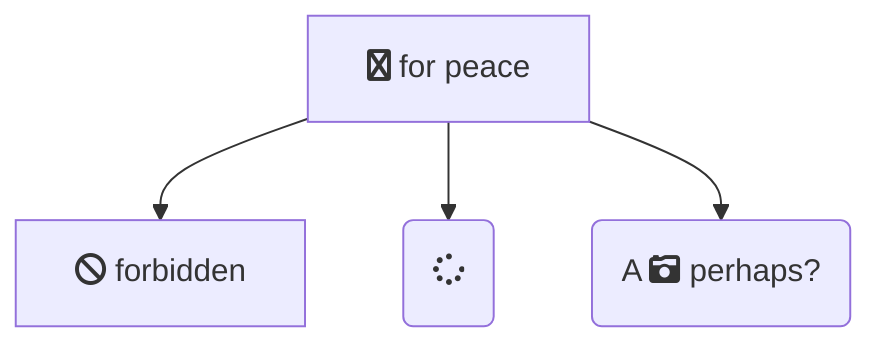
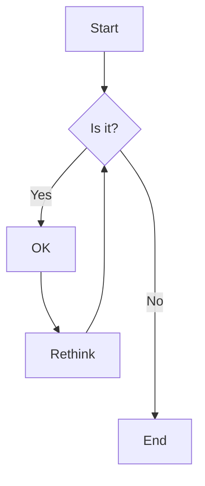

# 芯片分类 (chip classification)

## 1. 逻辑芯片 (Logic chips)

以二进制为原理, 实现运算与逻辑判断功能的集成电路

- **通用处理器**: CPU, GPU, NPU, TPU, DSP
- **可编程逻辑**: FPGA, CPLD
- **指令集架构(ISA)**: x86, ARM, RISC-V, MIPS
- **硬件架构范式**: ASIC, CGRA, Von Neumann / Harvard / Compute-in-Memory

### 常见的逻辑家族

在数字电路设计中, 逻辑家族指的是一组具有相似逻辑特性和电气特性的集成电路

1. TTL(Transistor-Transistor Logic): 使用双极型晶体管构建的逻辑家族, 速度较快, 但功耗较高

2. CMOS: 使用互补金属氧化物半导体技术构建的逻辑家族, 功耗低, 集成度高

3. ECL(Emitter-Coupled Logic): 发射极耦合逻辑, 速度非常快, 但功耗高

4. RTL(Resistor-Transistor Logic): 电阻- 双极型晶体管逻辑, 用于早期的数字电路设计

5. FPGA(Field-Programmable Gate Array): 可编程门阵列, 不是传统的逻辑家族, 但提供了可编程逻辑功能

SOC 芯片通常用于嵌入式系统、移动设备、智能家居等领域

## 2. 存储芯片 (Memory chips)

负责数据的存储与检索，不执行逻辑运算.

- **易失性存储(Volatile)**
    - **SRAM**: 多晶体管结构，无需刷新，速度极快，用于 L1/L2/L3 Cache、寄存器文件、DSP 暂存.
    - **DRAM**: 电容存储，需高频刷新，密度高成本低，用于主内存(PC/ 服务器 / 移动端).
- **非易失性存储(Non-volatile)**
    - **NAND Flash**: Floating Gate MOSFET 结构，按电荷量区分 0/1，用于 SSD/eMMC/UFS.
    - **NOR Flash**: 支持 XIP(片上执行)，用于 BIOS/ 固件存储.
    - **新兴存储**: MRAM, PCM, ReRAM, FeRAM

> DRAM 使用电容存储, 必须每隔一段时间刷新依次, 如果存储单元没有被刷新, 存储的信息就会丢失
>
> NAND Flash 内部存储是 MOSFET, 里面有个 Floating Gate, 是真正存储数据的单元, 数据再 Flash 内存单元中是以 electrical charge 形式存储, 存储电荷的多少, 取决于 external gate 所被施加的电压. 根据阈值电压 Vth, 若大于则表示 1, 小于则表示 0
>
> SRAM(静态随机存取存储器) vs DRAM(动态随机存取存储器)
>
> SRAM 和 DRAM 都属于存储芯片, 而不是逻辑芯片. 它们用于存储数据而不是执行计算或逻辑操作. 逻辑芯片通常执行诸如运算、控制和决策等逻辑功能, 而存储芯片则负责存储和检索数据.
>
> DRAM:
>
> - DRAM 是一种易失性存储器, 它将每一位数据存储在集成电路内的单独电容器中.
> - 由于电容器会随时间逐渐丢失充电, 因此需要以每秒数千次的频率进行刷新.
> - 通常用作计算机和其他电子设备的主存储器.
> - DRAM 应用场景:
>     - 计算机内存: 作为计算机的主内存, 用于存储运行中的程序和数据.
>     - 个人电脑、笔记本电脑和服务器: 用于提供临时存储以支持各种应用程序和操作系统的正常运行.
>     - 移动设备: 包括智能手机、平板电脑等, 用于存储应用程序和操作系统所需的数据.
>     - 嵌入式系统: 用于存储程序代码和临时数据, 如工业控制系统、通信设备等.
>
> SRAM:
>
> - SRAM 是一种使用多个晶体管存储每一位数据的易失性存储器.
> - 它无需定期刷新, 因此速度更快, 但也更昂贵且消耗更多功率, 与 DRAM 相比.
> - 经常用于缓存存储器等对速度要求较高的应用中.
> - SRAM 应用场景:
>     - 高速缓存: SRAM 被广泛用作处理器的高速缓存, 包括 L1, L2 和 L3 缓存. 因为它的读写速度很快, 能够提供处理器需要的快速访问.
>     - 寄存器文件: 在 CPU 内部, SRAM 用于构建寄存器文件, 这些寄存器存储着指令和数据, 对 CPU 执行操作非常重要.
>     - DSP(数字信号处理): 由于其快速的读写速度和能力, SRAM 广泛应用于数字信号处理器中, 用于存储临时数据和指令.

## 3. 模拟与射频芯片 (Analog & RF Chips)

处理连续物理信号 (声、光、电、温度、无线电波)，是真实世界与数字系统的接口.

- **RF 芯片**: PA(功率放大器), LNA(低噪声放大器), Filter(滤波器), Transceiver(收发器).应用于 5G/Wi-Fi/ 蓝牙 / 雷达 / 卫星通信.
- **模拟芯片**: PMIC(电源管理), ADC/DAC(数据转换), Op-Amp(运放), Sensor Interface, SerDes.
- **核心特征**: 依赖工艺经验而非单纯微缩;设计自动化程度低;生命周期长;验证依赖实测.

## 4. 光电子芯片 (Optoelectronic Chips)

实现光 - 电 / 电 - 光转换的芯片.

- **红外(IR)**: VCSEL/EEL 发射器, InGaAs/Si APD 探测器.用于 LiDAR、人脸识别、遥感、光通信.
- **可见光/紫外**: LED, CMOS Image Sensor(CIS), Solar Cell, UV Photodetector.
- **注**: "IR RF" 通常指 IR+RF 融合模组 (如 LiDAR 含 RF 读出电路)，但芯片层面 IR 与 RF 属不同工艺 Die.

## 5. 专用与系统级芯片

- **ASIC**: 为特定算法定制，如矿机芯片、视频编解码器、条码扫描芯片.
- **SoC**: 单芯片集成 Logic + Memory + Analog/RF + Opto，如手机 AP, Wi-Fi SoC、车载 ADAS SoC.现代 SoC 越来越多通过 SiP 或异质集成纳入 RF/Opto.

# 200mm vs 300mm wafer(8 吋 vs 12 吋)(about 8 inches vs about 12 inches)

| Attribute             | 200mm          | 300mm                       |
| :-------------------- | :------------- | :-------------------------- |
| Maximum Die per Wafer | 100-125 dies   | 229-450 dies                |
| Die Size Range        | 20mm2 – 320mm2 | 60mm2 – 450mm2              |
| Fabrication Maturity  | High           | Requires advanced expertise |
| Startup Costs         | Low            | Very high                   |

a 300mm wafer with a diameter of about 12 inches can typically yield around 300-400 chips

8 inches = 203.2 mm

12 inches = 304.8 mm

# CP

Full form: Chip Probing



<i class="fa-solid fa-check"></i>

<div align="center">



</div>

```{mermaid}
flowchart LR
    D(<svg xmlns="http://www.w3.org/2000/svg" height="16" width="16" viewBox="0 0 512 512"><!--!Font Awesome Free 6.5.1 by @fontawesome - https://fontawesome.com License - https://fontawesome.com/license/free Copyright 2023 Fonticons, Inc.--><path d="M313.4 32.9c26 5.2 42.9 30.5 37.7 56.5l-2.3 11.4c-5.3 26.7-15.1 52.1-28.8 75.2H464c26.5 0 48 21.5 48 48c0 18.5-10.5 34.6-25.9 42.6C497 275.4 504 288.9 504 304c0 23.4-16.8 42.9-38.9 47.1c4.4 7.3 6.9 15.8 6.9 24.9c0 21.3-13.9 39.4-33.1 45.6c.7 3.3 1.1 6.8 1.1 10.4c0 26.5-21.5 48-48 48H294.5c-19 0-37.5-5.6-53.3-16.1l-38.5-25.7C176 420.4 160 390.4 160 358.3V320 272 247.1c0-29.2 13.3-56.7 36-75l7.4-5.9c26.5-21.2 44.6-51 51.2-84.2l2.3-11.4c5.2-26 30.5-42.9 56.5-37.7zM32 192H96c17.7 0 32 14.3 32 32V448c0 17.7-14.3 32-32 32H32c-17.7 0-32-14.3-32-32V224c0-17.7 14.3-32 32-32z"/></svg>
)-->C[fa:fa-house]
```

<svg xmlns="http://www.w3.org/2000/svg" height="16" width="16" viewBox="0 0 512 512"><!--!Font Awesome Free 6.5.1 by @fontawesome - https://fontawesome.com License - https://fontawesome.com/license/free Copyright 2023 Fonticons, Inc.--><path d="M313.4 32.9c26 5.2 42.9 30.5 37.7 56.5l-2.3 11.4c-5.3 26.7-15.1 52.1-28.8 75.2H464c26.5 0 48 21.5 48 48c0 18.5-10.5 34.6-25.9 42.6C497 275.4 504 288.9 504 304c0 23.4-16.8 42.9-38.9 47.1c4.4 7.3 6.9 15.8 6.9 24.9c0 21.3-13.9 39.4-33.1 45.6c.7 3.3 1.1 6.8 1.1 10.4c0 26.5-21.5 48-48 48H294.5c-19 0-37.5-5.6-53.3-16.1l-38.5-25.7C176 420.4 160 390.4 160 358.3V320 272 247.1c0-29.2 13.3-56.7 36-75l7.4-5.9c26.5-21.2 44.6-51 51.2-84.2l2.3-11.4c5.2-26 30.5-42.9 56.5-37.7zM32 192H96c17.7 0 32 14.3 32 32V448c0 17.7-14.3 32-32 32H32c-17.7 0-32-14.3-32-32V224c0-17.7 14.3-32 32-32z"/></svg>

# PIE(Process Integration Enineer) Q & A

1m = 100cm, 1cm = 10mm, 1mm = 1000um, 1nm = 1000um

1 inch = 2.54cm

Q: 200mm, 300mm wafer 区别

A:

8 吋 wafer 直径 200mm, 12 吋 wafer 直径 300mm

---

Q: 为什么需要 300mm 12 吋 wafer?

A:

wafer size 变大, 单一 wafer 上的 chip 数变多, 单位成本降低, 200mm -> 300mm 面积增加 2.25 倍, 芯片数目约增加 2.5 倍

---

Q: 0.13 um 的 technology(工艺能力) 代表什么意义?

A:

指工艺能力可以达到 0.13um 栅极的线宽. 栅极的线宽越小, 整个器件就可以越小, 工作速度也越快. 一般工艺能力的难度为 0.35um -> 0.25um -> 0.18um -> 0.15um -> 0.13um

---

Q: 一般 wafer 的 substrate(基材 / 衬底) N-type 和 P-type 的区别

A:

N-type wafer 指掺杂 negative 元素 (5 价电荷元素, e.g. P, As).

P-type wafer 指掺杂 positive 元素 (3 价电荷元素, e.g. B, In)

---

Q: P, M, mask layer(光照层数) 有什么意义? 为什么用来代表工艺的时间长短?

A:

P 指 Poly(多晶硅), M 指 metal(金属导线), 几 P 几 M 指几层 Poly, 几层 metal. e.g. 0.15um 的产品为 1P6M

mask layer 代表必须要经过几次光刻

---

Q: Wafer 下线的第一道步骤是形成 start oxide and zero layer, start oxide 的目的是什么? 为什么要 zero layer?

A:

start oxide 的目的:

1. 不希望有机成分的光刻胶直接接触 Si 表面
2. 再 laser 刻号过程中, 避免粉尘污染

zero layer 是作为芯片工艺各层次之间的对准基准 (T7 Code 是 substrate 背面刻号, 与原物料相关, 用于追溯供应商的 ID, 是数字字母流水码)

---

Q: wafer process 制造过程包含那些主要部分?

A:

1. frontend(前段), device(元器件) 的制造过程
2. backend(后段), metal(金属导线) 的连接及 passivation(护层)

---

Q: frontend process 大致区分?

A:

1. STI(Shallow Trench Isolation, 浅沟道隔离) 的形成 (定义 AA 区域及器件间的隔离)
2. well implant(阱区离子注入) 以调整电性
3. poly gate(栅极) 的形成
4. source/drain(源 / 漏极) 的形成
5. salicide(硅化物) 的形成

---

Q: 为何需要 STI?

A: STI 可以当作两个 device 间的阻隔, 避免两个组件间的短路

---

Q: AA 的用途?

A:

Active Area(源区), 是用来建立晶体管主体的位置所在, 在 AA 上形成 源 / 漏 / 栅极, 两个 AA 区之间就是用 STI 作隔离

---

Q: 在 STI 的刻蚀 process 中, 需要注意的参数?

A:

1. STI ETCH 角度
2. STI ETCH 深度
3. STI ETCH 后的 CD(critical dimension) 尺寸大小控制

---

Q: STI 形成步骤中的 liner oxide(线形氧化层) 的特性和功能?

A:

特性: liner oxide 为 1100C, 120 min 高温炉管形成的氧化层

功能:

1. 修补 STI ETCH 造成的 substrate 损伤
2. 将 STI ETCH 造成的尖角 corner rounding(圆化)

---

Q: 一般的阱区 IMP 调整电性可以分为 3 步骤, 功能为何?

A:

1. Well Implant: 形成 N, P 阱区
2. Channel Implant: 防止 source/drain(源 / 漏极) 间的漏电
3. Vt Implant: 调整 Vt(阈值电压)

---

Q: 一般 Implant layer(离子注入层次) 分为几步骤?

A:

1. 光刻及图形的形成
2. 离子注入调整
3. 离子注入完后的 ash(plasma 等离子体清洗)
4. 光刻胶去除 (PR strip)

---

Q: Poly 栅极形成的步骤大致分为哪些?

A:

1. Gate oxide(栅极氧化层) 的沉积
2. Poly film 的沉积及 SiON(在光刻中作为抗反射层的物质) 的沉积
3. Poly 图形的形成
4. Poly 及 SiON 的 ETCH
5. ETCH 完后的 ash(plasma 等离子体清洗) 及光刻胶去除 (PR strip)
6. Poly 的 Re-oxidation(二次氧化)

---

Q: Poly 栅极的刻蚀要注意哪些地方?

A:

1. Poly 的 CD, i.e. 尺寸大小控制
2. 避免 gate oxide 被蚀刻掉, 造成 substrate 受损

---

Q: 何谓 Gate oxide(栅极氧化层) ?

A:

用来当器件的介电层, 利用不同厚度的 gate oxide, 可以调节栅极电压对不同器件进行开关

---

Q: source/drain 的形成步骤可以分为哪些?

A:

1. LDD implant(Light Doped Drain 离子注入)
2. Spacer 的形成
3. N+/P+ IMP 高浓度 S/D(源 / 漏极) 注入及 RTA(Rapid Thermal Anneal 快速热处理)

---

Q: LDD 用途

A:

LDD 是使用较低浓度的 source/drain, 以防止组件产生热载流子效应的一项工艺

---

Q: 何谓 Hot carrier effect(热载流子效应) ?

A:

在线宽小于 0.5um 以下时, 因为 source/drain 间的高浓度所产生的高电场, 导致载流子在移动时被加速产生热载流子效应, 此热载子会对 gate oxide 造成破坏, 造成组件损伤

---

Q: 何谓 Spacer? Spacer 蚀刻时需要注意哪些?

A:

在 poly 栅极的两旁用 dielectric(介电质) 形成的侧壁, 主要由 Ox/SiN/Ox 组成.

蚀刻 spacer 时需要注意 CD 大小, profile(剖面轮廓), remain oxide(残留氧化层的厚度)

---

Q: Spacer 的主要功能?

A:

1. 使用高浓度的 source/drain 与 gate 间产生一段 LDD 区域
2. 作为 Contact ETCH 时栅极的保护层

---

Q: 为何在离子注入后需要 Thermal Anneal(热处理) 的工艺?

A:

1. 为恢复经离子注入后造成的芯片表面损伤
2. 使注入离子扩散至适当的深度
3. 使注入离子移动到适当的晶格位置

---

Q: SAB(Salicide block) 目的为何?

A:

SAB 用于保护硅片表面, 在 RPO(Resist Protect Oxide) 的保护下硅片不与其他 Ti, Co 形成 salicide(硅化物)

---

Q: SAB 工艺的流程中需要注意哪些?

A:

1. SAB 光刻后, 刻蚀后的图案 (特别是小块区域), 要确定有完整的 block 包覆住必需被包覆的地方
2. remain oxide(残留氧化层的厚度)

---

Q: 何谓 salicide(硅化物)?

A:

Si 与 Ti/Co 形成 TiSix/CoSix, 一般来说是用来降低电阻值 (Rs, Rc)

---

Q: salicide 的形成步骤可以分为哪些?

A:

1. Co/Ti + TiN 的沉积
2. 第一次 RTA 来形成 Salicide
3. 将未反应的 Co/Ti 以化学酸去除
4. 第二次 RTA(用来形成 Ti 的晶相转化, 降低其阻值)

---

Q: MOS 器件的主要特性是什么?

A:

主要是通过栅极 Vg(电压) 来控制 S/D(source/drain) 之间电流, 实现其开关特性

---

Q: 一般用哪些参数来评价 device 的特性?

A:

主要由 Idsat, loff, Vt, Vbk(breakdown), Rs, Rc

一般要求 Idsat, Vbk 值尽量大; loff, Rc 尽量小; Vt, Rs 尽量接近设计值;

---

Q: 什么使 Idsat? Idsat 代表什么意义?

A: 饱和电流. 也就是在栅压 (Vg) 一定时, 源 / 漏极之间流动的最大电流

---

Q: 在工艺制作过程中哪些工艺可以影响到 Idsat?

A:

Poly CD(多晶硅尺寸), Gate oxide Thk(栅氧化层厚度), AA(有源区) 宽度, Vt IMP 条件, LDD IMP 条件, N+/P+ IMP 条件

---

Q: 什么是 Vt? Vt 代表什么意义?

A: 阈值电压 (Threshold Voltage), 就是产生强反转所需的最小电压. 当栅极电压 Vg < Vt 时, MOS 处于关闭状态, 而 Vg >= Vt 时, 源 / 漏极之间便产生导电沟道, MOS 处于开状态

---

Q: 在工艺制作过程中哪些工艺可以影响到 Vt?

A:

Poly CD, Gate oxide Thk, AA 宽度, Vt IMP 条件

---

Q: 什么是 loff? loff 小有什么好处?

A:

关态电流, Vg = 0 时的 source/drain 之间的电流, 一般要求此电流值越小越好. loff 越小, 表示栅极的控制能力越好, 可以避免不必要的漏电流 (省电)

---

Q: 什么是 device breakdown voltage?

A:

指崩溃电压 (击穿电压), 在 Vg = Vs = 0 时, Vd 所能承受的最大电压. 当 Vd 大于此电压时, source/drain 之间形成的导电沟道不受栅压的影响. 在 device 越做越小的情况下, 这种情况会越来越严重

---

Q: 何谓 ILD? IMD? 其目的为何?

A:

ILD: Inter Layer Dielectric, 是用来做 device 与第一层 metal 的 isolation(隔离).

IMD: Inter Metal Dielectric, 是用来做 metal 与 metal 的 isolation.

要注意 ILD 及 IMD 在 CMP 后的厚度控制

---

Q: 一般介电层 ILD 的形成由哪些层次组成?

A:

1. SiON 层沉积 (用来避免上层 B, P 渗入器件)
2. BPSG(掺有硼, 磷和硅玻璃) 层沉积
3. PETEOS(等离子体增强正硅酸乙脂) 层沉积

最后再经 ILD Oxide CMP(SiO2 的化学机械研磨) 来做平坦化

---

Q: 一般介电层 IMD 的形成由哪些层次组成?

A:

1. SRO 层沉积 (用来避免上层的氟离子往下渗入器件)
2. HDP-FSG(掺有氟离子的硅玻璃) 层沉积
3. PE-FSG(等离子体增强, 掺有氟离子的硅玻璃) 层沉积

使用 FSG 的目的时用来降低 dielectric k 值, 减低金属层之间的寄生电容

最后再经 IMD Oxide CMP(SiO2 的化学机械研磨) 来做平坦化

---

Q: 简单说明 Contact(CT) 的形成步骤由哪些?

A:

Contact 是指器件与金属线连接部分, 分布在 poly, AA 上

1. Contact 的 photo(光刻)
2. Contact 的 Etch 及光刻胶去除 (ash & PR strip)
3. Glue layer(粘合层) 的沉积
4. CVD W(钨) 的沉积
5. W-CMP

---

Q: Glue layer 的沉积所处的位置, 成分, 薄膜沉积方法是什么?

A:

因为 W 比较难附着在 Salicide 上, 所以必须先沉积 Glue layer 再沉积 W

Glue layer 是为了增强粘合性而加入的一层. 主要在 salicide 与 W(CT), W(VIA) 与 metal 之间, 其成分为 Ti, TiN, 分别采用 PVD, CVD 方式制作

---

Q: 为何各金属层之间的连接大多是采用 CVD 的 W-plug(钨插塞) ?

A:

1. 因为 W 有较低的电阻
2. W 有较佳的 step converage(阶梯覆盖能力)

---

Q: 一般 metal layer(金属层) 的形成工艺采用哪种方式? 大致可分为哪些步骤?

A:

1. PVD Metal film 沉积
2. Photo 及图形的形成
3. Metal film Etch 及 plasma(等离子体) 清洗 (此步骤为连续工艺, 在同一个机台内完成, 其目的在避免金属腐蚀)
4. Solvent 光刻胶去除

---

Q: Top metal 和 inter metal 的厚度, 线宽有何不同?

A:

Top metal 通常要比 inter metal 厚的多, e.g. 0.18um 工艺中 inter metal 为 4KA, 而 top metal 要 8KA.

主要是因为 top metal 直接与外部电路相接, 所承受负载较大. 一般 top metal 的线宽也比 inter metal 宽些

---

Q: 在量测 Contact / Via(metal 与 metal 间的连接) 的接触窗开的好不好时, 利用什么电性参数来得知的?

A:

通过 Contact/Via 的 Rc 值, Rc 值越高, 代表接触窗的电阻越大, 一般来说希望 Rc 是越小越好

---

Q: 什么是 Rc? Rc 代表什么意义?

A:

接触窗电阻, 具体指 金属和半导体 (contact) 或 金属和金属 (via), 在相接触时在节处所形成的电阻, 一般要求此电阻越小越好

---

Q: 影响 Contact(CT) Rc 的主要原因有哪些?

A:

1. ILD CMP 的厚度是否异常
2. CT 的 CD 大小
3. CT 的 Etch 过程是否正常
4. 接触 substrate 的质量或浓度 (Salicide, non-salicide)
5. CT 的 glue layer(粘合层) 形成
6. CT 的 W-plug

---

Q: 什么是 spacing? 如何量测?

A:

在电性测量中, 给一条线 (poly or metal) 加一定电压, 测量与此线相邻但不相交的另外一线的电流, 此电流越小越好. 当电流偏大时, 代表导线间可能发生短路现象

---

Q: 什么是 Rs?

A: 片电阻 (单位面积, 单位长度的电阻), 用来量测导线的导电情况如何. 一般可以量测的为 AA(N+, P+), Poly && metal.

---

Q: 影响 Rs 有哪些工艺?

A:

1. 导线 line(AA, poly & metal) 的 CD 大小
2. 导线 line(poly & metal) 的厚度
3. 导线 line(AA, poly & metal) 的本身电导性 (在 AA, poly line 时可能为注入离子的剂量有关)

---

Q: 一般护层的结构是由哪三层组成?

A:

1. HDP Oxide(高浓度等离子体二氧化硅)
2. SRO Oxide(Silicon rich oxygen 富氧二氧化硅)
3. SiN Oxide

---

Q: 护层的功能是什么?

A:

使用 oxdide 或 SiN 层, 用来保护下层的线路, 以避免与外界的水汽, 空气相接触而造成电路损害

---

Q: Alloy 的目的为何?

A:

1. Release 各层间的 stress(应力), 形成良好的层与层之间的接触面
2. 降低层与层接触面之间的电阻

---

Q: 工艺流程后有一步骤为 WAT, 其目的为何?

A: wafer acceptance test(WAT), 是在工艺流程结束后对芯片做电性测量, 用来检验各段工艺流程是否符合标准.(Idsat, loff, Vt, Vbk, Rs, Rc 都会在这步测完)

---

Q: WAT 电性测试的主要项目有哪些?

A:

1. device 特性测试
2. Contact resistant(Rc)
3. Sheet resistant(Rs)
4. Break down test
5. 电容测试
6. Isolation(spacing test)

---

Q: 什么是 WAT Watch 系统?它有什么功能?

A:

Watch 系统提供 PIE 一个工具, 来针对不同 WAT 测试项目, 设置不同的栏住产品及发出 Warning 警告标准, 能使 PIE 早期发现工艺上的问题

---

Q: 什么是 PCM SPEC?

A:

Process control monitor(PCM) SPEC

广义而言指芯片制造过程中所有工艺量测项目的规格

狭义而言是 WAT 测试参数的规格

---

Q: 当 WAT 量测到异常是如何处理?

A:

1. 查看 WAT 机台是否异常, 若有则重测
2. 利用手动机台 Double confirm
3. 检查产品是在工艺流程制作上是否有异常记录
4. 切片检查

---

Q: 什么是 EN? EN 有何功能?

A:

由 CE 发出, 祥记关于某一产品的相关信息 (包括 Technology ID, Reticle and some split condition ETC...) 或是客户要求的事项 (包括 HOLD, Split, Bank, Run to complete, Package...), 根据 EN 提供信息才可以建立 process flow 及处理此产品的相关动作

---

Q: PIE 每天开门五件事 check 哪些项目?

A:

1. Check MES, 查看自己的 lot 情况
2. 处理 inline hold lot(defect, process, WAT)
3. 分析汇总相关产品 inline 数据 (raw data & SPC)
4. 分析汇总相关产品 CP test 结果
5. 参加晨会, 汇报相关产品信息

# 半导体制造 8 大工艺

晶圆制造 -> 氧化工艺 -> 光刻工艺 -> 刻蚀工艺 -> 沉积和离子注入工艺 -> 金属化工艺 -> EDS(Electrical Die Sorting) 工艺 -> 封装工艺

# 4 大工艺过程 module

1. DIFF

    Diffusion, 扩散

    Include: Furnace(炉管), WET(湿刻), IMP(离子注入), RTP(快速热处理)

    在半导体制造中，扩散(Diffusion)工艺通常指的是将杂质原子(掺杂剂)引入半导体材料中，以改变其电学性质.湿法工艺在扩散模块(Diffusion Module)中主要用于前处理和后处理步骤，以确保扩散过程的有效性和晶圆表面的清洁度.以下是一些与扩散工艺相关的湿法工艺:

    湿法清洗(Wet Cleaning):
    - 在扩散工艺之前，晶圆表面需要进行严格的清洗，以去除任何可能影响掺杂剂扩散的污染物.
    - 使用 RCA 清洗、稀释氢氟酸(DHF)清洗等方法，确保晶圆表面的洁净度.

    湿法氧化(Wet Oxidation):
    - 在某些扩散工艺中，可能需要先在晶圆表面生成一层二氧化硅(SiO2)薄膜，作为掺杂剂的扩散阻挡层或掩膜.
    - 湿法氧化可以在高温下通过水蒸气与硅反应生成 SiO2 薄膜.
      湿法剥离(Wet Stripping):

    在扩散工艺完成后，可能需要去除光刻胶或其他掩膜材料.
    使用化学溶液如丙酮或显影液去除光刻胶，以便进行后续的工艺步骤.

    湿法剥离(Wet Stripping):
    - 在扩散工艺完成后，可能需要去除光刻胶或其他掩膜材料.
    - 使用化学溶液如丙酮或显影液去除光刻胶，以便进行后续的工艺步骤.

    湿法沉积(Wet Deposition):
    - 在某些情况下，可能需要在晶圆表面沉积特定的薄膜材料，以辅助扩散过程或作为后续工艺的准备.
    - 例如，化学溶液沉积(CSD)用于沉积某些金属氧化物薄膜.

    湿法抛光(Wet Polishing):
    - 在扩散工艺后，如果需要平坦化晶圆表面，可以使用化学机械抛光(CMP)技术.
    - 结合化学溶液和机械研磨，实现晶圆表面的平坦化.

2. TF

    Thin Film 薄膜

    Include: PVD(物理气相沉积), CVD(化学气相沉积), CMP(化学机械研磨)

3. PHOTO

    Photolithography/optical lithography/UV lithography 光刻

    used in microfabrication to pattern parts on a thin film or the bulk of a substrate(also called a wafer)

4. ETCH

    刻蚀

# CFA

CFA(Color Filter Array, 色彩滤波阵列), 也称作 CMOS 色彩滤镜

1. **Bayer Color Filter Array(BCFA)**:
    - **原理**: BCFA 包括红色、绿色和蓝色滤波器，它们以 2x2 的重复模式排列在图像传感器上. 每个像素只能接收其中一种颜色的光，通过插值算法生成完整的彩色图像.
    - **优点**: 成本低、易于实现、广泛应用.
    - **缺点**: 可能会引入彩色伪影和降低分辨率.
    - **实际应用**: 绝大多数消费级和专业摄像设备中使用，如手机摄像头、数码相机等.

    是最常用的 CFA, 俗称 "马赛克传感器", 由一行 RGRGRG..., 一行 BGBGBG...交错排列形成, 每一个像素点都只能读取单独的颜色信息, 其中绿色像素的采样频率是输出像素的 1/2, 红/蓝色像素采样频率是输出像素的 1/4, 所以用 BCFA 的传感器的分辨率是由绿色像素决定的

    BFCA 采样后要经过反马赛克运算(每个 2x2 像素经过 9 次矩阵运算, 也是种线性计算) 才可以输出为全色彩图像

    BFCA 存在欠采样的问题, 因为会出现摩尔纹和伪色(摩尔纹出现时因为输入信号的最高频率成分超过了传感器的奈奎斯特极限, 也就是说传感器的高频采样能力存在一些不足)

    虽然有图像质量的问题, 但因为结构简单, 所以只要 BCFA 底下的光电二极管能跟上, 分分钟就能上亿像素几百张图, 也就是暴力堆砌, 感觉适用非消费级产品

2. **RGBE Filter Array**:
    - **原理**: RGBE 阵列包括红色、绿色、蓝色和透明(Clear) 滤波器，透明滤波器用于捕获更多的光信息.
    - **优点**: 提供更好的光线捕获能力.
    - **缺点**: 可能需要更复杂的处理算法.
    - **实际应用**: 用于一些专业摄像设备和科学应用中.

3. **CYGM Filter Array**:
    - **原理**: CYGM 阵列包括青色、黄色、绿色和品红色滤波器，提供更广泛的色彩范围.
    - **优点**: 能够捕获更多的颜色信息.
    - **缺点**: 可能需要更复杂的处理算法.
    - **实际应用**: 在某些专业应用中可能会使用.

4. **X-Trans Filter Array**:
    - **原理**: X-Trans 阵列采用一种不规则排列方式，有助于减少颜色伪影并提高图像质量.
    - **优点**: 提高图像质量、减少颜色伪影.
    - **缺点**: 设计和处理可能更复杂，成本可能较高.
    - **实际应用**: 由富士胶片开发，用于一些高端相机中，提供更好的图像质量和细节表现.

    每一组 X-Trans(6x6 像素为一组)中都在中央包含 2x2 纯绿像素块, 而这 2x2 中的每一个 1x1 都可以和它三个角上的像素块拼成 2x2, 所以不是"无序性"的, 在高频的采样能力上优于 BCFA, X-Trans CMOS 能在不用低通(Low-pass filter) 的前提下规避摩尔纹

    每个 6×6 子像素当中会有分布较离散的 4 个绿色子像素, 这部分的采样频率低于传统的拜耳阵列, 绿色像素采样输出 1/9, 低于 BFCA 的 1/2, 红色/蓝色像素排列比较特殊, 等采样频率下输出像素 2/9, 与 BCFA 的 1/4 略低但相差不大

    这种排列方式就是"大小核"的思路, 采用 2×2 的高频采样模块来处理高频信息, 1/9 的低频模块来处理中低频信息, 同时保证红蓝像素的采样率基本不变. 但是 1 和 1/9 两种采样频率之间的差异实在是太大，中高频的信息势必会有一些损失

    胶片没有摩尔纹的原因其实也无关什么无序性，胶片是全色采样，类似 X3, 输出时 1:1, 所以 X-Trans 也可以叫 "仿生胶片传感器", X-Trans 还有一个问题就是解码算法远比 BCFA 来得复杂

5. **Foveon X3**:
    - **原理**: Foveon X3 传感器采用垂直色彩分离技术，通过在不同深度上分层排列红、绿、蓝色滤波器来捕获彩色信息.
    - **优点**: 相比传统 CFA，Foveon X3 传感器可以更准确地捕获颜色信息，因为每个像素都能同时获取红、绿、蓝三种颜色的信息.
    - **缺点**: 在高 ISO 情况下可能存在噪点问题，对光线敏感度较高.
    - **实际应用**: 用于 Sigma 相机中，提供较为准确的颜色还原.

    这种时 1:1 的采样, 拍摄色彩丰富的纹理图案时细节表现出色

    但是缺点很明显, 他是 3 层堆栈架构, 且 3 层之间距离大, 信号通路不可能用 TSV(硅片上穿孔), 而只能引出布线, 数字信号输出(内置 ADC) 更不可能, 所以这种 CMOS 传输的噪声很高, 连 ISP 来调整 ISO 会导致整体电路层设计性能堪忧, 后来 Sigma/Foveon 自己都妥协了，DP Q 系列相机采用了新的 4:1:1 Quattro X3 传感器

6. **Quattro X3 传感器**
    - **原理**: Quattro X3 传感器是 Foveon X3 传感器的改进版本，采用了新的排列方式和结构设计.
    - **优点**:
        - 提高了像素密度和分辨率，有助于提高细节表现和图像质量
        - 改进了噪点和光线敏感度问题，提升了高 ISO 性能
    - **缺点**: 相比传统 Foveon X3 传感器，可能会有更高的处理复杂度和成本
    - **实际应用**: 用于 Sigma 相机中，提供更好的图像质量和性能

这些彩色滤波器阵列类型在不同的应用和场景中具有各自的优势和特点，选择合适的 CFA 类型取决于具体的需求和应用场景.

@see: https://zhuanlan.zhihu.com/p/21298545

@see: https://zhuanlan.zhihu.com/p/42188821

# CMOS

CMOS(Complementary Metal-Oxide-Semiconductor), 互补金属氧化物半导体, 是一种集成电路制造技术, 也是一种常见的逻辑家族, 在数字集成电路中, CMOS 技术被广泛应用于制造处理器、存储器、传感器、逻辑门等各种电子设备

# SOC

SOC(System-on-chip), 是一种集成了多个功能模块或组件的芯片, 包括处理器核心、内存、输入 / 输出接口、通信模块等, 以实现完整的系统功能

edge ai + CIS 某种程度上可以被称为 SOC

e.g. CIS + ASIC(Application-Specific Integrated Circuit) + NN(Neural Network); CIS + AI + MCU(Microcontroller Unit)

CIS 用于捕获图像数据, 将光学信号转换为数字图像

ASIC 是专门为特定应用定制设计的集成电路, 可以实现高度定制化的功能, 在结合 CIS 和 ASIC 时, ASIC 可以用于处理 CIS 捕获的图像数据, 进行特定的图像处理、分析和决策, ASIC 可以根据具体的应用需求, 设计和优化特定的图像处理算法和功能模块, 以提高系统性能和效率

将神经网络集成到 CIS 和 ASIC 系统中, 可以实现智能图像处理和决策能力, 例如目标检测、图像识别、实时跟踪等功能, 可以通过学习和训练识别图像中的模式和特征, 从而使系统具备智能决策能力

MCU vs ASIC

1. 设计和用途
    - MCU 是一种集成了处理器核心、存储器、输入/输出接口和定时器等功能的单芯片微处理器, 通常用于控制嵌入式系统中的各种设备和执行特定任务, 如传感器数据采集、控制执行等
    - ASIC 是一种专门定制的集成电路, 根据特定应用的需求进行设计和制造. ASIC 的设计是为了在特定应用中实现特定功能或性能, 通常用于高性能计算、专用加速、图像处理等领域

2. 灵活性
    - MCU 通常具有更高的灵活性, 可以编程执行各种不同的任务和功能, 适用于广泛的应用领域
    - ASIC 是为特定应用而设计的, 功能固定, 不具备灵活性, 但在特定任务上通常具有更高的性能和效率

3. 成本
    - 通常来说, ASIC 的设计和制造成本较高, 适用于大量生产并需要高性能和定制化功能的场景
    - MCU 的成本相对较低, 适用于中小规模生产和需要较高灵活性的应用

4. 功耗
    - ASIC 通常设计为在特定任务上实现高效能力, 因此在功耗方面可以更加优化
    - MCU 通常设计为在低功耗下运行, 适用于需要长时间运行的嵌入式系统

光谱 (Spectrum) vs RGB vs 灰度图 (Grayscale image)

- Spectrum 是指整个可见光谱范围内的颜色表示, 涵盖了从红色到紫色的所有颜色, 每种颜色对应着不同的波长, 是一种更广泛的颜色表示方式, 而不仅仅局限于 RGB 颜色空间
- RGBRGB 是一种颜色模型, 在数字图像处理中, 每个像素的颜色可以通过 RGB 值来表示, 每个通道的值范围通常是 0 到 255
- Grayscale image 是一种只包含灰度信息的图像, 没有彩色信息. 即在灰度图中, 每个像素的值表示灰度级别, 通常在 0(黑色) 到 255(白色) 之间. 灰度图是一种单通道图像, 与 RGB 图像相比, 它只包含亮度信息, 而不包含颜色信息

可以认为, 在 CV 中, RGB image -> Grayscal image, 三通道 -> 单通道, 在处理速度和存储方面更高效, 降低计算复杂度, 加快训练速度; 光谱概念更多与光学和传感器技术有关,例如光谱分析、光谱成像等领域, 即 CV 任务一般不需要光谱数据

对于嵌入式系统 (如 MCU), 彩色图像需要更多的计算资源和存储空间, 所以要用到 WLO(Wafer Level Optic) 晶圆光学, 已知的是把一篇 8 吋镜片直接叠在 wafer 上, 相当于两片重叠, 然后获取图像数据的时候每次读 4 列 (设计为类似于麦克风阵列的光谱检测阵列), 只有 288k(还包含所有固件、软件, 所以 320 x 320 图片数据 远低于这个值), 而且其中 144k 使里面 operation 用的, 也就是没有大算力 (解决隐私问题和联网问题), 但是单芯片能做 AI 任务

诺磊 NB100X 系列中的 2×3 阵列有 6 颗小芯片 (18mm), 即 6 个 SOC 并行运算, 就是 6 颗一般算力加在一起用, 让他可以做海量的图像数据并行处理, 且扩展性很高, 用的模块式 IC 涉及, 功耗可控 (随时关闭不需要用的芯片), 不怕坏 (6 颗中有坏了的, 也可以用另一颗替代???但是不是一颗做一个任务吗), 系列中还有 2x2 阵列, 3x3 阵列, 4x1 阵列 (NB1001, 功耗仅有 0.3 W)

1. 还可以做成光谱的矩阵. 人是两个眼睛的, 所以可以看到立体, 四个眼睛看的立体更强烈, 这是用在光谱上, 所以说这一个里面可以做不同镜头的角度
2. 可以做不同的光谱
3. 应用很多, 医疗健康 (健康追踪尿液检查 / 非侵入式健康检查 / 医疗机器功能扩充), 智能生态 (手机功能扩充,/ADAS 自动驾驶功能扩充 / 珠宝金矿石高订材质坚定), 环保安全 (环境监督及管理 / 无人机 / 食品安全)

spectrum(光谱) 可以用在哪里, 可以用在调光、摄像头图像增强、增强现实等方面, 单颗的放在 VR 里面, 就是我们实际上放在眼镜里面, 追踪你眼球的移动. 这是眨眼, 再看另外一边. 不管眼球转多快, 都会跟得上. 这里面没有什么所谓的高算力, 对 IC 来说是很简单的事

@see: https://www.bilibili.com/video/BV1e24y1C7Dx/?vd_source=b8cb8db44d97eb71e6c4a2b35f279324

@see: https://www.sohu.com/a/732358180_120159035

# CIS

CIS(CMOS Image Sensor), 互补金属氧化物半导体图像传感器

是一种集成在单个芯片上的图像传感器, 用于将光学图像转换为电子信号, 是数字相机、手机摄像头和许多其他设备中常用的图像传感器类型之一

CIS 相对于传统的 CCD(电荩波耦合器件图像传感器) 具有许多优势, 包括低功耗、集成度高、成本低等

- 优点:
    - 低功耗: CMOS 技术本身具有低功耗特性, 使得 CIS 在移动设备等对功耗要求较高的应用中具有优势.

    - 集成度高: CMOS 技术能够实现高度集成, 使得 CIS 可以集成更多的功能, 如信号处理, 模拟数字转换等, 从而简化整个系统设计.

    - 良好的噪声特性: CMOS 图像传感器通常具有较好的噪声控制能力, 有利于提高图像质量.

    - 成本较低: 相对于其他图像传感器制造技术, CMOS 图像传感器的制造成本较低.

- 缺点:
    - 灵敏度相对较低: 与一些专用图像传感器相比, CMOS 图像传感器的灵敏度可能较低.

    - 动态范围受限: CMOS 图像传感器的动态范围可能受到一定限制, 这可能会在某些高要求的应用中受到影响.

- 应用场景:
    - 消费类电子产品: 如智能手机, 平板电脑, 数码相机等, 由于 CIS 具有低功耗, 集成度高等优势, 被广泛应用于这些产品中.

    - 安防监控: CIS 在安防监控领域也有广泛应用, 可用于监控摄像头, 视频会议设备等.

    - 医疗影像: CMOS 图像传感器在医疗影像设备中也有应用, 如 X 射线成像, 内窥镜等.

专用图像传感器通常指针对特定应用场景而设计的图像传感器, 例如专门用于低光条件下拍摄的低照度传感器或用于高动态范围场景的 HDR(高动态范围) 传感器等.这些专用传感器在特定方面通常具有比 CIS 更高的性能, 如更高的灵敏度、更广泛的动态范围等.

在动态范围受限方面, 动态范围是指图像传感器能够捕获的亮度范围, 即从最暗到最亮的范围. 动态范围较大的传感器能够同时捕获细节丰富的阴影和亮部, 产生更具视觉吸引力和信息丰富度的图像. 而动态范围受限的 CMOS 图像传感器可能无法在同一图像中准确捕获极暗和极亮的细节, 导致图像在这些区域失真或丢失细节.

这种限制可能会在需要对比度较高的场景中产生影响, 如在拍摄高对比度场景 (同时包含非常明亮和非常暗的区域) 时. 在这种情况下, 动态范围受限的 CMOS 图像传感器可能无法准确捕获整个场景的细节, 导致亮部过曝或暗部细节丢失, 从而影响图像质量和信息的完整性.

因此, 对于一些对图像质量要求较高、需要捕获广泛亮度范围的应用, 如专业摄影、广告拍摄、医学影像等领域, 动态范围受限的 CMOS 图像传感器可能无法满足需求, 因为这些应用对图像细节和色彩准确性有较高要求. 在这些情况下, 专用图像传感器可能更适合, 因为它们通常具有更广泛的动态范围和更高的灵敏度, 能够更好地满足这些高要求的应用场景.

## CIS 原理

1. 光信号捕捉: 传感器表面的微小像素阵列捕捉进入镜头的光线. 每个像素对应于影像中的一个点.
2. 光电转换: 当光线击中像素时, 它会被转换成电子. 这一过程通过光电效应实现, 是数字影像的基础.
3. 信号放大和转换: 捕捉到的电子信号随后被放大并转换为数字形式, 以便于存储和处理.

## CIS vs logic

- DIFF
    - CIS 制程中 IMP 步骤离子注入用于调节感光元件的电性能
    - Logic chip 制程中 IMP 步骤离子注入步骤可能不常见, 因为焦点是在电路逻辑功能上

- TF
    - CIS 制程中 CVD 步骤用于沉积薄膜在像素结构和感光元件上
    - Logic chip 制程中 CVD 步骤用于沉积多层金属导线, 绝缘层等
    - CIS 制程中 CMP 步骤用于平整化像素结构和感光元件
    - Logic chip 制程中 CMP 步骤用于凭证复杂的电路结构

- LITHO
    - CIS 制程中 LITHO 步骤主要用于定义像素结构, 感光元件的形状
    - Logic chip 制程中 LITHO 步骤更不服, 用于定义大量逻辑门, 存储单元等复杂电路结构

- ETCH
    - CIS 制程中 ETCH 步骤用于去除不需要的材料, 以形成稳定结构
    - Logic chip 制程中 ETCH 步骤设计更复杂的结构, 如多层金属线路的刻蚀

## CIS 架构

CMOS IMAGE SENSOR 由大量的像素阵列组成, 每个像素都包含光感受器和信号处理电路

1. 像素阵列: CMOS 图像传感器由成千上万个像素组成的阵列构成. 每个像素负责捕获光线并将其转换为电信号
2. 光感受器: 每个像素都包含一个光感受器, 通常是光电二极管 (photodiode) . 光感受器负责将光信号转换为电荷
3. 信号处理电路: 每个像素还包含信号处理电路, 用于处理从光感受器中生成的电荷. 这些电路包括放大器、模数转换器 (ADC/Analog-to-Digital Converter) 等
4. 列选择器: 在像素阵列的顶部有一组列选择器, 用于选择要读取的像素行
5. 行选择器: 在像素阵列的侧面有一组行选择器, 用于选择要读取的像素列
6. 控制逻辑: CMOS 图像传感器还包含控制逻辑, 用于协调像素的操作、信号的传输以及整体的工作
7. 输出引脚: 最终, 通过输出引脚, 传感器将处理后的图像数据传输给外部设备, 如处理器或存储器

光电二极管将 RGB 光的强度 转化为 电流的大小, 输出为 电压的大小

图像 -> 电信号过程: 每个像素点 RGB 强度 -> 光电二极管通过电路转化一定比例的电流

CMOS 图像传感器中, 一般每个像素通常包含一个光电二极管 (Photodiode), 用于捕获光信号并将其转换为电荷, 这些电荷随后通过信号处理电路进行放大和数字化, 最终形成图像数据

一般包含带 vdd 的电路越多, 对图像的分辨率越高, 画质越精细

一般传感器尺寸越大, 各感光像素点的尺寸越大, 电路面积越大, 受干扰性越强, 即使在阴暗处 (光强度区分不明显处) 也能很好的辨别颜色, 简而言之就是尺寸越大, 性能越好

图像传感器的基本单位: 像素

一般是光信号 -> 片上微透镜阵列 (On-Chip Microlens Array) -> 片上彩色滤波器阵列 (On-Chip Color Filter Array) -> 介质材料 (Dielectric Material) -> 遮光层 (Light Sheild) -> 二极管 (Photodiode)(n+ -> P) -> 衬底

前照式 CMOS: 光线 -> microlens(微透镜) -> color filter(颜色过滤器) -> metal wiring(金属排线) -> substrate(光电二极管)

背照式 CMOS: 光线 -> microlens(微透镜) -> color filter(颜色过滤器) -> substrate(光电二极管) -> metal wiring(金属排线)

由于传统 CMOS 传感器的金属布线在光电二极管上面, 因此会遮挡住一部分入射的光线, 减少光通量, 还会造成噪声, 所以目前大部分 CMOS 传感器均采用背照式传感器, BSI(Back side illumination) 技术来构建像素, 光线无需穿过金属排线, 光线几乎没有阻挡和干扰的就到达了光电二极管, 光线利用率高

CMOS 填充系数: 填充因子: 像素中感光区域面积比像素面积比率

`FF =(Apd / Apix) x 100%` Apd 指的是传感器横截面的 Aperture 光圈, Apix 指的是传感器横截面的 Pixel

非堆栈式 CMOS vs 堆栈式 CMOS: 像素区域和处理电路区域在一片 65nm 晶体管门极长度上, 而堆栈式是一片 65nm 的像素区域, 下面放一片 45nm 的处理电路区域, 效率更高, 处理电路上的晶体管数量能翻倍, 像素处理越快 (nm 一般指的是半导体制造工艺技术的节点, 表示晶体管的最小特征尺寸, 即晶体管的门极长度, 而不是指硅片、批次或芯片的厚度)

堆栈式 CIS 结构包括像素层、信号处理层和封装层, 这些层可以垂直堆叠在一起, 从而实现更高的像素密度和更好的性能, 堆栈式结构可以使 CIS 在相同尺寸下具有更多的像素, 同时还能够减少像素间的电路长度, 提高信号处理效率, 从而提高图像质量和传感器的整体性能

还有一种填充系数是与微透镜的覆盖率, microlens 主要是汇聚光用的, 定义为微透镜覆盖像素的面积 / 像素的集合面积, 即透镜是否可以将整个像素的面积全部覆盖, 和 CMOS 填充系数一样, 与像素面积正相关

CMOS 传感器成像质量不仅受到 CMOS 填充系数的影响, 同时还会受到微透镜覆盖率的影响

## 贝叶斯概率理论应用于 CIS

- 宏观应用

1. 噪声建模和去噪
    - 噪声建模: 贝叶斯概率理论可以帮助建模不同类型的噪声, 如暗电流噪声, 读出噪声, 固定模式噪声等. 这些噪声源会影响图像质量, 了解其统计特性对于有效去除噪声至关重要
    - 去噪算法: 基于贝叶斯概率理论，可以开发适用于 CIS 图像传感器的各种去噪算法，例如基于贝叶斯推断的去噪方法，通过对噪声进行建模和估计，实现更准确的噪声消除，提高图像质量

2. 图像重建和增强
    - 贝叶斯推断: 贝叶斯推断是一种用于从观测数据中推断未知参数的统计方法. 在图像重建和增强中，贝叶斯推断可以帮助恢复缺失的信息，提高图像的质量和清晰度
    - 超分辨率算法: 基于贝叶斯概率理论的图像超分辨率算法可以利用图像中的先验信息和统计特性，从低分辨率图像中恢复出高分辨率图像，提高图像的细节和清晰度

3. 目标检测和跟踪
    - 贝叶斯目标检测: 贝叶斯概率理论可用于设计目标检测算法，通过建模目标和背景的概率分布，实现对图像中目标的准确检测
    - 目标跟踪: 基于贝叶斯滤波器(如卡尔曼滤波器或粒子滤波器) 的目标跟踪算法可以结合传感器测量和运动模型，实现对目标在图像序列中的连续跟踪

4. 图像分割和特征提取
    - 贝叶斯图像分割: 贝叶斯概率理论可用于图像分割，将图像分成不同的区域或对象. 通过建模像素之间的关系和先验知识，可以实现准确的图像分割
    - 特征提取: 贝叶斯方法可以帮助提取图像中的关键特征，如边缘、纹理等，为后续的图像识别和分析提供更准确的信息

5. 动态范围优化
    - 贝叶斯动态范围优化: 通过贝叶斯方法，可以优化图像传感器的动态范围，使其能够更好地适应不同亮度条件下的图像采集，提高图像的对比度和细节表现
    - 参数调整: 基于贝叶斯概率理论，可以对图像传感器的参数进行优化调整，以最大化图像的信息捕获和质量

- 具体实现思路

1. 模型训练和转换
    - 使用 PyTorch 等深度学习框架训练适用于 CMOS 图像传感器的贝叶斯概率模型, 例如用于去噪、图像重建、目标检测等任务的模型
    - 将训练好的模型转换为 ONNX 格式或 PyTorch 的 PTH 格式，以便在不同平台上部署和使用

2. 模型嵌入到芯片上
    - 将训练好的模型嵌入到 wafer 上可能需要专门的硬件支持和设计. 这可能涉及到硬件加速器、专用芯片设计等
    - 目前将深度学习模型直接嵌入到芯片上的技术还处于探索阶段，需要深入的硬件和软件集成工作

3. 堆栈式 CMOS 工艺
    - 分图像传感器层和逻辑处理层, 每层是一个 wafer, 图像 wafer 接收图像, 逻辑 wafer 可以用于处理图像传感器采集的数据，实现不同的图像处理功能，包括噪声去除、图像重建、目标检测等

对像素层 wafer 和逻辑层 wafer 有两种选择:

1. die 级数据汇聚: 每个 die 上的图像处理器会处理部分图像数据，然后将处理后的部分数据传输给相应的逻辑层 wafer 中的处理器. 逻辑层 wafer 上的处理器负责汇聚和整合来自不同 die 的数据，最终生成完整的图像数据. 这种方式可以提高系统的并行处理能力，但需要在逻辑层 wafer 上实现复杂的数据汇聚逻辑.
2. 完整图像传输: 在图像层 wafer 上将整个图像处理完毕后，将完整的图像数据传输给逻辑层 wafer. 这样逻辑层 wafer 上的处理器可以直接处理完整的图像数据，而无需进行数据的汇聚和整合. 这种方式简化了逻辑层 wafer 的设计，但可能会增加数据传输的复杂性和延迟.

但是由于逻辑层 wafer 可能还要做其他任务:

1. 信号处理和数据传输: 逻辑 wafer 层可能需要进行信号处理和数据传输的任务，包括处理来自图像层 wafer 的数据传输、数据解码、编码等工作
2. 控制逻辑: 逻辑 wafer 层可能包含控制逻辑，用于管理整个系统的运行和协调不同部分之间的通信和操作
3. 功耗管理: 逻辑 wafer 层可能需要管理系统的功耗，包括优化功耗消耗、调整电源供应等功耗管理任务
4. 存储和缓存: 逻辑 wafer 层可能包含存储单元和缓存，用于存储处理过的数据或临时数据，以提高数据访问速度和系统性能
5. 错误检测和纠正: 逻辑 wafer 层可能需要实现错误检测和纠正功能，以确保系统的稳定性和可靠性
6. 通信接口: 逻辑 wafer 层可能包含通信接口，用于与其他系统或设备进行通信和数据交换

所以个人倾向 像素层 wafer 汇聚整张图像数据, 传给逻辑层 wafer

CIS vs bayesian brain

CIS 和贝叶斯大脑有一定关联, 尤其是在模仿生物视觉系统方面

1. 感知和处理方式: 贝叶斯大脑是指大脑使用贝叶斯推断 (Bayesian inference) 来处理感知信息的方式. 这种方法涉及将先验知识与新观察到的数据相结合, 从而更新对世界的认知. 类似地, CIS 通过感知光信号并使用电子电路处理这些信号, 类似于生物视觉系统感知光线并将其转换为神经信号.

2. 模式识别: 贝叶斯方法在模式识别和感知中发挥重要作用. CIS 也在图像处理中起着类似的作用, 识别图像中的模式和特征.

3. 生物启发: CIS 的设计受到生物视觉系统的启发, 尝试模仿大脑如何处理视觉信息. 这种生物启发设计可以帮助改进 CIS 的性能和效率.

但它们是两个不同的概念, 一个是关于图像传感器的技术, 另一个是关于大脑如何处理信息的理论

在人工智能和机器学习领域, 贝叶斯方法也被广泛应用于模式识别、决策制定和概率推断等方面

---

总结:

这些都是传统机器学习模型, 实际要深度学习模型嵌入进逻辑 wafer 层, 需要的更多的是 IC 设计门电路如何接收训练好的模型文件

## MRF

马尔可夫随机场 (Markov Random Field，MRF) 是一种用于建模联合概率分布的图模型. 在 MRF 中，变量被组织成一个图的结构，其中节点表示随机变量，边表示变量之间的依赖关系. 马尔可夫随机场具有马尔可夫性质，即给定其他所有节点的条件下，一个节点的状态只与其邻居节点的状态有关.

MRF 在模式识别、计算机视觉、自然语言处理等领域有着广泛的应用. 在图像处理中，MRF 被用于建模像素之间的关系，用于图像分割、去噪、恢复等任务. 在自然语言处理中，MRF 被用于建模文本数据中单词之间的关系，用于词性标注、命名实体识别等任务. MRF 是概率图模型中重要的一种形式，它提供了一种灵活的方式来表示复杂的联合概率分布.

## Bayesian principle + MRF

贝叶斯理论和马尔可夫随机场 (MRF) 是概率建模中两个重要的概念，它们在不同方面发挥着关键作用.

1. **贝叶斯理论**:
    - 贝叶斯理论是一种用于推断未知参数的统计方法，它基于贝叶斯公式，通过将先验知识和观测数据结合来更新参数的后验概率分布.
    - 贝叶斯理论在机器学习和统计推断中被广泛应用，例如贝叶斯线性回归、朴素贝叶斯分类器等.

2. **马尔可夫随机场**:
    - 马尔可夫随机场是一种用于建模联合概率分布的图模型，其中节点表示随机变量，边表示变量之间的依赖关系.
    - 马尔可夫随机场在模式识别、计算机视觉、自然语言处理等领域广泛应用，用于建模复杂的数据关系.

**关系**:

- 贝叶斯理论和马尔可夫随机场都是概率建模的重要工具，它们可以结合使用.
- 在马尔可夫随机场中，贝叶斯推断方法可以用于估计未知参数，从而更好地拟合模型到数据.
- 贝叶斯方法可以用于为马尔可夫随机场中的参数提供先验分布，从而更好地进行参数估计和推断.

综合来看，贝叶斯理论和马尔可夫随机场在概率建模中可以相互补充，共同用于解决复杂的推断和建模问题.

一个典型的模型，利用了贝叶斯理论和马尔可夫随机场结合的算法是 **条件随机场**(Conditional Random Fields，CRF) .

CRF 是一种判别式概率图模型，它结合了贝叶斯理论中的概率思想和马尔可夫随机场中的图模型思想. CRF 广泛应用于序列标注、自然语言处理、计算机视觉等领域，用于解决诸如标注、分割、分类等问题.

在 CRF 中，贝叶斯理论用于定义模型的参数先验分布，而马尔可夫随机场用于建模特征之间的依赖关系. 通过结合这两种方法，CRF 能够更好地利用特征之间的关系和先验知识，从而提高模型的性能和泛化能力.

具体来说，CRF 模型通常包括以下几个要素:

1. **特征函数**: 描述输入特征和输出标签之间的关系.
2. **参数**: 用来表示特征函数的权重.
3. **概率分布**: 通过贝叶斯理论定义参数的先验分布.
4. **马尔可夫随机场**: 用来建模标签之间的依赖关系.

在训练阶段，CRF 通过最大化条件概率来学习模型参数，结合了观测数据和标签序列. 在预测阶段，CRF 利用学习到的模型参数和特征函数，结合马尔可夫随机场的推断算法，预测最可能的标签序列.

因此，CRF 是一个典型的模型，展示了如何将贝叶斯理论和马尔可夫随机场结合在一起，以解决序列标注等任务.

CRF 算法和深度卷积网络算法之间存在一定的关系，通常在图像分割和语义分割等任务中会结合使用.

在这种情况下，深度卷积神经网络 (CNN) 通常用于提取图像特征，而 CRF 用于对这些特征进行后处理，以改善分割结果的空间一致性.

具体来说，CNN 在图像分割任务中表现出色，能够学习到丰富的图像特征. 然而，由于 CNN 是一种局部操作，它可能会导致分割结果中存在一些不连续性或者边界模糊的问题. 这时候，CRF 作为一种全局一致性模型，可以通过考虑像素之间的依赖关系来改善分割结果的准确性.

因此，结合 CNN 和 CRF 可以充分利用 CNN 学习到的特征，并通过 CRF 的空间一致性建模来提高分割结果的质量. 这种结合通常被称为“深度卷积神经网络与条件随机场”(Deep Convolutional Neural Networks with Conditional Random Fields，DeepLab 等) .

总的来说，CRF 算法和深度卷积网络算法在图像分割任务中通常结合使用，以充分利用两者的优势，提高分割结果的准确性和一致性.

## CIS 封装

bump 封装 硅通孔 / 线连接

CIS 通常用 bump 封装, 其中芯片的连接引脚通过小球 (bump) 连接到封装基板或其他器件上

这种封装方式可以提供良好的电连接和热管理, 并且可以在封装过程中实现高密度的引脚布局, 适合于集成度高、尺寸小的器件, 比如 CMOS 图像传感器

## Whatever Next? Predictive Brains, Situated Agents, and the Future of Cognitive Science.

@see: https://www.researchgate.net/publication/236689333_Whatever_Next_Predictive_Brains_Situated_Agents_and_the_Future_of_Cognitive_Science

Brains, it has recently been argued, are essentially prediction machines

They are bundles of cells that support perception and action by constantly attempting to match incoming sensory inputs with top-down expectations or predictions

This is achieved using a hierarchical generative model that aims to minimize prediction error within a bidirectional cascade of cortical processing

这个 bidirectional cascade 就很像 CNN 的前向传播+ 反向传播, 对卷积核之间的错误率进行 weight 的调整, 最小化预测值和真实值之间的 error, 感觉可以认为是脑信号 -> Encoder -> Decoder -> CNN, 可以用功能性 MRI 机器 (Magnetic resonance imaging/ 磁共振成像) 测量的视觉皮层脑信号活动, 把看到图像后的大脑活动转化为像素, 产生灰度图用于训练, 也就是借助深度学习强大的表征能力从局部开始构建人类大脑的模型

2016 Neural Encoding and Decoding with Deep Learning for Dynamic Natural Vision 图 1. 使用深度学习模型进行神经编码和解码的过程. 当一个人在看一部视频的时候 (a) , 信息通过级联的大脑皮质区 (b) 处理, 生成 fMRI 活动模式 (c) . 我们在这里使用一个深度卷积神经网络对皮质视觉处理过程建模 (d) . 这个模型将影片的每一帧转换为多个层的特征, 从视觉空间 (第 1 层) 的方向和颜色, 到语义空间 (第 8 层) 的目标类别. 编码过程中, 网络对视频中的视觉刺激和每一个皮质位置的反应之间的非线性关系进行建模. 解码过程中, 将不同位置的皮质应答组合以估算第 1 层和第 8 层的特征输出. 前者是一个解卷积过程 (deconvolved) , 用于重建视频的每一帧, 而后者输出语义描述.

@see: https://arxiv.org/ftp/arxiv/papers/1608/1608.03425.pdf

Intrinsic brain activity is not random, instead, it is spatiotemporally organised into reproducible, topologically meaningful patterns

@see: https://www.nature.com/articles/s41467-022-34410-6

### 1.1 From Helmholtz to Action-Oriented Predictive Processing

就有个小总结: The whole function of the brain is summed up in: error correction, 证明大脑如果在 CNN 中就是对训练的梯度反向传播最小化预测值和真实值之间的 error

### 1.3 Dynamic Predictive Coding by the Retina 视网膜动态预测编码

就是 Encoder, 将图像进入眼睛编码成神经信号,

What this means, in each case, is that neural circuits predict, on the basis of local image characteristics, the likely image characteristics of nearby spots in space and time(basically, assuming that nearby spots will display similar image intensities) and subtract this predicted value from the actual value.

是否可以理解成就是感受野 比如 9x9 的图像, 通过 3x3 感受野从左上到右下扫描一遍, 然后会得到每个像素点的特征值 (1x1) 和临近像素矩阵的特征值 (3x3), 然后通过训练, 得到一个空间维度的 bias, 加权运算下一轮卷积时的特征提取? 但是已知的是可以从空间维度进行预测加权, 但是时间维度的怎么做? 时间维度在训练时只能有前序时间, 后序时间来自于什么? 换句话说, 后序时间节点得到的是对 9x9 图像中每轮矩阵平移的 bias, 还是对 1x1 特征值的预测?

“Ganglion cells signal not the raw visual image but the departures from the predictable structure, under the assumption of spatial and temporal uniformity"

这段从宏观角度将很合理, 但是从已知的 CNN 角度来说无法去量化 / 产生公式, 因为如果输入图像本身就是个模糊的样本 (不知道是正样本还是负样本), 你如何通过训练网络计算真实值和预测值的差异? 除非你把这所谓的模糊的输入当成正样本? 或者说, 我是对比学习不要正样本负样本, 那问题是假设我 assume 了网络训练中产生的 `[0,1]` 跟眼睛看到的 (大脑猜想的) 不一样, 那该如何处理这一 batch 的结果呢? 是忽略他认为是 bias 还是把他作为一个参数传入下一个 epoch, 那这样网络训练中多次出现这种偏移大的参数就会导致网络无法收敛

Hosoya et al confirmed their hypothesis: within a space of several seconds about 50% of the ganglion cells altered their behaviours to keep step with the changing image statistics of the varying environments. A mechanism was then proposed and tested using a simple feedforward neural network that performs a form of anti-Hebbian learning.

文中的意思是改变环境只有 50% 的神经细胞发生转变, 这还有个原因肯定是因为生物神经是有记忆的, 改变环境不可能让他全改变. 这里讲的 Anti-Hebbian learning 前向传播神经网络本质其实指的应该是, 对于输入的样本而言, 样本间差异性越大, 训练难度越大, 才能有更好的泛化能力, 但这个泛化能力的增强也取决于初始基准样本的情况和初始复杂样本的情况. 偏差太大欠拟合, 偏差太小过拟合.

就原始的 NN 学习权重修正值就分成: 权值修正可以分为 Hebbian, anti-Hebbian, 和 non-Hebbian 三种情况:

- Hebbian 方式会增强正相关的突触前和突触后的信号, 而减弱负相关的 突触前和突触后的信号
- anti-Hebbian 方式则与 Hebbian 相反
- 而 non-Hebbian 则不使用 Hebbian 方式

到这里其实就是宏观的前向反馈网络来实现 error-correction, 最终输出与隐层和输出层的神经元都是相关, 而权值的修正 是通过当前输出自适应目标输出来实现的

那这时候就要引入 supervised learning with a teacher, 就也是一种自适应 error-correction 方法, 对于分类 / 识别问题, 输入数据不仅包含 feature, 还包含对应的 label, 目标函数就是让 NN 的输出与 Teacher 的结果差异最小, 即均方误差最小, 随后 student 就可以不需要 teacher 的情况下对新数据进行训练, 做分类 / 识别任务

但也可以 learning without a teacher:

1. unsupervised learning 就是 NN 尝试着对自己的隐含的统计规律, 比如用一个合适的线形模型来区分输入数据, Competitive Learning 和 Hebbian Learning 都算是非监督型学习, 经过非监督学习之后, NN 可以对输入数据进行特征编码
2. reinforcement learning 用到了 critic, 从环境中获取原始信号转换为更高质量的启发式的增强信号. 系统从延迟的 reinforcement 中学习, 也就让系统察觉到增强学习中时序的状态向量, 最终目标是为了最小化一个 cost-to-go function, 它的任一个任务是 discover the actions determing the best overall behavior of the system, 和动态规划算法非常相似

Filtering: 一个 Filter 可以从包含噪声的观察样本中获取一些有趣的性质, 可以用于 Filtering,Smoothing, Prediction, etc.

Adaptation: 在一个稳定的环境中, 一个 NN 经过学习之后, 就可以保持 weight 不变了, 并将之应用在新数据上. 但在实际应用中, 环境是会随着时间而改变的, 这就需要我们不断 更新我们的 NN 模型, 也就是要根据环境变化 (输入数据的变化) 来改变 weight, 这个过程称为 Adaptation. 在 Adaptation 中, 线性的 adaptation 方法是最简单的, 然而更多的 可能是使用非线性的 filter. 所以实际应用的时候难点在于在何时重新训练 NN 是适当的.

@see: https://ibillxia.github.io/blog/2013/03/27/learning-process-of-neural-networks/

### 1.4 Another Illustration: Binocular Rivalry

这部分其实就是将两个单独网络, 对比学习 / 对抗学习, 增大三维空间内 layer 的关系

Notice, though, what this means in the context of the predictive coding cascade. Topdown
signals will explain away(by predicting) only those elements of the driving signal
that conform to(and hence are predicted by) the current winning hypothesis. In the
binocular rivalry case, however, the driving(bottom-up) signals contain information that
suggests two distinct, and incompatible, states of the visually presented world – e.g. face at location X/house at location X.

这其实还是在说前向传播, 反向传播, 然后 error-correction, 不管是梯度下降还是其他反向传播算法, 更新前向过程中的权重, 达到对不同对象 (像素区域) 真实值和预测值得到区分, 特征图中归属于 label 的概率要明确, 才能把人脸和背景房子区分开

### 1.5 Action-Oriented Predictive Processing

就是个宏观的 AOPP 理论框架, 旨在解释大脑如何通过动作和感知来交互地构建对世界的预测, 可能的应用:

1. 增强学习: 使其更好地理解动作与环境之间的关系, 通过结合动作和感知的预测, 模型可以更有效地学习如何采取行动来实现预期的结果
2. 动态环境建模: 模型不仅预测感知输入的变化, 还预测由动作引起的环境变化, 有助于深度学习模型更好地适应不断变化的环境
3. 探索与利用: 指导深度学习模型在探索和利用之间取得平衡, 通过将动作和感知整合到预测过程中, 模型可以更好地决定何时进行探索以获得更多信息, 何时利用已有知识来实现目标
4. 模仿生物系统: 受到生物系统中感知与动作之间相互作用的启发, 帮助深度学习模型更好地模仿生物系统中的学习和行为

In motor systems error signals self-suppress, not through neuronally mediated
effects, but by eliciting movements that change bottom-up proprioceptive and
sensory input. This unifying perspective on perception and action suggests that
action is both perceived and caused by its perception”

就意思是对大脑而言, 预测先于感知, 分层预测处理, 再感知决策响应, 本质上就是 backbone 主干网络用到了预训练模型的参数, 动态改变了训练参数, 影响了最终推理结果

### 1.6 The Free Energy Formulation

自由能原理 Free energy principle 依然是一个宏观理论框架, 并且到 2018 年还是说不能被证伪, 也不能被证明, 说白了就是不能公式化 (原文要付钱 TMD, 典型废话自说自话, 动手能力为 0)

@see: https://wiki.swarma.org/index.php/%E8%87%AA%E7%94%B1%E8%83%BD%E5%8E%9F%E7%90%86#cite_note-wired20181112-3

自由能在 CNN 中应用:

1. 变分推断: Variational Inference, 是一种用于近似推断概率模型的技术, 通过最小化自由能, 可以实现对潜在变量的后验分布进行有效估计, 从而提高模型的推断能力
2. 生成模型: 用于训练生成模型, 如变分自编码器 (Variational Autoencoders, VAE), 通过最小化自由能, 使生成模型学习数据的潜在表示, 并生成符合数据分布的新样本
3. 主动学习: 可以帮助指导主动学习过程 (Active Learning), 模型可以通过选择最能减少自由能的数据样本来进行主动学习, 从而实现更高效的数据利用和模型改进
4. 探索与利用的平衡: 指导模型在探索和利用之间取得平衡, 通过最小化自由能, 模型可以同时考虑对环境的准确表示和对未知信息的探索, 从而实现更好的决策和行为

### 2.2 Encoding, Inference, and the ‘Bayesian Brain’

总而言之, CNN 跟这部分仅有点关系, 文中讲的 encode probability density distributions 编码概率密度分布跟 CNN 没关系纯粹就是个宏观理论, 但是 potential integration of Bayesian principles 和 CNN 的分层处理信息, 从概率中提取信息, 处理不确定性 (改进决策), 得到结果, 这部分和 CNN 有一定的一致性

### 2.3 The Delicate Dance Between Top-Down and Bottom-Up

不用总结了, 用词口语化用词不是学术论文用词, reasearchgate 也就人文社科可以放点文章上去反正没审查, 本质就不是个学术期刊是个学术交流社交社区, 跟 linkedin 一个性质

### 3.1 The Neural Evidence

Another example is the Bayesian treatment of color perception(see Brainerd(2009))
which again accounts for various known effects(here, color constancies and some color
illusions) in terms of optimal cue combination.

就这段话有点用, 引入 the Bayesian treatment of color perception 一个古老原始的机器学习可能会用到的贝叶斯概率 (先验概率, 条件概率, 后验概率), 它本身条件概率就很难得到, 在原始机器学习的时候都是定死的? 跟 CNN 这种深度学习无关系, 不知道高斯模糊图像增强的时候算不算? 但是高斯模糊并不是一种优秀的图像增强方法, 主要靠其他图像预处理方法结合, 产生复杂的图像增强才有点用 (增加训练难度).

@see: https://juejin.cn/post/7321777867604262939

常见用到贝叶斯概率的模型:

1. 贝叶斯线性回归: 在传统的线性回归中, 通常使用最小二乘法来估计模型参数. 而在贝叶斯线性回归中, 将参数视为随机变量, 并使用贝叶斯推断来估计参数的后验分布, 以及对新数据点的预测分布.

2. 朴素贝叶斯分类器: 朴素贝叶斯分类器是一种基于贝叶斯定理和特征条件独立性假设的分类器. 它通过计算给定类别的特征向量的条件概率来进行分类, 进而计算后验概率来确定最可能的类别.

3. 贝叶斯网络: 贝叶斯网络是一种用于建模变量之间概率依赖关系的概率图模型. 它使用有向无环图来表示变量之间的依赖关系, 并通过贝叶斯定理来推断变量之间的概率分布.

4. 高斯过程: 高斯过程是一种非参数贝叶斯方法, 用于建模连续函数的分布. 它通过定义一个先验分布 (通常是高斯分布) 来估计函数的分布, 并根据观测数据更新后验分布.

5. 变分推断: 变分推断是一种用于近似推断复杂概率模型后验分布的方法. 它通过最大化一个辅助目标函数来逼近真实的后验分布, 从而实现对参数和隐变量的推断.

以朴素贝叶斯分类器为例,

- 朴素贝叶斯分类器:
    - 模型类型: 朴素贝叶斯分类器是一种基于贝叶斯定理和特征条件独立性假设的简单概率分类器.
    - 参数估计: 通过计算特征向量的条件概率来进行分类，假设特征之间是独立的.
    - 适用性: 适用于文本分类、垃圾邮件过滤等简单分类任务，特别是在特征维度较高、样本量较小的情况下表现良好.

- 深度学习模型:
    - 模型结构: 这些深度学习模型通常是由深度神经网络构建而成，具有复杂的结构和多层次的特征提取能力.
    - 参数估计: 通过大量数据的反向传播和梯度下降等优化算法来学习模型参数，以最大化预测准确性.
    - 适用性: 适用于图像分割(DeepLabv3, UNet, etc.) 、目标检测(YOLO) 、轻量级模型设计(MobileNetv2) 、自监督学习(MoCo、BYOL) 和对比学习(SimCLR v2) 等领域.

## 背照式 + TSV(硅通孔) + 堆栈式 CIS

究其原因, 主要是随着应用端对画面像素及其他性能需求的持续提升, 传感器也正逐步受限于 CIS 的面积与感光二极体的大小. 果仍采用单纯的背照式结构, 要提升 CIS 的画素就需要增大器件的尺寸, 但显然成本也会成倍增加, 仅仅为了提升画素这一个性能显得有些得不偿失

因此, 在不增大 CIS 尺寸的情况下, 厂商更偏好于通过提升 CIS 效率 (例如进光亮、光的消耗率等) 以及强化 CIS 以外的部分, 来达到强化整体的影像品质的效果. 但这种方式实际上也难以达到厂商的预期，大多数情况下还是会牺牲很多其他方面的性能，以换取某个单一性能水平的提升.

### 关键参数

1. 量子效率 (Quantum Efficiency)
2. 暂态暗杂讯 (Temporal Dark Noise)
3. 系统增益 (Overall System Gain)
4. 空间非均匀性 (DSNU, PRNU)
5. 信噪比 SNR(Signal-to-Noise Ratio)
6. 灵敏度阈值 (Absolute Sensitivity Threshold)
7. 线性度误差 (Linearity Error)
8. 饱和容量值 (Saturation Capacity)
9. 动态范围 (Dynamic Range)
10. CRA(Chief Ray Angle) 主光线角度

### SONY 三层堆栈式 CMOS

1. 第一层 - CIS(像素层):
    - 任务: 负责捕获光学信号并将其转换为电信号.
    - 功能: 像素层包括光敏元件和信号转换电路，用于在图像传感器上捕获图像并生成电信号. 可以把这一层做成两层设计，图像层和逻辑层可能会分别位于不同的 wafer 上，即图像层 wafer 和逻辑层 wafer 整合成像素层，以便更好地优化每个层级的工艺和材料选择.

2. 第二层 - DRAM:
    - 任务: 用于存储图像数据.
    - 功能: DRAM 层通常用于临时存储从像素层捕获的图像数据，以便后续处理和传输.

3. 第三层 - ISP(Image signal processing, 图像信号处理):
    - 任务: 负责对图像数据进行处理和优化.
    - 功能: ISP 层包含图像信号处理器，用于执行各种图像处理任务，如去噪、增强、压缩等，以提高图像质量和适应不同的应用需求.

@see: https://www.eet-china.com/news/201707140608.html

### OmniVision PureCel Plus-S 技术

具有高分辨率、低功耗和高动态范围等特点, 采用了先进的像素设计和图像处理算法，适用于各种应用领域

LFM(Light Field Modulation, 光场调制): 通过对光场进行调制，可以实现对图像的控制和处理, 在图像传感器领域，LFM 技术可以用于改善图像质量、增强对焦能力、实现景深控制等功能. LFM 技术的应用范围广泛，涵盖了摄影、医疗影像、安全监控等领域.

CFA(Color Filter Array, 彩色滤光阵列): 彩色滤光阵列是数字相机传感器上的一种排列方式，用于捕捉彩色图像. 常见的 CFA 包括 Bayer 滤光阵列和其他一些变种，它们通过在像素级别上使用不同颜色的滤光片来捕捉红、绿和蓝三个颜色通道的信息，从而生成彩色图像

DCG(Dark Current Generation, 暗电流生成): 暗电流是指在摄像头或传感器中，即使没有光线照射也会产生的电流. 暗电流的存在会导致图像中的噪声和暗点，影响图像质量. 因此，在 CIS 工艺技术中，管理和最小化暗电流生成是非常重要的，以确保图像质量和传感器性能.

BFCA(Binary Coded Full-Resolution Analog, 全分辨率模拟二进制编码): BCFA 是一种模拟信号处理技术，在 CMOS 图像传感器中用于对图像进行编码和处理的方法

DTI(Deep Trench Isolation, 深沟隔离): DTI 是一种在 CMOS 图像传感器中常用的隔离技术，用于在图像传感器中隔离不同像素之间的光电器件，以减少串扰和提高图像质量

CRA(Chief Ray Angle, 主光角): CRA 是光学设计中的一个参数，指的是从光学系统的主光轴射出的光线与光学元件表面的法线之间的夹角. 在 CMOS 图像传感器中，CRA 的优化可以帮助提高光学系统的性能和图像质量.

HDR(High Dynamic Range, 高动态范围): 指的是一种图像处理技术，通过合并不同曝光水平的图像来增加图像的动态范围，从而在亮部和暗部保留更多细节

LFM(Low Light Fusion): 即低光融合，是一种图像处理技术，用于在低光条件下提高图像质量和亮度

OmniVision 这个是

1. 堆栈式架构

    Traditional sensor -> 2L stacked die -> 3L stacked die sensor + analog + digital/AI

    是 split pixel and LFM + DCG + Different CFA + stacking + cybersecurity, 主要是在 smaller pixel size 上提高传感器的性能

2. BFCA(Bayer Color Filter Array, 彩色滤波器)

    通过 BFCA 显著提高了不同入射角度的光的采集宽容度，同时使设计更紧凑

3. DTI

    通过在硅片内的像素之间设置隔离来降低串扰，以获得更好的主光角(CRA) 的容忍度

这三个技术和架构结合, 可以实现更小晶片尺寸, 更低功耗, 但性能却不打折扣. 获得了更优异的弱光性能、成像品质、动态范围, 搭载更多功能和算法, 例如 HALE(HDR 和 LFM 组合算法) 及网络安全功能, 这里 HALE 应该是 High Dynamic Range(HDR) and Low Light Fusion(LFM) Enhancement, 即 高动态范围 (HDR) 和低光融合 (LFM) 增强

@see: https://www.wecorp.com.cn/newsdetail.asp?newsid=1137

OmniVision 能达到 140dB HDR

DR(动态范围) 指的是一张图像, 明暗差异大, cis 能够识别的最强信号和最弱信号的比值. 人眼的 DR 一般在 130dB 左右, 但是对于车载摄像头而言, 130dB 肯定是不够的, 因为在不同光照条件一直在变化, 汽车出隧道就是典型的暗到亮的 HDR 需求, 理想的 DR 范围肯定是要超过人眼 DR 的

传统 HDR 使用不同曝光时间的多个图像，但对于快速移动物体会产生运动伪影 (Motion artefact)

① Split Pixel 分割像素技术: 2009 年推出，并分别在 2012 年和 2016 年优化升级. 该技术通过大小像素的分离结构，产生不同的感光度，形成了对不同动态范围的覆盖. 相比其他 HDR 方案，具备避免鬼影和 LED 闪烁抑制的优势

② Deep Well™ DCG 技术: 2018 年第一代 DCG 技术面世，后经过优化发展到目前的第三代 DCG 技术. 独特的 DCG 技术通过对转换增益进行两次采样并添加曝光以实现准确的场景再现. 该方案同样能避免高速运动产生的鬼影 (DCG, Dual Conversion Gain, 双转换增益, 双原生 ISO)

@see: https://www.wecorp.com.cn/newsdetail.asp?newsid=1140

@see: https://www.cnblogs.com/dawnlh/p/17718314.html

### Samsung ISOCELL 技术

旨在提供更高的像素性能、更低的噪声水平和更好的低光性能. ISOCELL 技术包括各种子技术，如 ISOCELL Plus, ISOCELL Bright, ISOCELL Fast 等

@see: https://semiconductor.samsung.com/cn/solutions/technology/ultra-high-resolution/

@see: https://semiconductor.samsung.com/cn/image-sensor/mobile-image-sensor/

@see: https://semiconductor.samsung.com/cn/image-sensor/

### ON Semiconductor XGS 技术

具有高分辨率、高速度和低功耗等特点. XGS 技术适用于工业、医疗和汽车等领域的高要求应用

### Canon Dual Pixel CMOS AF 技术

是一种专门用于相机的 CMOS 图像传感器技术，通过在像素级别实现双像素自动对焦，提供更快速、更准确的自动对焦性能

### 光焱科技 (Enlitech)

他是认为 microlens + on-chip color filter array + pixel array + CDS(Correlated Double Sampling) + Analog Singal Chain + ADC(Analog-to-Digital Converter) + ISP 整体属于 CMOS Image Sensor

@see: https://enlitechsy.com/%E5%85%88%E6%94%B6%E8%97%8F%E5%86%8D%E7%9C%8B%EF%BC%9A%E4%B8%80%E6%96%87%E5%B8%A6%E4%BD%A0%E4%BA%86%E8%A7%A3cis%E5%BD%B1%E5%83%8F%E4%BC%A0%E6%84%9F%E5%99%A8%E5%8D%81%E5%A4%A7%E5%85%B3%E9%94%AE/

SG-O, SG-A 影像传感器晶圆测试仪两套完整商用级 CIS / ALS / Light-Sensor 测试仪. 除了针对晶片等级检测外，更可以结合探针台进行晶圆等级 CP 测试，提供企业研究人员高精度、迅速的量测解决方案

- SG-A CIS Chip Level 图像传感器测试仪

    可提供最全面的 CMOS 图像传感器参数测试，如全光谱量子效率 QE 等 10 项以上参数性能量测，检验程序符合 EMVA 1288 标准

    可用于晶圆级光学检测、工艺参数控制、微透镜设计、微透镜验证

    适用于以下产品检测:
    - 指纹识别(CIS + 镜头、CIS + 准直器、TFT 阵列传感器)
    - CIS 微透镜设计，晶圆级光学检测
    - CIS DSP 芯片算法开发
    - Si TFT 传感器面板
    - 飞行时间相机传感器
    - 接近传感器(量子效率、灵敏度、线性度、SNR 等)
    - d-ToF 传感器、i-ToF 传感器
    - 多光谱传感器
    - 环境光传感器(ALS)
    - 屏下指纹(FoD) 传感器

- SG-O 商用 Wafer Level 影像传感器晶圆测试仪

    可整合探针台

    可针对晶圆进行前述量子效率等 10 项以上参数性能量测，可整合自动化、半自动化相关设备(自动晶圆装载机、探针台、模组化卡盘等) ，支持超大晶圆及晶片尺寸及低噪音与广域工作温度，一站式解决方案

### 引入 AI

可以引入到 ISP 层引入, 也可以在 CIS 的第二片逻辑 wafer 引入 (但有可能影响 ISP 层的深度学习)

1. 引入 AI 到 CIS 层的第二片 wafer(逻辑 wafer)
    - 效果: 在 CIS 层的第二片 wafer 引入 AI 可以使得图像传感器在捕获图像时就具备一定的智能处理能力，可以在像素级别进行一些基础的 AI 处理，如去噪、增强等
    - 优势: 通过在 CIS 层引入 AI，可以在图像采集阶段就对图像进行一些处理，减轻后续处理单元的负担，同时可以实现更快速的反馈和响应

2. 引入 AI 到 ISP 层的 wafer:
    - 效果: 在 ISP 层直接引入 AI 可以使图像处理更智能化和灵活，使得图像传感器更加适应各种复杂的应用场景. ISP 层可以利用 AI 技术进行更高级别的图像处理和分析任务，如目标检测、场景理解等
    - 优势: ISP 层可以更灵活地应用各种深度学习模型，实现更复杂的图像处理任务，同时可以在图像传感器内部完成更多的智能化处理，减少对外部处理单元的依赖.

# 衬底 → 外延 → 器件 → 封装 → 热管理

## 衬底 (Substrate)

衬底是外延生长和器件制造的基础，其决定晶格匹配、热导率、机械强度、成本及器件性能.

-   1. Si(硅)
    - 定义：第一代半导体材料，CMOS 工艺基础.
    - 特性：成本最低、大尺寸(12 英寸成熟)、工艺最完善、导热率中等、不适合高压、高频
    - 应用：CPU / GPU、DRAM、NAND Flash、CMOS Logic、MEMS、CMOS Image Sensor(CIS)

-   2. SOI(Silicon On Insulator，绝缘体上硅)
    - 定义：在 Si 衬底上增加一层埋氧层(BOX)的特殊硅衬底，可显著降低寄生效应.
    - 特性：寄生电容低、漏电流小、隔离性能好、高频性能优异、功耗低
    - 应用：FD-SOI 芯片、RF CMOS、模拟 IC、高速通信芯片、MEMS

-   3. Ge(锗)
    - 定义：第一代半导体材料，常与 Si 形成 SiGe 材料体系，很少单独作为主流衬底.
    - 特性：电子和空穴迁移率高、与 Si 工艺兼容、适合高速器件
    - 应用：SiGe BiCMOS、高速 CMOS、红外光电探测器、应变沟道

-   4. SiC(碳化硅)
    - 定义：第三代宽禁带半导体代表材料，禁带宽度约为 Si 的 3 倍.
    - 特性：耐高压、耐高温、高导热率(约 490 W/mK)、低开关损耗、高击穿电场
    - 应用：电动汽车主驱逆变器、OBC、DC/DC、充电桩、光伏逆变器、储能、工业电源

-   5. GaN(氮化镓)
    - 定义：第三代宽禁带半导体材料，通常以外延形式生长在 Si、SiC 或蓝宝石衬底上.
    - 特性：电子迁移率高、高频、高效率、耐高压、适合高功率密度应用
    - 应用：5G 基站、射频功放(PA)、快充、电源转换器、Mini LED、Micro LED

-   6. Sapphire(蓝宝石，Al₂O₃)
    - 定义：单晶氧化铝衬底，是 GaN LED 最常用的衬底材料之一.
    - 特性：成本低、绝缘性好、化学稳定性高、导热率较低(约 30 W/mK)、透明度高
    - 应用：GaN LED、Micro LED、光电子器件、光学窗口

-   7. AlN(氮化铝)
    - 定义：兼具超宽禁带半导体和高导热陶瓷特性的材料，可作为衬底或封装基板.
    - 特性：高导热率(170～285 W/mK)、高绝缘、热膨胀系数与 SiC/GaN 匹配、紫外透光
    - 应用：高功率 RF 器件、深紫外 LED(DUV LED)、SAW/BAW 滤波器、功率模块散热基板

-   8. InP(磷化铟)
    - 定义：III-V 族直接带隙半导体，是光通信器件的重要衬底材料.
    - 特性：电子迁移率高、直接带隙、适用于 1.3～1.55 μm 波段、高速光电性能优异
    - 应用：DFB 激光器、EML 激光器、PIN/APD 光探测器、硅光外置光源、光通信模块

-   9. GaAs(砷化镓)
    - 定义：III-V 族直接带隙半导体，高频和光电子器件的重要衬底材料.
    - 特性：电子迁移率高、高频性能优异、噪声低、工艺成熟、可实现高效率发光
    - 应用：GaAs pHEMT、手机 PA、Wi-Fi FEM、VCSEL、红外探测器、卫星通信

## 外延片 (Epitaxial Wafer)

在单晶衬底上生长高质量单晶薄膜，是晶圆制造前道核心工艺.

主要方法: MOCVD, MBE, CVD, LPCVD, RPCVD, HVPE, LPE(较少)

## 外延材料分类

- 光电子 / 光通信外延
    - 材料体系: GaAs、InP、InGaAs、AlGaAs、InGaAsP、GaN、InGaN、HgCdTe
    - 应用: VCSEL、EEL、DFB、EML、APD、PIN、LiDAR、光模块、红外焦平面、Mini LED、Micro LED
    - 核心技术: MOCVD、MBE、MQW(多量子阱)、Superlattice(超晶格)、Buffer Layer、Composition Grading

- 功率电子 / 射频外延
    - 材料体系: SiC、GaN-on-Si、GaN-on-SiC、AlGaN/GaN、GaAs、InGaAs/AlGaAs
    - 应用: SiC MOSFET、GaN HEMT、GaAs pHEMT、MMIC、RF PA、Radar TR 组件、5G 基站、快充电源、EV 电源系统
    - 核心技术: 厚膜外延、生长速率控制、掺杂浓度与均匀性控制、位错密度控制、应力管理、Crack Control、异质结界面优化

- CMOS / 存储外延
    - 材料体系: Si、Ge、SiGe、SOI
    - 应用: DRAM、NAND Flash、FinFET、GAA、CMOS Logic、MEMS、先进节点晶体管沟道
    - 核心技术: SEG(选择性外延)、应变工程(Strain Engineering)、超低缺陷外延、精确掺杂剖面控制、Raised Source/Drain、硅锗应变层设计

- 新型宽禁带外延
    - 材料体系: β-Ga₂O₃(氧化镓)、Diamond(金刚石)、AlN(氮化铝)、BN(氮化硼，研究阶段)
    - 应用: 超高压功率器件、深紫外 LED、极端环境电子、高功率射频器件、下一代能源电子
    - 核心技术: 高质量单晶生长、低缺陷控制、异质外延、界面工程、热管理优化、超宽禁带器件结构设计

## 常见器件及材料体系

| 器件       | 全称                               | 核心材料      | 特点         | 应用             |
| ---------- | ---------------------------------- | ------------- | ------------ | ---------------- |
| CMOS       | Complementary MOS                  | Si            | 超大规模集成 | CPU/GPU          |
| FinFET     | Fin Field Effect Transistor        | Si            | 3D 沟道      | 7nm~16nm         |
| GAA        | Gate All Around                    | Si/SiGe       | 全包围栅     | 3nm 以下         |
| SiC MOSFET | 碳化硅 MOSFET                      | 4H-SiC        | 高压低损耗   | EV               |
| GaN HEMT   | 高电子迁移率晶体管                 | AlGaN/GaN     | 高频高功率   | RF               |
| GaAs pHEMT | 赝配 HEMT                          | InGaAs/AlGaAs | 低噪声       | 手机 PA          |
| HBT        | 异质结双极晶体管                   | GaAs/InP      | 高频         | RF               |
| PIN        | PIN 光电二极管                     | InGaAs        | 高速探测     | 光模块           |
| APD        | 雪崩光电二极管                     | InGaAs        | 高灵敏       | LiDAR            |
| VCSEL      | 垂直腔面发射激光器                 | GaAs          | 阵列化       | 3D Sensing       |
| EEL        | 边发射激光器                       | GaAs/InP      | 高功率       | 激光雷达         |
| DFB        | Distributed Feedback Laser         | InP           | 单纵模       | 光通信           |
| EML        | Electro-Absorption Modulated Laser | InP           | 高速调制     | 400G/800G 光模块 |
| Micro LED  | 微型 LED                           | GaN           | 高亮度       | AR/VR            |
| CIS        | CMOS Image Sensor                  | Si            | 图像采集     | 手机摄像头       |

## 先进封装 (Advanced Packaging)

- 2.5D 封装
    - 定义: 通过 Silicon Interposer(硅中介层)连接多个 Die，实现高密度 Chiplet 异构集成的先进封装技术.
    - 特性: 多芯片高速互连、带宽高、延迟低、支持 HBM 堆叠、适用于大规模 AI/HPC 芯片
    - 应用: AI GPU、HPC 加速器、FPGA、高性能计算系统
    - 代表技术: CoWoS、I-Cube、EMIB

- 3D 封装
    - 定义: 通过垂直方向堆叠多个 Die 或 Wafer，实现芯片三维集成的封装技术.
    - 特性: 芯片面积利用率高、互连距离短、功耗低、带宽密度高，适合存储与逻辑异构集成
    - 应用: HBM、3D NAND、3D SoC、CIS、AI 加速器
    - 主要技术: W2W(Wafer-to-Wafer)、D2W(Die-to-Wafer)、D2D(Die-to-Die)、Hybrid Bonding

- W2W(Wafer-to-Wafer) 晶圆级键合
    - 定义: 两片完整晶圆之间直接进行对准和键合，再切割形成封装芯片.
    - 特性: 对准精度最高、批量效率高、制造成本低，但单片晶圆缺陷会影响整体良率
    - 应用: CIS 图像传感器、3D NAND、晶圆级 MEMS
    - 核心技术: Wafer Alignment、Dielectric Bonding、Cu-Cu Bonding

- D2W(Die-to-Wafer) 芯粒到晶圆封装
    - 定义: 将经过测试筛选的 Known Good Die(KGD)贴装到目标晶圆上，实现异构集成.
    - 特性: 可选择高良率 Die、降低良率损失、支持不同工艺节点组合
    - 应用: Chiplet、高性能计算、AI 加速器、逻辑+存储异构封装
    - 核心技术: Die Placement、Fine Pitch Bonding、Hybrid Bonding

- D2D(Die-to-Die) 芯粒互连
    - 定义: 多个独立 Die 之间通过高速互连直接连接，实现类似单芯片功能.
    - 特性: 支持 Chiplet 架构、设计灵活、降低先进制程成本、提高系统集成度
    - 应用: 3D SoC、AI GPU、CPU Chiplet、HBM 堆叠
    - 核心技术: Hybrid Bonding、Advanced Interconnect、Die-to-Die Interface

- Fan-Out 封装
    - 定义: 将裸 Die 嵌入重构晶圆，通过 RDL(redistribution layer) 扩展 I/O，实现无基板封装.
    - 特性: 封装厚度低、I/O 密度高、散热性能好、适合高集成度移动及 AI 芯片
    - 应用: 手机处理器、AI 芯片、RF 模组、Chiplet
    - 代表技术: InFO、FO-WLP、FOPLP

- TSV(Through Silicon Via，硅通孔)
    - 定义: 通过硅晶圆内部垂直通孔实现上下层芯片电连接的三维互连技术.
    - 特性: 垂直互连距离短、信号延迟低、带宽密度高、支持多层芯片堆叠
    - 应用: HBM、3D IC、CMOS Image Sensor、先进存储
    - 核心技术: Deep Silicon Etching、Via Filling、Wafer Bonding

- Hybrid Bonding(混合键合)
    - 定义: 利用 Cu-Cu 金属直接键合结合介质层键合，实现无凸点高密度芯片连接.
    - 特性: 无焊球、电阻低、互连间距可低于 10μm、可靠性高，是未来 3D 集成核心技术
    - 应用: HBM、3D NAND、3D SoC、先进 Chiplet
    - 核心技术: Surface Activation、Cu-Cu Direct Bonding、Ultra Fine Pitch Alignment

## 封装基板 (Package Substrate)

- BT 树脂基板
    - 定义: 采用双马来酰亚胺三嗪(Bismaleimide Triazine)树脂作为核心材料的 IC 封装基板.
    - 特性: 成本低、耐热性好、尺寸稳定、工艺成熟
    - 应用: DRAM、NAND Flash、MEMS、中低端 FC-BGA
- ABF 基板
    - 定义: Ajinomoto Build-up Film(味之素堆积膜)，用于高端 IC 载板的绝缘介质材料.
    - 特性: 支持激光钻孔、超细线路(<10μm)、高层数堆叠、高密度互连
    - 应用: CPU、GPU、AI Accelerator、服务器芯片、FC-BGA
- Glass Core(玻璃基板)
    - 定义: 采用玻璃作为封装核心载板的新一代先进封装材料.
    - 特性: 平整度高、热膨胀低、翘曲小、支持超大尺寸封装和超细 RDL
    - 应用: AI GPU、HPC、大尺寸 Chiplet 封装
    - 核心技术: Glass Through Via(TGV)、Fine Pitch RDL

## 功率模块封装

- DBC(Direct Bonded Copper，直接覆铜陶瓷)
    - 定义: 通过高温氧化工艺将铜箔直接键合到陶瓷基板表面的功率封装技术.
    - 特性: 工艺成熟、成本低、热阻较低，但热循环可靠性有限
    - 陶瓷材料: Al₂O₃、AlN
    - 应用: IGBT 模块、中低功率 SiC 模块、电源模块
- AMB(Active Metal Brazing，活性金属钎焊)
    - 定义: 使用 Ti/Zr 等活性金属钎料实现铜与陶瓷之间化学键合.
    - 特性: 结合强度高、耐热冲击、热循环寿命长、可靠性优于 DBC
    - 应用: 车规级 SiC 功率模块、新能源汽车逆变器、高可靠功率系统
- 功率模块陶瓷材料
    - 材料体系: Al₂O₃(氧化铝)、AlN(氮化铝)、Si₃N₄(氮化硅)
    - 特性:
        - Al₂O₃: 成本最低、绝缘性能好、导热率较低
        - AlN: 导热率高、热膨胀匹配 SiC/GaN、适合高功率应用
        - Si₃N₄: 韧性最高、抗热冲击能力强、机械可靠性最佳
    - 应用: SiC 功率模块、新能源汽车、电网设备、高可靠工业电源

## 热管理材料

- CVD Diamond(金刚石薄膜)
    - 定义: 采用化学气相沉积技术制备的人造金刚石热扩散材料.
    - 特性: 超高导热率(1000~2200 W/mK)、电绝缘、热扩散速度快
    - 应用: GaN RF 器件、高功率激光器、AI 芯片散热、高功率电子设备
- Diamond / SiC 复合材料
    - 定义: 将金刚石高导热能力与 SiC 高机械强度结合的新型复合散热材料.
    - 特性: 导热能力强、热膨胀系数匹配、机械稳定性高
    - 应用: 大功率 GaN、雷达系统、微波器件、高热流密度芯片
- TIM( Thermal Interface Material，导热界面材料)
    - 定义: 用于降低芯片与散热结构之间界面热阻的材料.
    - 特性: 提高热传导效率、填充微观间隙、提升散热可靠性
    - 材料体系: 银烧结(Sinter Silver)、导热硅脂、导热凝胶、相变材料(PCM)
    - 应用: CPU/GPU 散热、功率模块、AI 服务器、高功率电子设备

## 先进互连

- RDL(Redistribution Layer，重布线层)
    - 定义: 在封装表面重新设计金属线路，实现芯片 I/O 重新分布.
    - 特性: 提升 I/O 密度、支持 Fan-Out 封装、降低封装尺寸
    - 应用: Fan-Out、Chiplet、2.5D/3D 封装
- Micro Bump(微凸点)
    - 定义: 用于 Die 与 Die 或 Die 与 Interposer 之间电连接的微型金属凸点.
    - 特性: 高密度互连、低电阻、适合高速信号传输
    - 应用: HBM、GPU、2.5D/3D IC
    - 典型 Pitch: 20~40μm
- Cu-Cu Direct Bonding(铜铜直接键合)
    - 定义: 通过铜金属表面直接连接，实现无焊料互连.
    - 特性: 电阻低、互连密度高、可靠性高、支持超细 Pitch
    - 应用: Hybrid Bonding、HBM、3D SoC、先进 Chiplet 封装

## 典型产业链对应关系

| 环节     | 代表材料                        | 代表产品  |
| -------- | ------------------------------- | --------- |
| 衬底     | Si, SiC, GaAs, InP、蓝宝石、AlN | Wafer     |
| 外延     | Si, GaN, GaAs, InP, SiC         | Epi Wafer |
| 前道制造 | CMOS, FinFET, GAA, HEMT         | 晶圆      |
| 切割     | Die                             | Chip      |
| 封装     | FC-BGA, Fan-Out, CoWoS, HBM     | Package   |
| 热管理   | Diamond, TIM, AMB, AlN          | Module    |

## 材料体系速查

| 材料     | 类型            | 优势             | 主要应用             |
| -------- | --------------- | ---------------- | -------------------- |
| Si       | 第一代半导体    | 成本低、工艺成熟 | CMOS、存储           |
| Ge       | 第一代半导体    | 高迁移率         | SiGe、探测器         |
| GaAs     | III-V           | 高频             | PA, VCSEL            |
| InP      | III-V           | 光通信           | DFB, EML             |
| SiC      | 第三代半导体    | 高压、高温       | EV、储能             |
| GaN      | 第三代半导体    | 高频、高效率     | RF、快充             |
| AlN      | 超宽禁带 / 陶瓷 | 高导热           | 封装、DUV            |
| β-Ga₂O₃  | 第四代候选      | 超高耐压         | 超高压器件 (研发)    |
| Diamond  | 超宽禁带        | 导热率最高       | 热管理、极端功率器件 |
| Sapphire | 单晶氧化物      | 成本低           | LED 衬底             |
| Si₃N₄    | 陶瓷            | 高可靠性         | SiC 功率模块         |
