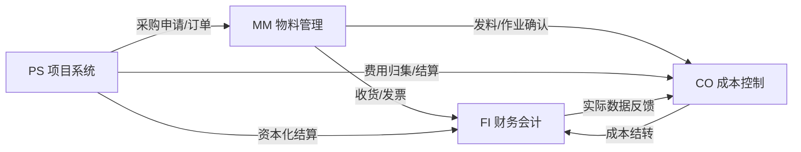
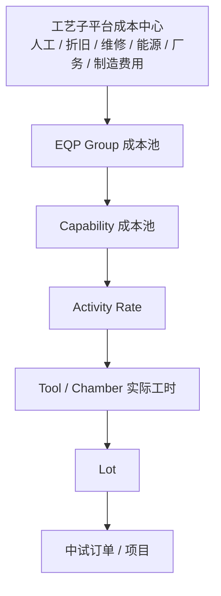
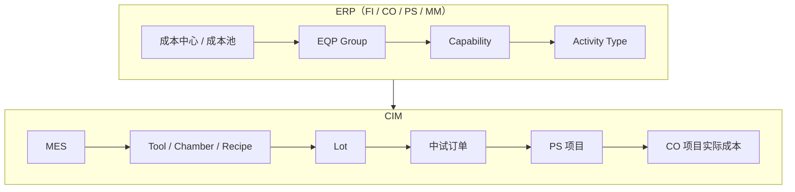

# ERP

SAP(Systeme, Anwendungen und Produkte in der Datenverarbeitung) 数据处理中的系统、应用和产品

ERP(Enterprise Resource Planning)

1. FI - 财务会计 - Financial Accounting
    - **核心定位：** **对外报告**.记录企业所有经济业务，生成符合会计准则（如 GAAP, IFRS）的法定财务报表.
    - **主要内容：**
        - **总账 (G/L)：** 科目表、凭证过账、期末结账.
        - **应收/应付 (AR/AP)：** 客户发票、收款、供应商发票、付款、账龄分析.
        - **资产会计 (AA)：** 固定资产购置、折旧、报废、重估.
        - **银行会计 (BL)：** 银企对账、电子支付、现金管理.
        - **特殊分类账：** 多币种、多账簿并行核算.
    - **关键产出：** 资产负债表、利润表、现金流量表.
2. CO - 管理会计 / 成本控制 - Controlling
    - **核心定位：** **对内管理**.为管理层提供决策支持，监控成本、预算和盈利能力.
    - **主要内容：**
        - **成本要素/中心会计：** 费用归集、分摊、分配.
        - **内部订单：** 研发项目、市场活动、维修工单的成本追踪.
        - **产品成本核算：** 标准成本估算、实际成本核算、差异分析（料/工/费）.
        - **获利能力分析：** 按客户/产品/区域/渠道分析边际贡献.
        - **利润中心会计：** 事业部/工厂级别的损益考核.
        - **预算与计划：** 年度预算编制、版本对比、预警.
    - **关键产出：** 成本分析报告、盈利分析报表、预算执行差异表.
3. PS - 项目系统 - Project System
    - **核心定位：** **项目全生命周期管理**.适用于资本性支出项目、大型研发、工程建设等复杂项目.
    - **主要内容：**
        - **WBS：** 将项目分解为可管理的层级任务.
        - **网络/活动：** 定义任务间的逻辑关系、工期、资源需求.
        - **里程碑：** 关键节点管控与触发付款/确认收入.
        - **预算管理：** 项目级预算下达、承诺控制、超支预警.
        - **进度与资源：** 甘特图、资源负荷分析、关键路径法.
        - **结算：** 将项目成本结算至在建工程、固定资产或费用科目.
    - **关键产出：** 项目进度报告、预算消耗报告、项目决算书.
4. MM - 物料管理 - Materials Management
    - **核心定位：** **供应链基础**.覆盖从采购到库存再到发票校验的完整物流链条.
    - **主要内容：**
        - **采购：** 采购申请、询价/报价、采购订单、合同管理.
        - **库存管理：** 收货、发货、转储、盘点、批次/序列号管理.
        - **物料主数据：** 物料编码、单位、重量、体积、采购/会计视图.
        - **发票校验：** 三单匹配、自动过账、暂估冲销.
        - **服务采购：** 非实物类服务的订购与验收.
        - **评估与账户确定：** 物料移动自动触发 FI 凭证的核心配置.
    - **关键产出：** 采购订单、入库单、库存台账、应付暂估.

- **MM ↔ FI：** 每一笔收货 / 发货 / 发票都会自动生成会计凭证（借：原材料 / 费用，贷：GR/IR 或应付账款）.这是 ERP 业财一体化的基石.
- **MM ↔ CO：** 生产领料计入生产成本中心；采购价差影响材料成本差异.
- **PS ↔ MM：** 项目所需物料通过 PS 触发 MM 采购；项目到货直接关联 WBS 元素.
- **PS ↔ CO：** 项目成本实时归集到 WBS；预算占用检查基于 CO 配置.
- **PS ↔ FI：** 项目完工后，成本从 WBS 结算至固定资产（AA）或在建工程.
- **CO ↔ FI：** CO 的数据源于 FI 的实际过账；CO 的调整分录也会回写 FI.

---

## ERP CO 资材视角 —— 作为 MES 上位系统的核心诉求

**一句话：** CO 要把成本从"工艺子平台成本中心"逐级分摊到 Lot / 中试订单 / PS 项目，就必须有 MES 提供的机台级实际报工数据.因此 ERP CO 对 MES 的核心诉求 = **按 Equipment / Chamber / Recipe 颗粒度，产出真实、可追溯的资源消耗与时间构成数据**（见末节"机台报工"）.

### 成本颗粒度

- 核算维度：Wafer / EMM / Work Center / Batch / Product.
- 组织形态：Plant Transfer 和 Super Plant 都有.
- XXX（原文占位，待补）.

### Plant Transfer 场景判定

| 场景                   | 是否 Plant Transfer | 是否内部结算               | 建议                               |
| ---------------------- | ------------------- | -------------------------- | ---------------------------------- |
| 同一条产线内部工序流转 | 否/逻辑流转         | 否                         | MES 内部 Lot 流转                  |
| 不同工艺子平台晶圆流转 | 是                  | 通常不做内部收入结算       | 库存/成本随产品流转                |
| 不同平台之间材料领用   | 是                  | 通常不做内部利润结算       | 成本跟随物料                       |
| 测试平台提供测试服务   | 不完全是            | **建议做内部作业分摊**     | Activity Type                      |
| 封装平台提供封装服务   | 不完全是            | **建议做内部作业分摊**     | Activity Type                      |
| 设备共享               | 否                  | 建议作业成本分摊           | Machine Hour                       |
| 能源/厂务服务          | 否                  | 建议成本分摊               | Activity Type                      |
| ~~不同法人主体之间~~   | ~~是~~              | ~~需要内部结算~~           | ~~Intercompany~~（已排除）         |
| ~~不同 Company Code~~  | ~~是~~              | ~~通常需要跨公司代码处理~~ | ~~Intercompany Billing~~（已排除） |

### 成本模型 L1-L8

| 层级                | 定义       | 主要责任     | 是否直接财务核算 |
| ------------------- | ---------- | ------------ | ---------------- |
| L1 工艺子平台       | 组织/产线  | 成本责任     | **是**           |
| L2 EQP Group        | 设备资源池 | 资源归集     | **是/成本池**    |
| L3 Capability       | 制造能力   | 能力成本     | **重点核算**     |
| L4 Equipment        | 具体设备   | 实际资源     | 明细追溯         |
| L5 Chamber          | 腔体       | 实际加工资源 | 明细追溯         |
| L6 Recipe           | 工艺参数   | 成本驱动因子 | 不作为成本中心   |
| L7 Lot              | 制造对象   | 成本承载对象 | **最终成本归集** |
| L8 中试订单/PS 项目 | 业务对象   | 项目经营核算 | **最终经营核算** |

**成本流转链：**

**ERP ↔ CIM 整体链路：** Activity Type / Activity Rate 是两个域的交接点——ERP 侧负责成本归集与费率，CIM/MES 侧负责实际执行与数据采集.

### 机台报工 —— MES 必须提供给 ERP CO 的数据

**数据产生链：**

MES 至少需要能够产生：

| 数据             | 用途         |
| ---------------- | ------------ |
| Tool ID          | 设备识别     |
| Chamber ID       | 实际资源识别 |
| Capability       | 能力识别     |
| Recipe           | 工艺识别     |
| Lot              | 成本对象     |
| Start Time       | 开始时间     |
| End Time         | 结束时间     |
| Process Time     | 加工时间     |
| Setup Time       | 准备时间     |
| Idle Time        | 空闲时间     |
| Engineering Time | 工程时间     |

然后把这些数据提供给 ERP CO，支撑 Activity Rate × 实际工时 的成本分摊与 Lot/项目级核算.
