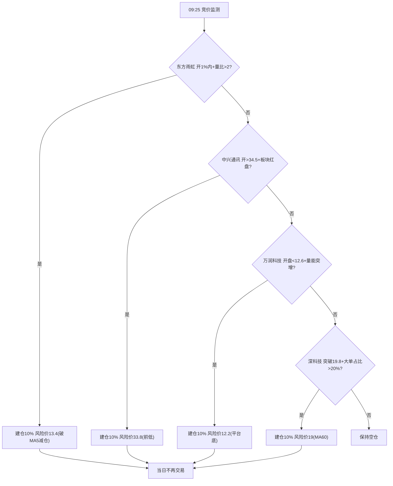

# 2025-03-28 周五

## 盘前

泰豪科技 | 动不了

中国海油 | 做 T 减仓位到 1 仓位, 盈利了换 中国石油

太阳电缆 |

紫金矿业 | 做 T, 维持 2 仓位

中国电信 | 做 T, 维持 1 仓位

纳指 ETF(159941) | 不动/清仓, 盈利了就换 纳斯达克 ETF(159632)+纳指科技 ETF(159509)

### 预期仓位

1 仓 停牌动不了

试错成本高阶段(8 仓):

| 资产类别 |                                      标的组合                                       | 仓位 | 仓数 |
| :------: | :---------------------------------------------------------------------------------: | :--: | :--: |
| 全球龙头 |             纳指 ETF(159941)/纳斯达克 ETF(159632)+纳指科技 ETF(159509)              | 20%  |  2   |
| 稳健防御 |                              三桶油(10%)+中国电信(10%)                              | 20%  |  2   |
| 周期防御 | 右侧交易超跌反弹小票(东方雨虹/中兴通讯/万润科技/深科技/上海贝岭)(10%)+紫金矿业(20%) | 30%  |  3   |
| 短线妖股 |                                    太阳电缆(20%)                                    | 20%  |  1   |
|   现金   |                                  国债逆回购(GC001)                                  | 10%  |  0   |

太阳电缆 策略:

|      情景      |               操作建议                |           逻辑依据           |
| :------------: | :-----------------------------------: | :--------------------------: |
| 竞价高开＞+3%  |       立即卖出 50%，剩余等冲高        | 诱多概率大，利用情绪反抽减亏 |
| 平开(-2%至+2%) | 观察放量阶段能否站上 7.9 元，否则清仓 |     7.9 元为套牢盘密集区     |
|   低开＞-5%    |     补仓 1 倍仓位，反弹至-3%T 出      |  利用量化程序的自动反抽机制  |

右侧交易超跌反弹小票 策略:

|   标的   | 赔率空间  |    均线系统     |        关键状态         |    资金信号     | 确定性 |     策略类型      | 优先级 |
| :------: | :-------: | :-------------: | :---------------------: | :-------------: | :----: | :---------------: | :----: |
| 东方雨虹 | 13.6-15.8 | MA60>MA55>MA20↑ | 涨价公告+站上 MA5(13.4) | 连续 3 日净流入 |  ★★★☆  |   事件驱动反弹    |   1    |
| 中兴通讯 |   34-38   | MA20>MA10>MA5↑  |   缩量企稳前低(33.5)    |  首日资金回流   |  ★★☆☆  |     技术反抽      |   2    |
| 万润科技 |  12.8-15  | MA55≈MA60(0.18) | MA5 下穿中长期线(-9.2%) |    地量企稳     |  ★★★☆  |     超跌反弹      |   3    |
|  深科技  |   19-22   | MA60>MA55>MA20↑ |   4 日站稳 MA60(19.2)   |  大单占比 38%   |  ★★☆☆  |     趋势跟随      |   4    |
| 上海贝岭 |   34-39   | MA60>MA55>MA20↓ |   缺口未补(35.2-34.8)   |  融资余额增 7%  |  ★★☆☆  | 缺口回补+业绩催化 |   5    |

### 盘前策略

## 早盘

## 下午盘

## 涨停梯队

3 板: 荣泰健康

2 板: 河化股份 凯美特气 至纯科技 华尔泰 冠石科技

## 涨停概念

### 机器人(5)

| 序号 | 股票名称 (股票代码) |     涨停原因     |                                                                                                                               动因                                                                                                                                | 涨停板数  | 连续涨停数 |
| :--: | :-----------------: | :--------------: | :---------------------------------------------------------------------------------------------------------------------------------------------------------------------------------------------------------------------------------------------------------------: | :-------: | :--------: |
|  1   | 荣泰健康 (sh603579) |      机器人      |                                                         公司于 2025 年 3 月 13 日成立上海阿而泰机器人有限公司，经营范围包含：特殊作业机器人制造；工业机器人制造；智能机器人的研发；人工智能应用软件开发等                                                         | 3 天 3 板 |     3      |
|  2   | 振邦智能 (sz003028) |      机器人      |                                                                                            2024 年 1 月 8 日公司接受调研时表示，公司目前主要布局清洁机器人、割草机器人                                                                                            |           |     1      |
|  3   | 雪龙集团 (sh603949) | 间接持股宇树科技 |                                                                       雪龙集团在互动平台表示，公司作为有限合伙人通过深创投中小企业发展基金（新疆）有限合伙企业间接持股杭州宇树科技有限公司                                                                        |           |     1      |
|  4   | 福达股份 (sh603166) |   核电+机器人    | 1. 公司与阿尔芬签订合资合作协议，双方共同投资设立合资公司福达阿尔芬，借助阿尔芬的技术力量、客户渠道等，共同开拓船舶、核电以及大型工程机械所需曲轴市场。 2. 公司在 2024 年半年报中透露，公司持续关注机器人零部件产业的迅速发展，在机器人减速器产品上已获得相应成果 |           |     1      |
|  5   | 新亚电缆 (sz001382) |      机器人      |                                                                                        公司的主要产品为电力电缆、电气装备用电线电缆及架空导线等，机器人电缆正处于研发阶段                                                                                         |           |     1      |

### 化工(4)

| 序号 | 股票名称 (股票代码) | 涨停原因  |                                                                                                                                                  动因                                                                                                                                                   | 涨停板数  | 连续涨停数 |
| :--: | :-----------------: | :-------: | :-----------------------------------------------------------------------------------------------------------------------------------------------------------------------------------------------------------------------------------------------------------------------------------------------------: | :-------: | :--------: |
|  1   | 河化股份 (sz000953) | 化肥+甲醇 |                                                    公司主要经营范围仍为尿素、液体二氧化碳、液氨、甲醇等产品的生产与销售。尿素产品实现的营业收入占公司营业收入总额的 90％以上，液体二氧化碳、液氨、甲醇等产品实现的营业收入占公司营业收入总额约 10％                                                     | 2 天 2 板 |     2      |
|  2   |  华尔泰 (sz001217)  |   硫酸    |                                                                                 公司致力于化工产品的研发、生产与销售，已发展成为以合成氨、硝酸、硫酸、双氧水等基础化工产品为基础，以精细化工产品为方向的综合型化工企业                                                                                  | 2 天 2 板 |     2      |
|  3   | 光华股份 (sz001333) | 业绩+IPD  | 1. 光华股份公告称，光华股份发布 2024 年年度报告摘要，公司实现营业收入 17.24 亿元，同比增长 16.48%；归属于上市公司股东的净利润 1.46 亿元，同比增长 39.10%。拟每 10 股派发现金红利 3.60 元（含税）。 2. 光华股份的主要产品包括 TGIC 固化聚酯树脂、HAA 固化聚酯树脂、IPDI 固化聚酯树脂、环氧固化聚酯树脂等 |           |     1      |
|  4   | 麦加芯彩 (sh603062) | 化工+风电 |     1. 公司是一家致力于研发、生产和销售高性能多品类涂料产品的高新技术企业。公司生产的涂料按照分散介质划分，主要分为水性涂料及辅料、油性涂料及辅料和无溶剂涂料及辅料。 2. 公司风力发电设备防护涂层系列产品可以应用到风电叶片涂层防护及塔筒保护领域，目前已在国内主要风电叶片厂成功应用并且得到了认可     |           |     1      |

### 文化传媒(3)

| 序号 | 股票名称 (股票代码) | 涨停原因 |                                                                                       动因                                                                                       | 涨停板数 | 连续涨停数 |
| :--: | :-----------------: | :------: | :------------------------------------------------------------------------------------------------------------------------------------------------------------------------------: | :------: | :--------: |
|  1   | 上海电影 (sh601595) |   影视   |          公司控股股东为上海电影（集团）有限公司，控股股东上影集团是本行业产业链最为完整的综合性影业集团之一，在制片、制作、影视基地和影视技术等领域均拥有成熟的行业经验          |          |     1      |
|  2   | 国脉文化 (sz301052) |   影视   | 2021 年 12 月 21 日公告，公司于 2021 年 2 月 9 日与亭东影业在公司会议室签署《电影投资合作协议》，投资 1300 万元购买新电影 5%投资份额。截至目前，该片已经拍摄完成，定名为《四海》 |          |     1      |
|  3   | 新华文轩 (sh601811) |   出版   |                                                       公司是我国第一家按照上市公众公司标准规范设立的大型股份制出版发行企业                                                       |          |     1      |

### 核电(3)

| 序号 | 股票名称 (股票代码) |  涨停原因   |                                                                                                                   动因                                                                                                                    | 涨停板数  | 连续涨停数 |
| :--: | :-----------------: | :---------: | :---------------------------------------------------------------------------------------------------------------------------------------------------------------------------------------------------------------------------------------: | :-------: | :--------: |
|  1   | 合锻智能 (sh603011) | 核聚变+算力 | 1. 公司核聚变业务主要致力于解决聚变堆复杂部件的研发制造，已经参与了聚变堆、真空室、偏滤器等核心部件的制造预研工作。 2. 公司基于国内外一线 AI 芯片厂家的产品，打造自己的专用硬件算力平台，在平台支撑下自主研发并部署传统算法及 AI 专用算法 |           |     1      |
|  2   | 雪人股份 (sz002639) | 可控核聚变  |                                                 公司已为中科院合肥物质研究所、理化所等多所研究院提供氦气螺杆压缩机，分别应用于全超导托克马克核聚变实验装置、航天试验等大科学工程应用领域                                                  | 4 天 2 板 |     1      |
|  3   |  哈空调 (sh600202)  |    核电     |                                  公司从事的主营业务为各种高、中、低压空冷器的设计、制造和销售。主要产品包括石化空冷器和电站空冷器。此外，公司还设计、制造和销售核电站空气处理机组产品及其他工业空调产品                                   |           |     1      |

### 芯片产业链(3)

| 序号 | 股票名称 (股票代码) |  涨停原因  |                                                                             动因                                                                             | 涨停板数  | 连续涨停数 |
| :--: | :-----------------: | :--------: | :----------------------------------------------------------------------------------------------------------------------------------------------------------: | :-------: | :--------: |
|  1   | 凯美特气 (sz002549) |   光刻气   |                                                    公司光刻气产品通过 ASML 子公司 Cymer 的合格供应商认证                                                     | 2 天 2 板 |     2      |
|  2   | 冠石科技 (sh605588) | 半导体材料 |   公司主营业务为半导体显示器件及特种胶粘材料的研发、生产和销售，其中半导体显示器件包括偏光片、功能性器件、信号连接器、液晶面板、生产辅耗材及 OCA 光学胶等    | 2 天 2 板 |     2      |
|  3   | 至纯科技 (sh603690) | 半导体设备 | 公司是国内主流气体化学品相关的高纯工艺系统及半导体装备的合格供应商，高纯工艺系统产品主要包括气体高纯工艺设备及系统、化学品高纯工艺设备及系统以及物料及水系统 | 2 天 2 板 |     2      |

### 光伏(3)

| 序号 | 股票名称 (股票代码) |  涨停原因   |                                                        动因                                                        | 涨停板数 | 连续涨停数 |
| :--: | :-----------------: | :---------: | :----------------------------------------------------------------------------------------------------------------: | :------: | :--------: |
|  1   | 欧晶科技 (sz001269) | 光伏+半导体 | 公司主要产品为直拉单晶硅用电弧石英坩埚，产品主要应用于光伏和半导体领域，可支持太阳能和半导体用户高温条件下连续拉晶 |          |     1      |
|  2   | 森特股份 (sh603098) |    光伏     |                公司主要致力于光伏系统、光伏电站项目的投资、开发、设计、销售、系统运行维护、售后服务                |          |     1      |
|  3   | 恒星科技 (sz002132) |    光伏     |                公司目前在光伏领域涉及太阳能光伏用多晶硅片产品及切割多（单）晶硅片的超精细金刚线产品                |          |     1      |

### 医药(1)

| 序号 | 股票名称 (股票代码) |     涨停原因      |                                                                                                               动因                                                                                                               | 涨停板数 | 连续涨停数 |
| :--: | :-----------------: | :---------------: | :------------------------------------------------------------------------------------------------------------------------------------------------------------------------------------------------------------------------------: | :------: | :--------: |
|  1   | 四环生物 (sz000518) | 医疗器械+细胞治疗 | 1. 公司是一家以生物医学技术及传统医药相结合的药品生产企业，主营肝炎诊断试剂、注射剂、体外诊断试剂等。 2. 2023 年公司研发项目包括新型干细胞培养技术，目的为通过对干细胞培养技术的研究，以期在未来将干细胞技术应用于人类疾病的治疗 |          |     1      |

### 稀土永磁(1)

| 序号 | 股票名称 (股票代码) |   涨停原因    |                                                                                                                                     动因                                                                                                                                      | 涨停板数 | 连续涨停数 |
| :--: | :-----------------: | :-----------: | :---------------------------------------------------------------------------------------------------------------------------------------------------------------------------------------------------------------------------------------------------------------------------: | :------: | :--------: |
|  1   | 华宏科技 (sz002645) | 稀土+汽车拆解 | 1. 公司旗下全资子公司鑫泰科技主营业务为稀土废料的综合利用，即通过钕铁硼废料、荧光粉废料生产高纯稀土氧化物，其全资子公司中杭新材从事稀土永磁材料生产业务。 2. 公司是再生资源加工装备专业制造商和综合服务提供商，再生资源运营业务主要以废钢加工、贸易和报废汽车综合回收利用为主 |          |     1      |

### 算力工程(1)

| 序号 | 股票名称 (股票代码) | 涨停原因 |                                                                                                                               动因                                                                                                                               | 涨停板数 | 连续涨停数 |
| :--: | :-----------------: | :------: | :--------------------------------------------------------------------------------------------------------------------------------------------------------------------------------------------------------------------------------------------------------------: | :------: | :--------: |
|  1   | 大位科技 (sh600589) |   算力   | 公司聚焦主业完成由数据中心、云计算中心向算力中心的业务转型，张北算力中心项目位于国家八大算力枢纽之一的张家口算力集群。公司将在算力基础设施建设运营的基础上，向客户提供垂直算力服务，并基于国家八大算力枢纽建设主算力节点，结合边缘算力开展云网一体化垂直算力服务 |          |     1      |

### ST 股(3)

| 序号 | 股票名称 (股票代码)  | 涨停原因 |                                               动因                                               | 涨停板数 | 连续涨停数 |
| :--: | :------------------: | :------: | :----------------------------------------------------------------------------------------------: | :------: | :--------: |
|  1   | \*ST 九有 (sh600462) |  ST 股   |                         公司原主营新闻纸、商品木浆、胶版纸等的生产与销售                         |          |     1      |
|  2   |  ST 恒久 (sz002808)  |  ST 股   | 公司的控股子公司福建省闽保信息技术有限公司是一家从事信息安全领域软件开发及系统集成的高新技术企业 |          |     1      |
|  3   |  ST 花王 (sh603007)  |  ST 股   | 公司是一家集园林景观、市政工程、河湖整治、生态治理、文体文旅等多领域业务于一体的生态工程建设企业 |          |     1      |

### 其他(8)

| 序号 | 股票名称 (股票代码) |   涨停原因   |                                                                                               动因                                                                                                | 涨停板数  | 连续涨停数 |
| :--: | :-----------------: | :----------: | :-----------------------------------------------------------------------------------------------------------------------------------------------------------------------------------------------: | :-------: | :--------: |
|  1   | 和顺石油 (sh603353) |   华为超充   | 2023 年 11 月 24 日公司在官网披露，公司与华为数字能源技术有限公司、深圳市新顺能科技有限公司签署三方战略合作协议，三方会基于智能超快充数据技术，并融合 AI 等新技术应用，共同合作智能超快充数据平台 | 3 天 2 板 |     1      |
|  2   | 润都股份 (sz002923) |     烟碱     |                                                     子公司润都制药（荆门）有限公司生产的电子烟用烟碱品质获得客户普遍认可，并已形成商业化销售                                                      | 4 天 2 板 |     1      |
|  3   | 天普股份 (sh605255) |  汽车零部件  |             公司主营产品为汽车用高分子材料流体管路系统及密封系统零件及总成，目前与全球日产、吉利汽车、一汽轿车、江铃汽车等客户合作开发其新能源车型产品，配套产品以橡胶管与总成管为主              |           |     1      |
|  4   | 西部黄金 (sh601069) |     黄金     |                               公司主营业务为黄金采选及冶炼，同时从事铬矿石的开采。公司主要产品包括黄金、铬矿石、铁矿石，其中黄金是公司最主要的产品和最主要收入来源                                |           |     1      |
|  5   | 新力金融 (sh600318) |   多元金融   |                                             实际控制人为安徽省供销合作社联合社。公司以农村金融服务为特色，以互联网金融为核心的综合性现代金融服务企业                                              |           |     1      |
|  6   | 德尔未来 (sz002631) |     地板     |            国内地板龙头之一，2017 年完善了地板强化、实木复合、实木的全品类系列，逐步完善全屋空间定制（板、衣柜、橱柜、木门、软装等），整合研发、销售网络、安装服务满足消费者差异化需求            |           |     1      |
|  7   | 云南城投 (sh600239) |    房地产    |                                                公司经营范围涵盖房地产开发与经营、商品房销售、房屋租赁、基础设施建设投资、土地开发、项目投资与管理                                                 |           |     1      |
|  8   | 永利股份 (sz300230) | 精密模塑产品 |                                                                   公司精密模塑产品包含智能家居产品配件、智能益智教育产品配件等                                                                    |           |     1      |

## 复盘

### 泰豪科技 | 数据中心应急电源(02/24)+数据中心电力(02/21)+数据中心电源(02/20)

### 中国海油 | 沪深 300+上证 180+石油行业板块

2 仓位

### 中国电信 | 沪深 300+上证 50+通信服务板块+国资云(02/21)

2 仓位

### 紫金矿业 | 沪深 300+上证 50+有色金属板块

2 仓位

### 长江电力 | 沪深 300+上证 50+电力行业板块

1 仓位

### 山东黄金 | 沪深 300+上证 180+贵金属板块

1 仓位
