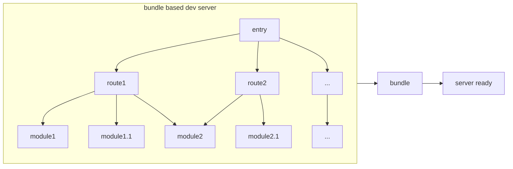
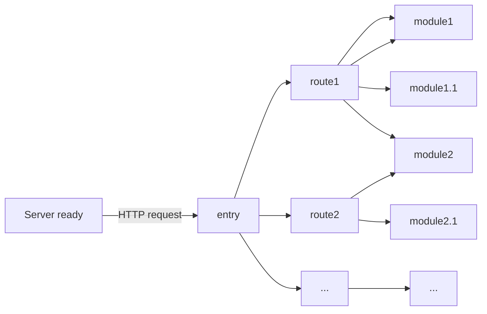

创建项目:(`node -v` v20.17.0)

vscode 打开文件夹, 打开 vscode terminal:

1. `npm create vite@latest` / `npm create vue@latest`(推荐) / `npm init vite@latest {project-name} --template vue-ts`
2. 其他全选 no
3. open with vscode 打开新项目 terminal `npm i`
4. `npm run dev` 测试通过

`npm install element-plus`
`npm install @element-plus/icons-vue`

@see: https://element-plus.org/zh-CN/guide/quickstart.html

`npm install -D @types/node`

main.ts:

```ts
import { createApp } from "vue";
import App from "@/App.vue";
import ElementPlus from "element-plus";
import "element-plus/dist/index.css";
import zhCn from "element-plus/es/locale/lang/zh-cn";
import * as ElementPlusIconsVue from "@element-plus/icons-vue";

const app = createApp(App);

for (const [key, component] of Object.entries(ElementPlusIconsVue)) {
    app.component(key, component);
}
app.use(ElementPlus, {
    locale: zhCn,
});
app.mount("#app");
```

关于别名 alias, 用上面的办法创建自动就有别名 '@' 了

# env

`.env.development`, `.env.production` 必须这样命名, 否则取不到

在 package.json 的 scripts 中配置:

```json
    "scripts": {
        "dev": "vite --open",
        "build:prod": "vue-tsc && vite build --mode production"
    },
```

TypeScript 智能提示:

修改 `env.d.ts`:

```ts
/// <reference types="vite/client" />

interface ImportMetaEnv {
    readonly VITE_APP_TITLE: string;
    // 更多环境变量...
}

interface ImportMeta {
    readonly env: ImportMetaEnv;
}
```

之后就能用 import.meta.env 获取环境变量

# svg 图标

`npm i vite-plugin-svg-icons -D`
`npm i fast-glob -D`

vite.config.ts:

```ts
import { fileURLToPath, URL } from "node:url";

import { defineConfig } from "vite";
import vue from "@vitejs/plugin-vue";
import path from "path";
import { createSvgIconsPlugin } from "vite-plugin-svg-icons";

// https://vitejs.dev/config/
export default defineConfig({
    plugins: [
        vue(),
        createSvgIconsPlugin({
            iconDirs: [path.resolve(process.cwd(), "src/assets/icons")],
            symbolId: "icon-[dir]-[name]",
        }),
    ],
    resolve: {
        alias: {
            "@": fileURLToPath(new URL("./src", import.meta.url)),
        },
    },
});
```

并在入口 main.ts 引入:

```ts
import "virtual:svg-icons-register";
```

阿里图标下载 @see: https://www.iconfont.cn/

> > 注意: 复制/下载 svg 代码时记得关闭 darkreader, 否则会自动识别(默认填充要是 fill)

# mock

`npm i -D vite-plugin-mock@2.9.6`

# axios

`npm i axios`

# router

`npm i vue-router`

# pinia

`npm i pinia`

# async

async 函数返回 Promise 对象

# v-for vs v-if vs v-show

优先级:

1. v-for: 这个指令总是首先被处理. 当你在列表上使用 v-for 时，Vue 会基于提供的数组创建一个项目列表.
2. v-if: 这个指令在 v-for 之后进行评估. 当你在同一个元素上同时使用 v-for 和 v-if 时，v-if 不会应用于整个列表；相反，它会在列表被创建后应用于每个项目. 这意味着只有满足 v-if 条件的项目会被渲染.
3. v-show: 这个指令最后被评估. 它并不真正从 DOM 中移除元素，而是使用 CSS 切换它们的可见性. 由于它是在 v-for 和 v-if 之后应用的，因此它会用于显示或隐藏已经渲染的项目.

总结:

1. 总是先使用 v-for
2. 然后应用 v-if 条件性地渲染列表中的元素
3. 最后使用 v-show 切换可见性而不移除 DOM 中的元素

# 进度条

`npm i nprogress`

`npm i --save-dev @types/nprogress`

修改进度条颜色:

node_modules/nprogress/nprogress.css

```css
#nprogress .bar {
}
```

# Vue3 vs Vue2

Vue3 推荐 组合式 API + TS + setup 语法糖

核心: ref, reactive, computed, watch, 生命周期

常用: hooks, 自定义 ref, 路由, pinia, mitt

1. 打包减少 41%
2. 初次渲染快 55%, 更新渲染快 133%
3. 内存减少 54%
4. Proxy 代替 defineProperty 实现响应式
5. 重写虚拟 DOM 的实现和 Tree-Shaking
6. Composition API (组合式 API)
    - setup
    - ref & reactive
    - computed & watch
7. 新的内置组件
    - Fragment
    - Teleport
    - Suspense
8. data 选项始终被声明为一个函数
9. 一处 keyCode 支持作为 v-on 的修饰符
10. 新的生命周期钩子

vue3 基本不用 vue-cli 创建, 官方推荐 Vite 创建

vue2 用的 选项式 API(Options API), e.g.:

```js
<script>
export default {
    name: 'xxx',
    data() {
        ...
    },
    methods {
        ...
    },
}
</script>
```

`name`, `data()`, `methods` 都是选项/配置项, 如果要新增/修改一个需求, 就要分别修改 data, methods, computed, watch, 不便于维护和复用

vue3 的 Composition API 就是通过 function 来把 data, methods, computed, watch 里面每个业务组合起来, 分别放在不同的 function 里, 每次仅需要修改 function, 通过 setup 配置项(内容是 function)实现

# vite

-   轻量快速热重载(HMR), 能实现激素的服务启动
-   对 TS, JSX, CSS 等支持开箱即用
-   按需编译, 不许等待整个应用编译完成
-   于 webpack 不同的构建

webpack 如果 route 多了就会慢, vite 上来就是 server ready -> entry

webpack:



vite:



# get start

Install Node.js version 18.3 or higher

```cmd
node -v
where node
```

https://nodejs.org/en 下载 LTS 版本

cmd: `npm create vue@latest`

√ Add TypeScript? ... No / **Yes**

√ Add JSX Support? ... **No** / Yes

√ Add Vue Router for Single Page Application development? ... **No** / Yes (实际开发 YES)

√ Add Pinia for state management? ... **No** / Yes (实际开发 YES)

√ Add Vitest for Unit Testing? ... **No** / Yes

√ Add an End-to-End Testing Solution? » No
? Add ESLint for code quality? » **No** / Yes

打开项目, vscode termial: `npm i`

腾讯云镜像源:

```
npm config set registry http://mirrors.cloud.tencent.com/npm/
npm config get registry
```

淘宝镜像源:

```
npm config set registry https://registry.npmmirror.com
npm config get registry
```

华为云镜像源:

```
npm config set registry https://mirrors.huaweicloud.com/repository/npm/
npm config get registry
```

如果出现 `tsconfig.app.json`, `tsconfig.node.json` 报红: `"extends": "@vue/tsconfig/tsconfig.dom.json",` 或者 `"extends": "@tsconfig/node20/tsconfig.json",`

手动添加`"moduleResolution":"node",`:

```json
{
    "extends": "@vue/tsconfig/tsconfig.dom.json",
    "include": ["env.d.ts", "src/**/*", "src/**/*.vue"],
    "exclude": ["src/**/__tests__/*"],
    "compilerOptions": {
        "composite": true,
        "tsBuildInfoFile": "./node_modules/.tmp/tsconfig.app.tsbuildinfo",
        "moduleResolution": "node",
        "baseUrl": ".",
        "paths": {
            "@/*": ["./src/*"]
        }
    }
}
```

```json
{
    "extends": "@tsconfig/node20/tsconfig.json",
    "include": [
        "vite.config.*",
        "vitest.config.*",
        "cypress.config.*",
        "nightwatch.conf.*",
        "playwright.config.*"
    ],
    "compilerOptions": {
        "composite": true,
        "noEmit": true,
        "tsBuildInfoFile": "./node_modules/.tmp/tsconfig.node.tsbuildinfo",
        "moduleResolution": "node",
        "module": "ESNext",
        "moduleResolution": "Bundler",
        "types": ["node"]
    }
}
```

## basic guid with e.g. and description

## `App.vue`

```vue
<template></template>

<script lang="ts"></script>

<style></style>
```

## setup()

用了 setup 就不需要 `data(){}, methods: {}` 了, 但是非要用 data, methods, 在 setup 外可以写出来,而且在 data, methods 仍然能用 this, 读取 setup 里的数据

但是 setup 读不到 data, methods 里的数据, 都是 undefined

setup 在 beforeCreate 钩子之前就产生

```vue
<script lang="ts">
export default {
    name: "Person",
    setup() {
        let obj = "obj";

        function changeObj() {
            obj = "newObj";
        }

        return { a: obj, changeObj };
    },
};
</script>
```

setup() 返回对象, 直接给 template 使用, e.g. `{{a}}`

setup 中没有维护 `this`, 是 undefined

setup 语法糖:

```vue
<script lang="ts">
export default {
    name: "A",
};
</script>

<script lang="ts" setup>
let a = 'a'

function changeA() {
    ...
}
</script>
```

相当于不需要逐一 return let 的对象和 function, 还能合成一个, 但需要插件: `npm i vite-plugin-vue-setup-extend`, 并修改 `vite.config.ts`添加 import:

```ts
import vueSetupExtend from "vite-plugin-vue-setup-extend";

// https://vitejs.dev/config/
export default defineConfig({
    plugins: [vue(), vueSetupExtend()],
    resolve: {
        alias: {
            "@": fileURLToPath(new URL("./src", import.meta.url)),
        },
    },
});
```

然后就可以去掉 export default 了, 只需要在 `<>` 中添加 name

```vue
<script lang="ts" setup name="xxx123"></script>
```

但这种场景比较少见, 因为一般 xxx.vue, 在引用的时候就叫 xxx, 很少需要改名

还有种情况就是 components 里每个 vue 文件都叫 index.vue,比如 components/a/index.uve, components/b/index.vue, 这种情况下, 就需要改名了

## ref reactive

上面 setup() 里 let 的对象都不是响应式的

想让什么数据变响应式, 就用 ref 包裹

```vue
<script lang="ts" setup name="Person">
import { ref } from "vue";
let a = ref(a);
</script>
```

ref 就是把所有东西变成对象 RefImpl, a.value 才是真实值

ref: 可以定义 基本类型 && 对象类型 数据

reactive: 只能定义 对象类型 数据

用 `import { reactive } from "vue";`, 然后将对象用 reactive 包裹后: let a = reactive({b: '1', c: 2}), 就不是一个单纯的对象, 而是一个 Proxy(Object), 对象的内容在 Proxy.target 里, Proxy 是原生 js 自带的

ref 处理对象类型的响应式数据实际底层还是用的 reactive, 即 RefImpl -> value: Proxy(Object)

区别:

1. ref 创建的变量必须使用 .value
2. reactive 重新分配一个新对象, 会失去响应式(可以用 Object.assign 去整体替换, 如下)

```js
let a = reactive({ a: "a", b: 1 });
let b = ref({ c: "c", d: 1 });

function changeA() {
    Object.assign(a, { a: "newA", b: 2 });
}

function changeB() {
    b.value = { c: "newC", d: 2 };
}
```

所以 .value 也有好处, 可以整个替换

使用原则:

1. 若需要一个基本类型的响应式数据, 必须使用 ref
2. 若需要一个响应式对象, 层级不深, ref, reactive 都可以
3. 若需要一个响应式对象, 层级较深, 推荐使用 reactive

注意:

1. 如果是自定义的 ref 对象, 必须用 .value
2. 如果是 reactive 包裹的 ref 对象, 不需要 .value, 读取的时候会自动拆包读 .value 属性

## toRefs & toRef

都是用来解构的

toRefs 就是把一个 reative 对象转成 ObjectRefImpl 对象

也就是 reactive 对象变成了一个 ref 对象, 然后通过 .value 获取值

相当于 toRefs 把 reactive({obj}) 里每一个层级都变成了带 .value 的 ref 对象, 并且 reactive 对象本身跟随着一起变成了响应式的(或者说, 本来就是响应式, 里面的值被跟随着变成新的赋值对象的响应式了), e.g.

```vue
<template>
    <div class="person">
        <h2>姓名: {{ person.name }}</h2>
        <h2>年龄: {{ person.age }}</h2>
        <button @click="changeName">修改名字</button>
        <button @click="changeAge">修改年龄</button>
    </div>
</template>

<script lang="ts" setup name="Person">
import { reactive, toRefs } from "vue";

let person = reactive({ name: "zhangsan", age: 18 });

let { name, age } = toRefs(person);

function changeName() {
    name.value += "-";
    console.log(name.value, person.name);
}

function changeAge() {
    age.value += 1;
}
</script>
```

toRef 用的不多, 就是仅仅把 reactive 中某一个层级修改成 ref 对象

## computed

```js
import { computed } from "vue";

// 只读 Cannot assign to 'value' because it is a read-only property.
let xxx = computed(() => {
    return abc;
});
```

let computed 是有缓存的, function 是没缓存的

下面是通过 get, set 实现 computed 可写入, e.g.

```vue
<template>
    <div class="person">
        姓: <input type="text" v-model="firstName" />
        <br />
        名: <input type="text" v-model="lastName" />
        <br />
        全名:
        <span>{{ fullName }}</span>
        <button @click="changeFullName">修改全名</button>
    </div>
</template>

<script lang="ts" setup name="Person">
import { ref, computed } from "vue";

let firstName = ref("zhang");
let lastName = ref("san");

let fullName = computed({
    get() {
        return (
            firstName.value.slice(0, 1).toUpperCase() +
            firstName.value.slice(1) +
            lastName.value
        );
    },
    set(val) {
        const [str1, str2] = val.split("-");
        firstName.value = str1;
        lastName.value = str2;
    },
});

function changeFullName() {
    fullName.value = "li-si";
}
</script>
```

## watch

作用: 监视数据的变化

监视四种数据:

1. ref 定义的数据
2. reactive 定义的数据
3. function 返回一个值 (getter 函数)
4. 一个包含上述内容的数组

watch 是一个函数, 返回的是一个停止函数

### 情况一

```vue
<template>
    <div class="person">
        <h1>情况一: 监视 ref 定义的 基本类型 数据</h1>
        <h2>当前求和为: {{ sum }}</h2>
        <button @click="changeSum">点我sum+1</button>
    </div>
</template>

<script lang="ts" setup name="Person">
import { ref, watch } from "vue";

let sum = ref(0);

function changeSum() {
    sum.value++;
}

const stopWatch = watch(sum, (oldValue, newValue) => {
    console.log("old: " + oldValue + "; new: " + newValue);
    if (newValue >= 10) {
        stopWatch();
    }
});
</script>
```

### 情况二

```vue
<template>
    <div class="person">
        <h1>情况二: 监视 ref 定义的 对象类型 数据</h1>
        <h2>姓名: {{ person.name }}</h2>
        <h2>姓名: {{ person.age }}</h2>
        <button @click="changeName">修改名字</button>
        <button @click="changeAge">修改年龄</button>
        <button @click="changePerson">修改人</button>
    </div>
</template>

<script lang="ts" setup name="Person">
import { ref, watch } from "vue";

let person = ref({
    name: "张三",
    age: 18,
});

function changeName() {
    person.value.name += "-";
}

function changeAge() {
    person.value.age += 1;
}

function changePerson() {
    person.value = { name: "李四", age: 30 };
}

// 监视的是 ref 对象的地址值, 若想监视对象内部属性的变化, 需要手动开启
watch(
    person,
    (oldValue, newValue) => {
        console.log(oldValue, newValue);
    },
    { deep: true }
);
</script>
```

Q: 为什么 newValue 和 oldValue 没变?

A: 因为监听的都是 person 的地址值, 而没有监听新 new 出来的对象, 实际也不会用 old, new value, 直接一个 `(value) => {}` 就好了, 拿到的就是默认最新的值

### 情况三

```vue
<template>
    <div class="person">
        <h1>情况三: 监视 reactive 定义的 对象类型 数据</h1>
        <h2>姓名: {{ person.name }}</h2>
        <h2>姓名: {{ person.age }}</h2>
        <button @click="changeName">修改名字</button>
        <button @click="changeAge">修改年龄</button>
        <button @click="changePerson">修改人</button>
        <br />
        <h2>测试: {{ obj.a.b.c }}</h2>
        <button @click="changeObj">修改obj</button>
    </div>
</template>

<script lang="ts" setup name="Person">
import { reactive, watch } from "vue";

let person = reactive({
    name: "张三",
    age: 18,
});
let obj = reactive({
    a: {
        b: {
            c: 666,
        },
    },
});

function changeName() {
    person.name += "-";
}

function changeAge() {
    person.age += 1;
}

function changePerson() {
    Object.assign(person, { name: "李四", age: 20 });
}

function changeObj() {
    obj.a.b.c = 888;
}

// 监听 reactive 定义的 对象类型 数据, 隐式的创建了deep :true, 且这个深度监听无法通过false关闭
watch(person, (oldValue, newValue) => {
    console.log(oldValue, newValue);
});
watch(obj, (newValue, oldValue) => {
    console.log("obj changed", newValue, oldValue);
});
</script>
```

### 情况四

```vue
<template>
    <div class="person">
        <h1>情况四: 监视 ref 或 reactive 定义的 对象类型 数据</h1>
        <h2>姓名: {{ person.name }}</h2>
        <h2>年龄: {{ person.age }}</h2>
        <h2>汽车: {{ person.car.c1 }}, {{ person.car.c2 }}</h2>
        <button @click="changeName">修改名字</button>
        <button @click="changeAge">修改年龄</button>
        <button @click="changeC1">修改第一台车</button>
        <button @click="changeC2">修改第二台车</button>
        <button @click="changeCar">修改整个车</button>
    </div>
</template>

<script lang="ts" setup name="Person">
import { reactive, watch } from "vue";

let person = reactive({
    name: "张三",
    age: 18,
    car: {
        c1: "奔驰",
        c2: "宝马",
    },
});

function changeName() {
    person.name += "-";
}

function changeAge() {
    person.age += 1;
}

function changeC1() {
    person.car.c1 = "奥迪";
}

function changeC2() {
    person.car.c2 = "大众";
}

function changeCar() {
    person.car = { c1: "比亚迪", c2: "路虎" };
}

// 两种写法等效, 都是监听 getter 函数
// watch(
//     () => {
//         return person.name;
//     },
//     (newValue, oldValue) => {
//         console.log("person.name changed", newValue, oldValue);
//     }
// );
watch(
    () => person.name,
    (newValue, oldValue) => {
        console.log("person.name changed", newValue, oldValue);
    }
);
watch(
    () => person.age,
    (newValue, oldValue) => {
        console.log("person.age changed", newValue, oldValue);
    }
);
// 但是这样可以监听 car.c1, car.c2, 但是 car 对象地址发生变化就无法监听
// watch(person.car, (newValue, oldValue) => {
//     console.log("person.car changed", newValue, oldValue);
// });

// 这样监听的就是 person.car 对象, 但是无法监听 person.car.c1, person.car.c2里面具体内容
// watch(
//     () => person.car,
//     (newValue, oldValue) => {
//         console.log("person.car changed", newValue, oldValue);
//     }
// );

// 这样 对象和值 都能被监听, 也是官网推荐的监听写法
watch(
    () => person.car,
    (newValue, oldValue) => {
        console.log("person.car changed", newValue, oldValue);
    },
    { deep: true }
);
</script>
```

### 情况五

```vue
<template>
    <div class="person">
        <h1>情况五: 监视 多个 数据</h1>
        <h2>姓名: {{ person.name }}</h2>
        <h2>年龄: {{ person.age }}</h2>
        <h2>汽车: {{ person.car.c1 }}, {{ person.car.c2 }}</h2>
        <button @click="changeName">修改名字</button>
        <button @click="changeAge">修改年龄</button>
        <button @click="changeC1">修改第一台车</button>
        <button @click="changeC2">修改第二台车</button>
        <button @click="changeCar">修改整个车</button>
    </div>
</template>

<script lang="ts" setup name="Person">
import { reactive, watch } from "vue";

let person = reactive({
    name: "张三",
    age: 18,
    car: {
        c1: "奔驰",
        c2: "宝马",
    },
});

function changeName() {
    person.name += "-";
}

function changeAge() {
    person.age += 1;
}

function changeC1() {
    person.car.c1 = "奥迪";
}

function changeC2() {
    person.car.c2 = "大众";
}

function changeCar() {
    person.car = { c1: "比亚迪", c2: "路虎" };
}

// 监视多个数据: person.name, person.car.c1, new/old value 是前面的数组
watch(
    [() => person.name, () => person.car.c1],
    (newValue, oldValue) => {
        console.log("person changed", newValue, oldValue);
    },
    { deep: true }
);
</script>
```

## watchEffect

实际开发用的比 watch 多

```vue
<template>
    <div class="person">
        <h2>需求: 当水温达到60度, 或水位达到80cm, 给服务器发请求</h2>
        <h2>当前水温: {{ temp }} °C</h2>
        <h2>当前水位: {{ height }} cm</h2>
        <button @click="changeTemp">水温+10</button>
        <button @click="changeHeight">水位+10</button>
    </div>
</template>

<script lang="ts" setup name="Person">
import { ref, watch, watchEffect } from "vue";

let temp = ref(10);
let height = ref(0);

function changeTemp() {
    temp.value += 10;
}
function changeHeight() {
    height.value += 10;
}

// watch([temp, height], (value) => {
//     let [newTemp, newHeight] = value;
//     if (newTemp >= 60 || newHeight >= 80) {
//         console.log("xxx");
//     }
// });

watchEffect(() => {
    if (temp.value >= 60 || height.value >= 80) {
        console.log("xxx");
    }
});
</script>
```

### watchEffect vs watch

都能监听响应式数据的变化, 不同的是监听数据变化的方法不同

-   watch: 需要指出监听的数据
-   watchEffect: 函数中用到哪些属性, 就监听哪些属性, 不用明确指出监听的数据

## 标签 ref & 组件 ref

html 标签加 ref, 避免使用 getElementById, 而是 ref.value, 防止组件之间冲突

组件加 ref, 需要在子组件添加 `import {defineExpose} from 'vue'` 并且在 script 末端声明 `defineExpose({a,b,c})` 需要暴露的值, 之后就能在父组件通过 ref.value 获取, 如果没有 defineExpose, 父组件只能获取子组件的实例对象

## ts interface

一般在 src/types/index.ts 定义 interface, 必须用 index.ts 命名, 否则 import 的时候就要写全路径名加文件名

### 写法一

```ts
export interface IPerson {
    id: string;
    name: string;
    age: number;
}
```

> 注意, ts interface 中定义类型, 必须是小写

```vue
<script lang="ts" setup name="Person">
import { type IPerson } from "@/types";

let person: IPerson = { id: "abc123", name: "John Doe", age: 30 };
</script>
```

定义数组也是一样的, 用泛型:

```js
let personList: Array<IPerson> = [
    { id: "abc123", name: "zhangsan", age: 30 },
    { id: "123abc", name: "lisi", age: 20 },
    { id: "abcdef", name: "wangwu", age: 10 },
];
```

### 写法二

```ts
export interface IPerson {
    id: string;
    name: string;
    age: number;
}

// 两种都行
// export type Persons = Array<IPerson>;
export type Persons = IPerson[];
```

```vue
<script lang="ts" setup name="Person">
import { type IPerson, type Persons } from "@/types";

// let person: IPerson = { id: "abc123", name: "John Doe", age: 30 };

let personList: Persons = [
    { id: "abc123", name: "zhangsan", age: 30 },
    { id: "123abc", name: "lisi", age: 20 },
    { id: "abcdef", name: "wangwu", age: 10 },
];
</script>
```

### reactive 泛型

```ts
export interface IPerson {
    id: string;
    name: string;
    age: number;
    x?: number;
}

// export type Persons = Array<IPerson>;
export type Persons = IPerson[];
```

```vue
<template>
    <Person />
</template>

<script lang="ts" setup name="App">
import Person from "./components/Person.vue";
import { reactive } from "vue";
import { type Persons } from "@/types";

let personList = reactive<Persons>([
    { id: "123", name: "zhangsan", age: 18 },
    { id: "456", name: "lisi", age: 19 },
    { id: "789", name: "wangwu", age: 20, x: 1 },
]);
</script>
```

## props

```vue
<template>
    <Person a="haha" />
</template>
```

```vue
<template>
    <div class="person">
        <h2>{{ a }}</h2>
    </div>
</template>

<script lang="ts" setup name="Person">
import { defineProps } from "vue";

// 接收a
// defineProps(["a"]);

// 接收a, 同时保存props
let x = defineProps(["a", "b"]);
console.log(x);
</script>
```

defineProps 里接受的是数组, 数组里每个都是字符串

```vue
<template>
    <Person :list="personList" />
</template>

<script lang="ts" setup name="App">
import Person from "./components/Person.vue";
import { reactive } from "vue";
import { type Persons } from "@/types";

let personList = reactive<Persons>([
    { id: "123", name: "zhangsan", age: 18 },
    { id: "456", name: "lisi", age: 19 },
    { id: "789", name: "wangwu", age: 20, x: 1 },
]);
</script>
```

```vue
<template>
    <div class="person">
        <ul>
            <li v-for="item in list" :key="item.id">
                {{ item.name }} -- {{ item.age }}
            </li>
        </ul>
    </div>
</template>

<script lang="ts" setup name="Person">
import { defineProps } from "vue";
import { type Persons } from "@/types";

// 只接收list
// defineProps(["list"]);

// 接收list+限制类型
defineProps<{ list: Persons }>();
</script>
```

最终写法:

```vue
<script lang="ts" setup name="Person">
import { defineProps, withDefaults } from "vue";
import { type Persons } from "@/types";

// 只接收list
// defineProps(["list"]);

// 接收list + 限制类型
// defineProps<{ list: Persons }>();

// 接收list + 限制类型 + 限制必要性 + 指定默认值
withDefaults(defineProps<{ list?: Persons }>(), {
    list: () => [{ id: "123456", name: "aaa.bbb.ccc", age: 18 }],
});
</script>
```

## 生命周期

组件的生命周期: 创建(created), 挂载(mounted), 更新, 销毁

vue2 生命周期:

-   创建阶段: beforeCreate, created
-   挂载阶段: beforeMount, mounted
-   更新阶段: beforeUpdate, updated
-   销毁阶段: beforeDestroy, destroyed

vue3 生命周期:

-   创建阶段: setup
-   挂载阶段: onBeforeMount, onMounted
-   更新阶段: onBeforeUpdate, onUpdated
-   销毁阶段: onBeforeUnmount, onUnmounted

常用的钩子: onMounted(挂载完毕), onUpdated(更新完毕), onBeforeUnmount(卸载之前)

## custom hooks

`npm i axios`

新建目录和文件: src/hooks/useDog.ts, src/hooks/useSum.ts

1. useDog.ts

```ts
import { reactive, onMounted } from "vue";
import axios from "axios";

export default function () {
    // "https://dog.ceo/api/breed/pembroke/images/random"
    let dogList = reactive([
        "https://images.dog.ceo/breeds/pembroke/n02113023_11103.jpg",
        "https://images.dog.ceo/breeds/pembroke/n02113023_5032.jpg",
    ]);

    async function getDog() {
        // 可以用 axios 拦截器不用每个都 try-catch, 但太麻烦了就不写了
        try {
            let result = await axios.get(
                "https://dog.ceo/api/breed/pembroke/images/random"
            );
            dogList.push(result.data.message);
        } catch (error) {
            alert(error);
        }
    }

    onMounted(() => {
        getDog();
    });

    return { dogList, getDog };
}
```

2. useSum.ts

```ts
import { ref, onMounted, computed } from "vue";

export default function () {
    let sum = ref(0);
    let bigSum = computed(() => {
        return sum.value * 10;
    });

    function add() {
        sum.value++;
    }

    onMounted(() => {
        add();
    });

    return { sum, add, bigSum };
}
```

3. components/Person.vue

```vue
<template>
    <div class="person">
        <h2>当前求和为: {{ sum }}, 放大10倍后: {{ bigSum }}</h2>
        <button @click="add">点我sum+1</button>
        <hr />
        
        <br />
        <button @click="getDog">再来一只狗</button>
    </div>
</template>

<script lang="ts" setup name="Person">
import useDog from "@/hooks/useDog";
import useSum from "@/hooks/useSum";

const { sum, add, bigSum } = useSum();
const { dogList, getDog } = useDog();
</script>

<style scoped>
.person {
    background-color: skyblue;
    box-shadow: 0 0 10px;
    border-radius: 10px;
    padding: 20px;
}
button {
    margin: 0 5px;
}
li {
    font-size: 20px;
}
/* width, height 只限制一个, 另一个会自适应 */
img {
    height: 100px;
    margin-right: 10px;
}
</style>
```

钩子封装了 let 的对象和 function, 可以在封装的 ts 里继续引用 vue3 自带钩子 onMounted, computed, etc.

## 路由

对前后端而言:

1. 路由就是一组 key-value
2. 多个 route(路由) 需要由 router(路由器)管理

对 SPA(single page web application) 而言, 也就是一般的后台管理系统, 就只有一个 .html, 所以要用到路由切换

vue-router: route 规则: xxx.xxx:port/abc => abc 组件

注意:

1. 路由组件通常存放在 pages 或 views 文件夹, 一般组件通常存放在 components 文件夹
2. 通过点击导航, 视觉效果上消失了的路由组件, 默认是被卸载掉的, 需要的时候再去挂载

`npm i vue-router`

### e.g.

#### 创建 src/router/index.ts

```ts
import { createRouter, createWebHistory } from "vue-router";
import Home from "@/views/Home.vue";
import News from "@/views/News.vue";
import About from "@/views/About.vue";

const router = createRouter({
    history: createWebHistory(),
    routes: [
        {
            path: "/home",
            component: Home,
        },
        {
            path: "/news",
            component: News,
        },
        {
            path: "/about",
            component: About,
        },
    ],
});
export default router;
```

并且修改 main.ts:

```ts
import { createApp } from "vue";
import App from "./App.vue";
import router from "./router";

const app = createApp(App);
app.use(router);
app.mount("#app");
```

#### 创建 src/components/Header.vue

```js
<template>
    <h2 class="title">Vue route test</h2>
</template>

<script setup lang="ts" name="Header"></script>

<style scoped>
.title {
    text-align: center;
    word-spacing: 5px;
    margin: 30px 0;
    height: 70px;
    line-height: 70px;
    background-image: linear-gradient(45deg, gray, white);
    border-radius: 10px;
    box-shadow: 0 0 2px;
    font-size: 30px;
}
</style>

```

#### 创建 src/views/Home.vue, src/views/About.vue, src/views/News.vue

Home.vue:

```js
<template>
    <div class="home">
        
    </div>
</template>

<script setup lang="ts" name="Home"></script>

<style scoped>
.home {
    display: flex;
    justify-content: center;
    align-items: center;
    height: 100%;
}
</style>

```

News.vue:

```js
<template>
    <div class="news">
        <ul>
            <li><a href="#">新闻001</a></li>
            <li><a href="#">新闻002</a></li>
            <li><a href="#">新闻003</a></li>
            <li><a href="#">新闻004</a></li>
        </ul>
    </div>
</template>

<script setup lang="ts" name="News"></script>

<style scoped>
.news {
    padding: 0 20px;
    display: flex;
    justify-content: space-between;
    height: 100%;
}
.news ul {
    margin-top: 30px;
    list-style: none;
    padding-left: 10px;
}
.news li > a {
    font-size: 18px;
    line-height: 40px;
    text-decoration: none;
    color: #64967e;
    text-shadow: 0 0 1px rgb(0, 84, 0);
}
.news-content {
    width: 70%;
    height: 90%;
    border: 1px solid;
    margin-top: 20px;
    border-radius: 10px;
}
</style>

```

About.vue:

```js
<template>
    <div class="about">
        <h2>this is about</h2>
    </div>
</template>

<script setup lang="ts" name="About">
import { onMounted, onUnmounted } from "vue";
onMounted(() => {
    console.log("About组件挂载了");
});
onUnmounted(() => {
    console.log("About组件卸载了");
});
</script>

<style scoped>
.about {
    display: flex;
    justify-content: center;
    align-items: center;
    height: 100%;
    color: rgb(85, 84, 84);
    font-size: 18px;
}
</style>

```

App.vue:

```js
<template>
    <div class="app">
        <Header />
        <div class="navigate">
            <RouterLink to="/home" active-class="active">首页</RouterLink>
            <RouterLink to="/news" active-class="active">新闻</RouterLink>
            <RouterLink to="/about" active-class="active">关于</RouterLink>
        </div>

        <div class="main-content">
            <RouterView></RouterView>
        </div>
    </div>
</template>

<script lang="ts" setup name="App">
import { RouterView, RouterLink } from "vue-router";
import Header from "@/components/Header.vue";
</script>

<style>
.navigate {
    display: flex;
    justify-content: space-around;
    margin: 0 100px;
}
.navigate a {
    display: block;
    text-align: center;
    width: 90px;
    height: 40px;
    line-height: 40px;
    border-radius: 10px;
    background-color: gray;
    text-decoration: none;
    color: white;
    font-size: 18px;
    letter-spacing: 5px;
}
.navigate a.active {
    background-color: #64967e;
    color: #ffc268;
    font-weight: 900;
    text-shadow: 0 0 1px black;
    font-family: 微软雅黑;
}
.main-content {
    margin: 0 auto;
    margin-top: 30px;
    border-radius: 10px;
    width: 90%;
    height: 400px;
    border: 1px solid;
}
</style>

```

### 路由工作模式

-   history 模式
    -   Vue2: `mode: "history"`
    -   Vue3: `createWebHistory()`
    -   React: `<BrowserRouter>`
-   hash 模式

-   history 模式:

    -   pros: URL 更加美观, 不带有 #, 更接近传统网站的 URL
    -   cons: 后期项目上线, 需要服务端配合处理路径问题, 否则刷新会有 404

-   hash 模式
    -   pros: 兼容性更好, 因为不需要服务器端处理路径
    -   cons: URL 带有 # 不美观, 且在 SEO 优化方面较差

### RouterLink to && RoterLink :to

`<RouterLink :to={path: '/xxx'}></RouterLink>` 或者`<RouterLink :to={name: '/xxx'}></RouterLink>`这种写法其实更好, 随着路由深度加深更方便修改

#### e.g.

修改 src/router/index.ts

```ts
import { createRouter, createWebHistory } from "vue-router";
import Home from "@/views/Home.vue";
import News from "@/views/News.vue";
import About from "@/views/About.vue";

const router = createRouter({
    history: createWebHistory(),
    routes: [
        {
            name: "zhuye",
            path: "/home",
            component: Home,
        },
        {
            name: "xinwen",
            path: "/news",
            component: News,
        },
        {
            name: "guanyu",
            path: "/about",
            component: About,
        },
    ],
});
export default router;
```

修改 src/App.vue

```js
<template>
    <div class="app">
        <Header />
        <div class="navigate">
            <RouterLink to="/home" active-class="active">首页</RouterLink>
            <RouterLink :to="{ name: 'xinwen' }" active-class="active"
                >新闻</RouterLink
            >
            <RouterLink :to="{ path: '/about' }" active-class="active"
                >关于</RouterLink
            >
        </div>

        <div class="main-content">
            <RouterView></RouterView>
        </div>
    </div>
</template>
```

### 嵌套路由

注意: 子路由 children 里的 path 不需要添加 `/`

#### e.g.

src/views/News.vue:

```js
<template>
    <div class="news">
        <ul>
            <li v-for="item in newsList" :key="item.id">
                <RouterLink to="/news/detail">{{ item.title }}</RouterLink>
            </li>
        </ul>
        <div class="news-content">
            <RouterView />
        </div>
    </div>
</template>

<script setup lang="ts" name="News">
import { reactive } from "vue";
import { RouterView, RouterLink } from "vue-router";

const newsList = reactive([
    { id: "abcdefg", title: "新闻001", content: "这是新闻001的内容" },
    { id: "hijklmn", title: "新闻002", content: "这是新闻002的内容" },
    { id: "opqrstu", title: "新闻003", content: "这是新闻003的内容" },
    { id: "vwxyzab", title: "新闻004", content: "这是新闻004的内容" },
]);
</script>

<style scoped>
.news {
    padding: 0 20px;
    display: flex;
    justify-content: space-between;
    height: 100%;
}
.news ul {
    margin-top: 30px;
    list-style: none;
    padding-left: 10px;
}
.news li > a {
    font-size: 18px;
    line-height: 40px;
    text-decoration: none;
    color: #64967e;
    text-shadow: 0 0 1px rgb(0, 84, 0);
}
.news-content {
    width: 70%;
    height: 90%;
    border: 1px solid;
    margin-top: 20px;
    border-radius: 10px;
}
</style>

```

src/router/index.ts:

```ts
import { createRouter, createWebHistory } from "vue-router";
import Home from "@/views/Home.vue";
import News from "@/views/News.vue";
import About from "@/views/About.vue";
import Detail from "@/views/Detail.vue";

const router = createRouter({
    history: createWebHistory(),
    routes: [
        {
            name: "zhuye",
            path: "/home",
            component: Home,
        },
        {
            name: "xinwen",
            path: "/news",
            component: News,
            children: [
                {
                    path: "detail",
                    component: Detail,
                },
            ],
        },
        {
            name: "guanyu",
            path: "/about",
            component: About,
        },
    ],
});
export default router;
```

### route query

#### e.g.

src/views/News.vue:

```js
<template>
    <div class="news">
        <ul>
            <li v-for="item in newsList" :key="item.id">
                <!-- 写法一 -->
                <!-- <RouterLink
                    :to="`/news/detail?id=${item.id}&title=${item.title}&content=${item.content}`"
                    >{{ item.title }}</RouterLink
                > -->
                <!-- 写法二 -->
                <RouterLink
                    :to="{
                        name: 'x',
                        query: {
                            id: item.id,
                            title: item.title,
                            content: item.content,
                        },
                    }"
                    >{{ item.title }}</RouterLink
                >
            </li>
        </ul>
        <div class="news-content">
            <RouterView />
        </div>
    </div>
</template>

<script setup lang="ts" name="News">
import { reactive } from "vue";
import { RouterView, RouterLink } from "vue-router";

const newsList = reactive([
    { id: "abcdefg", title: "新闻001", content: "这是新闻001的内容" },
    { id: "hijklmn", title: "新闻002", content: "这是新闻002的内容" },
    { id: "opqrstu", title: "新闻003", content: "这是新闻003的内容" },
    { id: "vwxyzab", title: "新闻004", content: "这是新闻004的内容" },
]);
</script>

<style scoped>
.news {
    padding: 0 20px;
    display: flex;
    justify-content: space-between;
    height: 100%;
}
.news ul {
    margin-top: 30px;
    /* list-style: none; */
    padding-left: 10px;
}
.news li::marker {
    color: rgb(216, 27, 53);
}
.news li > a {
    font-size: 18px;
    line-height: 40px;
    text-decoration: none;
    color: #64967e;
    text-shadow: 0 0 1px rgb(0, 84, 0);
}
.news-content {
    width: 70%;
    height: 90%;
    border: 1px solid;
    margin-top: 20px;
    border-radius: 10px;
}
</style>

```

src/views/Detail.vue:

```js
<template>
    <ul class="news-list">
        <!-- <li>编号: {{ route.query.id }}</li>
        <li>标题: {{ route.query.title }}</li>
        <li>内容: {{ route.query.content }}</li> -->
        <li>编号: {{ query.id }}</li>
        <li>标题: {{ query.title }}</li>
        <li>内容: {{ query.content }}</li>
    </ul>
</template>

<script setup lang="ts" name="Detail">
import { toRefs } from "vue";
import { useRoute } from "vue-router";

let route = useRoute();
console.log("@", route);

// 解构赋值
let { query } = toRefs(route);
</script>

<style scoped>
.news-list {
    list-style: none;
    padding-left: 20px;
}
.news-list > li {
    line-height: 30px;
}
</style>

```

src/router/index.ts:

```ts
import { createRouter, createWebHistory } from "vue-router";
import Home from "@/views/Home.vue";
import News from "@/views/News.vue";
import About from "@/views/About.vue";
import Detail from "@/views/Detail.vue";

const router = createRouter({
    history: createWebHistory(),
    routes: [
        {
            name: "zhuye",
            path: "/home",
            component: Home,
        },
        {
            name: "xinwen",
            path: "/news",
            component: News,
            children: [
                {
                    name: "x",
                    path: "detail",
                    component: Detail,
                },
            ],
        },
        {
            name: "guanyu",
            path: "/about",
            component: About,
        },
    ],
});
export default router;
```

### route params

params 在 template 标签中只能使用 `name` 而不能使用 `path` 去连接 route

#### e.g.

src/router/index.ts:

```ts
import { createRouter, createWebHistory } from "vue-router";
import Home from "@/views/Home.vue";
import News from "@/views/News.vue";
import About from "@/views/About.vue";
import Detail from "@/views/Detail.vue";

const router = createRouter({
    history: createWebHistory(),
    routes: [
        {
            name: "zhuye",
            path: "/home",
            component: Home,
        },
        {
            name: "xinwen",
            path: "/news",
            component: News,
            children: [
                {
                    name: "x",
                    path: "detail/:id/:title/:content",
                    component: Detail,
                },
            ],
        },
        {
            name: "guanyu",
            path: "/about",
            component: About,
        },
    ],
});
export default router;
```

src/views/News.vue:

```js
<template>
    <div class="news">
        <ul>
            <li v-for="item in newsList" :key="item.id">
                <!-- 写法一 -->
                <!-- <RouterLink
                    :to="`/news/detail/${item.id}/${item.title}/${item.content}`"
                    >{{ item.title }}</RouterLink
                > -->
                <!-- 写法二, 只能写name不能写path -->
                <RouterLink
                    :to="{
                        name: 'x',
                        params: {
                            id: item.id,
                            title: item.title,
                            content: item.content,
                        },
                    }"
                    >{{ item.title }}</RouterLink
                >
            </li>
        </ul>
        <div class="news-content">
            <RouterView />
        </div>
    </div>
</template>
```

src/views/Detail.vue:

```js
<template>
    <ul class="news-list">
        <li>编号: {{ route.params.id }}</li>
        <li>标题: {{ route.params.title }}</li>
        <li>内容: {{ route.params.content }}</li>
    </ul>
</template>

<script setup lang="ts" name="Detail">
import { useRoute } from "vue-router";

const route = useRoute();
console.log(route);
</script>
```

### route props

router/index.ts 添加 props 参数, 相当于把路由收到的所有 params 参数传给 props

#### e.g.

src/router/index.ts:

```ts
import { createRouter, createWebHistory } from "vue-router";
import Home from "@/views/Home.vue";
import News from "@/views/News.vue";
import About from "@/views/About.vue";
import Detail from "@/views/Detail.vue";

const router = createRouter({
    history: createWebHistory(),
    routes: [
        {
            name: "zhuye",
            path: "/home",
            component: Home,
        },
        {
            name: "xinwen",
            path: "/news",
            component: News,
            children: [
                {
                    name: "x",
                    path: "detail/:id/:title/:content?",
                    component: Detail,
                    // 写法一: 将route收到的所有params作为props传给路由参数
                    // props: true,

                    // 写法二: 函数写法: 可以自己决定将什么作为props给路由组件
                    props(route) {
                        return route.query;
                    },

                    // 写法三: 对象写法: 可以自己决定将什么作为props给路由组件, 用的少因为只能写死
                    // props: {
                    //     a: 100,
                    //     b: 200,
                    //     c: 300,
                    // },
                },
            ],
        },
        {
            name: "guanyu",
            path: "/about",
            component: About,
        },
    ],
});
export default router;
```

src/views/News.vue:

```js
<template>
    <div class="news">
        <ul>
            <li v-for="item in newsList" :key="item.id">
                <RouterLink
                    :to="{
                        name: 'x',
                        query: {
                            id: item.id,
                            title: item.title,
                            content: item.content,
                        },
                    }"
                    >{{ item.title }}</RouterLink
                >
            </li>
        </ul>
        <div class="news-content">
            <RouterView />
        </div>
    </div>
</template>
```

src/views/Detail.vue:

```js
<template>
    <ul class="news-list">
        <li>编号: {{ id }}</li>
        <li>标题: {{ title }}</li>
        <li>内容: {{ content }}</li>
    </ul>
</template>

<script setup lang="ts" name="Detail">
defineProps(["id", "title", "content"]);
</script>
```

### route replace

1. 作用: 控制路由跳转时操作浏览器历史记录的模式
2. 浏览器历史记录两种写入方式: `push` && `replace`
    - push: 追加历史记录(默认值)
    - replace: 替换当前历史记录
3. 开启 replace 模式
    - `<RouterLink replace ...>ComponentName></RouterLink>`

### 编程式导航

之前用的都是 RouterLink 组件, 会被浏览器编译成 html 标签

如果只用 RouterLink 就会使所有 html 都变成 `<a>` 标签

#### e.g. 1

src/views/Home.vue

```js
<script setup lang="ts" name="Home">
import { onMounted } from "vue";
import { useRouter } from "vue-router";

const router = useRouter();

onMounted(() => {
    setTimeout(() => {
        // console.log("@");
        router.push("/news");
    }, 3000);
});
</script>
```

一般用户登录经常使用这种方法, 符合条件 -> 跳转到页面

#### e.g. 2

src/views/News.vue:

```js
<template>
    <div class="news">
        <ul>
            <li v-for="item in newsList" :key="item.id">
                <button @click="showNewsDetail(item)">查看新闻</button>
                <RouterLink
                    :to="{
                        name: 'x',
                        params: {
                            id: item.id,
                            title: item.title,
                            content: item.content,
                        },
                    }"
                    >{{ item.title }}</RouterLink
                >
            </li>
        </ul>
        <div class="news-content">
            <RouterView />
        </div>
    </div>
</template>

<script setup lang="ts" name="News">
import { reactive } from "vue";
import { RouterView, RouterLink, useRouter } from "vue-router";

const newsList = reactive([
    { id: "abcdefg", title: "新闻001", content: "这是新闻001的内容" },
    { id: "hijklmn", title: "新闻002", content: "这是新闻002的内容" },
    { id: "opqrstu", title: "新闻003", content: "这是新闻003的内容" },
    { id: "vwxyzab", title: "新闻004", content: "这是新闻004的内容" },
]);

const router = useRouter();

interface INews {
    id: string;
    title: string;
    content: string;
}

function showNewsDetail(news: INews) {
    router.replace({
        name: "x",
        params: {
            id: news.id,
            title: news.title,
            content: news.content,
        },
    });
}
</script>
```

router.replace() 和 router.push() 可以放两个类型: 字符串, 对象

放对象的时候写法和 `:to` 写法一样, 且 vue3 在两种都存在时不会报错, 但 vue2 会报错

### 路由重定向

#### e.g.

src/router/index.ts:

```ts
import { createRouter, createWebHistory } from "vue-router";
import Home from "@/views/Home.vue";
import News from "@/views/News.vue";
import About from "@/views/About.vue";
import Detail from "@/views/Detail.vue";

const router = createRouter({
    history: createWebHistory(),
    routes: [
        {
            name: "zhuye",
            path: "/home",
            component: Home,
        },
        {
            name: "xinwen",
            path: "/news",
            component: News,
            children: [
                {
                    name: "x",
                    path: "detail/:id/:title/:content?",
                    component: Detail,
                    // 写法一: 将route收到的所有params作为props传给路由参数
                    props: true,
                },
            ],
        },
        {
            name: "guanyu",
            path: "/about",
            component: About,
        },
        {
            path: "/",
            redirect: "/home",
        },
    ],
});
export default router;
```

## pinia

pinia 是 vue3 的集中式状态管理工具, 比 vuex(vue2) 简单, react 用的 redux

把共享的数据, 而不是组件自身的数据交给状态管理

用法: `npm i pinia`

pinia 强调 **分类**

store 文件夹就是 pinia 具体的体现

```ts
export const useCountStore = defineStore("className", {
    // 放置方法, 用于响应式组件中的操作
    actions: {
        functionName() {

        }
    }
    // 存储数据的地方
    state() {
        return {}
    }

})
```

actions 里写判断逻辑和在组件中写效果是一样的, 其的意义是解耦, 把多个 .vue 中相同的逻辑抽离出来

pinia 的 storeToRefs 比 toRefs 好, 前者只把数据包裹成响应式对象, 后者把所有 store 中的内容都包裹成响应式包括数据, 函数, etc.

pinia defineStore 后的 store, 在 .vue 中被使用时, `$subscribe` 推荐使用箭头函数:

`storeName.$subscribe((mutate, state)=>{console.log('hello')})`, 其中 mutate 是本次修改的信息, state 是真实数据

`$subscribe` 跟 watch 相似, 都能对 event 进行监听, 但是 subscribe 可以用来做 **刷新不丢失数据**

### e.g.

准备:

`npm i axios`

`npm i nanoid` || `npm i uuid`

src/main.ts:

```ts
import { createApp } from "vue";
import App from "./App.vue";

const app = createApp(App);
app.mount("#app");
```

src/App.vue:

```js
<template>
    <Count />
    <br />
    <LoveTalk />
</template>

<script setup lang="ts" name="App">
import Count from "./components/Count.vue";
import LoveTalk from "./components/LoveTalk.vue";
</script>
```

src/components/Count.vue:

```js
<template>
    <div class="count">
        <h2>当前求和为: {{ sum }}</h2>
        <!-- 方法一 -->
        <!-- <select v-model="n">
            <option :value="1">1</option>
            <option :value="2">2</option>
            <option :value="3">3</option>
        </select> -->
        <!-- 方法二 -->
        <select v-model.number="n">
            <option value="1">1</option>
            <option value="2">2</option>
            <option value="3">3</option>
        </select>
        <button @click="add">加</button>
        <button @click="minus">减</button>
    </div>
</template>

<script setup lang="ts" name="Count">
import { ref } from "vue";

let sum = ref(1);
let n = ref(1);

function add() {
    sum.value += n.value;
}

function minus() {
    sum.value -= n.value;
}
</script>

<style scoped>
.count {
    background-color: skyblue;
    padding: 10px;
    border-radius: 10px;
    box-shadow: 0 0 10px;
}
select,
button {
    margin: 0 5px;
    height: 25px;
}
</style>

```

src/components/LoveTalk.vue:

```js
<template>
    <div class="talk">
        <button @click="getTalk">获取一句土味情话</button>
        <ul>
            <li v-for="talk in talkList" :key="talk.id">{{ talk.title }}</li>
        </ul>
    </div>
</template>

<script setup lang="ts" name="LoveTalk">
import { reactive } from "vue";
import axios from "axios";
import { nanoid } from "nanoid";

let talkList = reactive([
    { id: "dijsfaofnw01", title: "我最近要换个造型. 什么造型？没你不行. " },
    {
        id: "dijsfaofnw02",
        title: "你累不累啊？不累. 可是你都在我心里跑了一天了. ",
    },
    { id: "dijsfaofnw03", title: "今天你有点怪，哪里怪？怪好看的！" },
    { id: "dijsfaofnw04", title: "草莓、蓝莓、蔓越莓，今天想我了没？" },
]);

async function getTalk() {
    // let result = await axios.get(
    //     "https://api.uomg.com/api/rand.qinghua?format=json"
    // );
    // console.log(result.data);
    // let obj = { id: nanoid(), title: result.data.content };
    // console.log(obj);

    // 简写方式
    // let { data } = await axios.get(
    //     "https://api.uomg.com/api/rand.qinghua?format=json"
    // );
    // let obj = { id: nanoid(), title: data.content };
    // console.log(obj);

    // 进一步简写
    // 简写方式
    let {
        data: { content: title },
    } = await axios.get("https://api.uomg.com/api/rand.qinghua?format=json");
    let obj = { id: nanoid(), title };
    console.log(obj);

    talkList.unshift(obj);
}
</script>

<style scoped>
.talk {
    background-color: orangered;
    padding: 10px;
    border-radius: 10px;
    box-shadow: 0 0 10px;
}
</style>

```

以上测试无误后 `npm i pinia`

修改 src/main.ts:

```ts
import { createApp } from "vue";
import App from "./App.vue";
import { createPinia } from "pinia";

const app = createApp(App);
const pinia = createPinia();
app.use(pinia);
app.mount("#app");
```

创建 src/store/count.ts:

```ts
import { defineStore } from "pinia";

// 对象名: useXxxStore 第一个参数: 与ts文件名一致,
// 第二个参数: 包含state的对象
export const useCountStore = defineStore("count", {
    // 存储数据的地方
    state() {
        return {
            sum: 6,
        };
    },
});
```

修改 src/components/Count.vue:

```js
<template>
    <div class="count">
        <h2>当前求和为: {{ countStore.sum }}</h2>
        <select v-model.number="n">
            <option value="1">1</option>
            <option value="2">2</option>
            <option value="3">3</option>
        </select>
        <button @click="add">加</button>
        <button @click="minus">减</button>
    </div>
</template>

<script setup lang="ts" name="Count">
import { ref, reactive } from "vue";
import { useCountStore } from "@/store/count";

const countStore = useCountStore();
console.log(countStore);
console.log(countStore.sum);
console.log(countStore.$state.sum);

let n = ref(1);

function add() {}

function minus() {}
</script>
```

#### 修改 + 存储 数据

创建 src/store/lovetalk.ts:

```ts
import { defineStore } from "pinia";

export const useTalkStore = defineStore("talk", {
    // 存储数据的地方
    state() {
        return {
            talkList: [
                {
                    id: "dijsfaofnw01",
                    title: "我最近要换个造型. 什么造型？没你不行. ",
                },
                {
                    id: "dijsfaofnw02",
                    title: "你累不累啊？不累. 可是你都在我心里跑了一天了. ",
                },
                {
                    id: "dijsfaofnw03",
                    title: "今天你有点怪，哪里怪？怪好看的！",
                },
                {
                    id: "dijsfaofnw04",
                    title: "草莓、蓝莓、蔓越莓，今天想我了没？",
                },
            ],
        };
    },
});
```

修改 src/components/LoveTalk.vue:

```js
<template>
    <div class="talk">
        <button @click="getTalk">获取一句土味情话</button>
        <ul>
            <li v-for="talk in talkStore.talkList" :key="talk.id">
                {{ talk.title }}
            </li>
        </ul>
    </div>
</template>

<script setup lang="ts" name="LoveTalk">
import { reactive } from "vue";
import axios from "axios";
import { nanoid } from "nanoid";
import { useTalkStore } from "@/store/lovetalk";

const talkStore = useTalkStore();

async function getTalk() {
    let {
        data: { content: title },
    } = await axios.get("https://api.uomg.com/api/rand.qinghua?format=json");
    let obj = { id: nanoid(), title };
    console.log(obj);

    talkStore.talkList.unshift(obj);
}
</script>

<style scoped>
.talk {
    background-color: orangered;
    padding: 10px;
    border-radius: 10px;
    box-shadow: 0 0 10px;
}
</style>

```

#### 修改数据

src/store/count.ts:

```ts
import { defineStore } from "pinia";

export const useCountStore = defineStore("count", {
    // 放置方法, 用于响应式组件中的操作
    actions: {
        increment(value: number) {
            if (this.sum < 10) {
                this.sum += value;
            }
        },
        decreament(value: number) {
            this.sum -= value;
        },
    },
    // 存储数据的地方
    state() {
        return {
            sum: 6,
            school: "university of waterloo",
            address: "123 main st",
        };
    },
});
```

src/components/Count.vue:

```js
<template>
    <div class="count">
        <h2>当前求和为: {{ countStore.sum }}</h2>
        <h3>
            欢迎来到: {{ countStore.school }}, 坐落于: {{ countStore.address }}
        </h3>
        <select v-model.number="n">
            <option value="1">1</option>
            <option value="2">2</option>
            <option value="3">3</option>
        </select>
        <button @click="add">加</button>
        <button @click="minus">减</button>
    </div>
</template>

<script setup lang="ts" name="Count">
import { ref, reactive } from "vue";
import { useCountStore } from "@/store/count";

const countStore = useCountStore();
let n = ref(1);

function add() {
    // 写法一: 逐一修改
    // countStore.$state.sum += n.value;
    // 写法二: 批量修改
    // countStore.$patch({
    //     sum: countStore.$state.sum + n.value,
    //     school: "清华大学",
    //     address: "北京市海淀区",
    // });
    // 写法三: actions
    countStore.increment(n.value);
}

function minus() {
    countStore.$state.sum -= n.value;
}
</script>
```

同理修改

src/store/lovetalk.ts:

```ts
import { defineStore } from "pinia";
import axios from "axios";
import { nanoid } from "nanoid";

export const useTalkStore = defineStore("talk", {
    actions: {
        async getATalk() {
            let {
                data: { content: title },
            } = await axios.get(
                "https://api.uomg.com/api/rand.qinghua?format=json"
            );
            let obj = { id: nanoid(), title };
            this.talkList.unshift(obj);
        },
    },
    state() {
        return {
            talkList: [
                {
                    id: "dijsfaofnw01",
                    title: "我最近要换个造型. 什么造型？没你不行. ",
                },
                {
                    id: "dijsfaofnw02",
                    title: "你累不累啊？不累. 可是你都在我心里跑了一天了. ",
                },
                {
                    id: "dijsfaofnw03",
                    title: "今天你有点怪，哪里怪？怪好看的！",
                },
                {
                    id: "dijsfaofnw04",
                    title: "草莓、蓝莓、蔓越莓，今天想我了没？",
                },
            ],
        };
    },
});
```

src/components/LoveTalk.vue:

```js
<template>
    <div class="talk">
        <button @click="getTalk">获取一句土味情话</button>
        <ul>
            <li v-for="talk in talkStore.talkList" :key="talk.id">
                {{ talk.title }}
            </li>
        </ul>
    </div>
</template>

<script setup lang="ts" name="LoveTalk">
import { useTalkStore } from "@/store/lovetalk";

const talkStore = useTalkStore();

async function getTalk() {
    talkStore.getATalk();
}
</script>

<style scoped>
.talk {
    background-color: orangered;
    padding: 10px;
    border-radius: 10px;
    box-shadow: 0 0 10px;
}
</style>

```

#### storeToRefs

修改 src/components/Count.vue:

```js
<template>
    <div class="count">
        <h2>当前求和为: {{ sum }}</h2>
        <h3>欢迎来到: {{ school }}, 坐落于: {{ address }}</h3>
        <select v-model.number="n">
            <option value="1">1</option>
            <option value="2">2</option>
            <option value="3">3</option>
        </select>
        <button @click="add">加</button>
        <button @click="minus">减</button>
    </div>
</template>

<script setup lang="ts" name="Count">
import { ref } from "vue";
import { useCountStore } from "@/store/count";
import { storeToRefs } from "pinia";

const countStore = useCountStore();
let n = ref(1);
const { sum, school, address } = storeToRefs(countStore);

function add() {
    countStore.increment(n.value);
}

function minus() {
    countStore.decreament(n.value);
}
</script>
```

同理 src/components/LoveTalk.vue:

```js
<template>
    <div class="talk">
        <button @click="getTalk">获取一句土味情话</button>
        <ul>
            <li v-for="talk in talkList" :key="talk.id">
                {{ talk.title }}
            </li>
        </ul>
    </div>
</template>

<script setup lang="ts" name="LoveTalk">
import { useTalkStore } from "@/store/lovetalk";
import { storeToRefs } from "pinia";

const talkStore = useTalkStore();
const { talkList } = storeToRefs(talkStore);

async function getTalk() {
    talkStore.getATalk();
}
</script>

<style scoped>
.talk {
    background-color: orangered;
    padding: 10px;
    border-radius: 10px;
    box-shadow: 0 0 10px;
}
</style>

```

#### getters

src/store/count.ts:

```ts
import { defineStore } from "pinia";

export const useCountStore = defineStore("count", {
    actions: {
        increment(value: number) {
            if (this.sum < 10) {
                this.sum += value;
            }
        },
        decreament(value: number) {
            this.sum -= value;
        },
    },
    state() {
        return {
            sum: 6,
            school: "university of waterloo",
            address: "123 main st",
        };
    },

    getters: {
        // 写法一
        // bigSum(state) {
        //     return state.sum * 999;
        // },
        // 写法二改箭头函数
        bigSum: (state) => {
            return state.sum * 999;
        },
        // 写法三, 可以用this, 但是getters方法里必须传参个state, 否则由隐式类型问题
        // upperSchoold(state) {
        //     return this.school.toUpperCase();
        // },
        // 写法四, 手动定义返回类型
        upperSchool(): string {
            return this.school.toUpperCase();
        },
    },
});
```

src/components/Count.vue:

```js
<template>
    <div class="count">
        <h2>当前求和为: {{ sum }}, 放大后: {{ bigSum }}</h2>
        <h3>
            欢迎来到: {{ school }}, 坐落于: {{ address }}, toUpper:
            {{ upperSchool }}
        </h3>
        <select v-model.number="n">
            <option value="1">1</option>
            <option value="2">2</option>
            <option value="3">3</option>
        </select>
        <button @click="add">加</button>
        <button @click="minus">减</button>
    </div>
</template>

<script setup lang="ts" name="Count">
import { ref } from "vue";
import { useCountStore } from "@/store/count";
import { storeToRefs } from "pinia";

const countStore = useCountStore();
let n = ref(1);
const { sum, school, address, bigSum, upperSchool } = storeToRefs(countStore);

function add() {
    countStore.increment(n.value);
}

function minus() {
    countStore.decreament(n.value);
}
</script>
```

#### $subscribe

src/store/lovetalk.ts:

```ts
import { defineStore } from "pinia";
import axios from "axios";
import { nanoid } from "nanoid";

export const useTalkStore = defineStore("talk", {
    actions: {
        async getATalk() {
            let {
                data: { content: title },
            } = await axios.get(
                "https://api.uomg.com/api/rand.qinghua?format=json"
            );
            let obj = { id: nanoid(), title };
            this.talkList.unshift(obj);
        },
    },
    state() {
        // 写法一
        // return {
        //     talkList: JSON.parse(localStorage.getItem("talkList") || "[]"),
        // };
        // 写法二
        return {
            talkList:
                JSON.parse(localStorage.getItem("talkList") as string) || [],
        };
    },
});
```

src/components/LoveTalk.vue:

```js
<template>
    <div class="talk">
        <button @click="getTalk">获取一句土味情话</button>
        <ul>
            <li v-for="talk in talkList" :key="talk.id">
                {{ talk.title }}
            </li>
        </ul>
    </div>
</template>

<script setup lang="ts" name="LoveTalk">
import { useTalkStore } from "@/store/lovetalk";
import { storeToRefs } from "pinia";

const talkStore = useTalkStore();
const { talkList } = storeToRefs(talkStore);
// mutate 是本次修改的信息, state 是真实数据
talkStore.$subscribe((mutate, state) => {
    console.log("talkStore里数据发生了变化", mutate, state);
    localStorage.setItem("talkList", JSON.stringify(state.talkList));
});

async function getTalk() {
    talkStore.getATalk();
}
</script>
```

#### store 组合式写法

src/store/lovetalk.ts:

```ts
import { defineStore } from "pinia";
import axios from "axios";
import { nanoid } from "nanoid";
import { reactive } from "vue";

// export const useTalkStore = defineStore("talk", {
//     actions: {
//         async getATalk() {
//             let {
//                 data: { content: title },
//             } = await axios.get(
//                 "https://api.uomg.com/api/rand.qinghua?format=json"
//             );
//             let obj = { id: nanoid(), title };
//             this.talkList.unshift(obj);
//         },
//     },
//     state() {
//         return {
//             talkList:
//                 JSON.parse(localStorage.getItem("talkList") as string) || [],
//         };
//     },
// });

// 组合式写法
export const useTalkStore = defineStore("talk", () => {
    // talkList 相当于 state
    const talkList = reactive(
        JSON.parse(localStorage.getItem("talkList") as string) || []
    );
    // getATalk 函数相当于 action
    async function getATalk() {
        let {
            data: { content: title },
        } = await axios.get(
            "https://api.uomg.com/api/rand.qinghua?format=json"
        );
        let obj = { id: nanoid(), title };
        talkList.unshift(obj);
    }
    return { talkList, getATalk };
});
```

## 组件通信

**`Vue3`组件通信和`Vue2`的区别：**

-   移出事件总线，使用`mitt`代替.

*   `vuex`换成了`pinia`.
*   把`.sync`优化到了`v-model`里面了.
*   把`$listeners`所有的东西，合并到`$attrs`中了.
*   `$children`被砍掉了.

1. props

    子组件用 defineProps 接收, 父组件用 import 子组件接收

2. 自定义事件

    可以对原生事件 `@click=test(value, $event)` 并在 script 中定义函数 `function test(value:number, event:Event)` 接收参数, Event 是 vue3 自带类型, 里面是 DOM 里的事件对象 PointerEvent

    自定义事件专门用于: 子传父, 对父组件中的子组件标签添加自定义事件 `@abc='xyz` 绑定事件, 并在子组件中用 `defineEmits([''])` 声明事件

    官方文档推荐自定义事件名用 kebab-case, 传参用 camelCase, 因为时间名用小驼峰有可能不被监听到, 比如 `:v-on:myEvent` 就不会, 必须用 `:v-on:my-event`, 即使用 `:v-on:myevent` 都行

3. mitt

    `npm i mitt`

    pubsub , vue2 的 $bus, vue3 的 mitt 都是提前订阅消息

    接收数据的: 提前绑定好事件 (提前订阅消息)

    提供数据的: 在合适的时候触发事件 (发布消息)

    mitt 一般以 utils 写在单独的 utils/emitter.ts, 因为很多组件都需要绑定事件, 触发事件

    作用: 任意两个组件, 无论嵌套层次, 是否级联关系, 只要能用 mitt 通信, 都可以传递数据进行 订阅/发布

4. v-model

    双向绑定, 跟 vue2 不太一样, 实际开发中很少用, 不过自定义 UI 组件 的时候会用

    `v-model=username` 底层实现: `:value @input="username = (<HTMLInputElement>$event.target).value"`

    在单个.vue 中用 v-model, 但是拆分组件的时候就要用底层写法

    因为: `<ComponentName v-model="username"/>` 实际等于 `<ComponentName :modelValue="username" @update:modelValue="username = $event"/>`

    一般 html 标签里拿到的是原生 DOM 数据, 要用 `(<HTMLInputElement>$event.target).value`, 自定义组件/事件里拿到的是触发事件, 传的就只有数据, 只要用 $event

5. $attrs

    专门用于实现当前组件的父组件, 想当前组件的子组件通信(父组件->孙组件/孙组件->父组件)

    `$attrs` 是一个对象, 包含所有父组件传递给当前组件的属性

6. $refs-$parent

    父组件用 `$refs` 获取所有的子组件的 defineExpose 里的数据

7. provide-inject

    父组件用 provide 向下传递数据, 子组件用 inject 接收数据

    `import {provide} from 'vue'`, 然后直接用 `provide("name", value)` 向父组件所有子组件/层级组件传递

    `import { inject } from "vue"`, 同理 `inject("name", value)`, 子组件写啥都没用, 用的都是父组件里的值

    注意传递的是 ref/reactive 对象, 不要把具体值.value 传进去, 否则只有父组件发生改变, 层级子组件不会

8. pinia

    跟之前 pinia 一样

9. slot

    分为: 默认插槽, 具名插槽, 作用域插槽

    默认插槽: 父组件在引用组件时使用原生 html 标签, 子组件用 `<slot>`默认插槽显示

    具名插槽: 父组件`<template v-slot:name>`, 子组件`<slot name="name">`, 默认插槽名字叫 `"default"`, 父组件有简写方式: `<template #name>`

    作用域插槽: 子组件给 vue3 自带的 slot 组件传递 props: `<slot :name="name">`, 父组件通过 props 获得数据`<template v-slot="params">`, 获取所有 kv props 数据, 当子组件有多组 kv props 时, 父组件也可以通过解构获取所需的 props: `<template v-slot="{name}">`

    注意: 具名插槽和作用域插槽, 最外层都只能用 `<template>` 标签包裹, 不能用 `<div>` 标签包裹, 否则会报错

### e.g.

准备工作:

从官网下一个 bootstrap 包, 放在 public/css/bootstrap.css

index.html:

```html
<!DOCTYPE html>
<html lang="en">
    <head>
        <meta charset="UTF-8" />
        <link rel="icon" href="/favicon.ico" />
        <meta name="viewport" content="width=device-width, initial-scale=1.0" />
        <link rel="stylesheet" href="/css/bootstrap.css" />
        <title>Vite App</title>
    </head>
    <body>
        <div id="app"></div>
        <script type="module" src="/src/main.ts"></script>
    </body>
</html>
```

src/router/index.ts

```ts
import { createRouter, createWebHistory } from "vue-router";
import Props from "@/views/01_props/Father.vue";
import Event from "@/views/02_custom-event/Father.vue";
import Bus from "@/views/03_mitt/Father.vue";
import Model from "@/views/04_v-model/Father.vue";
import AttrsListeners from "@/views/05_$attrs/Father.vue";
import RefChildrenParent from "@/views/06_$refs-$parent/Father.vue";
import ProvideInject from "@/views/07_provide-inject/Father.vue";
import Pinia from "@/views/08_pinia/Father.vue";
import Slot from "@/views/09_slot/Father.vue";

export default createRouter({
    history: createWebHistory(),
    routes: [
        {
            path: "/props",
            component: Props,
        },
        {
            path: "/event",
            component: Event,
        },
        {
            path: "/mitt",
            component: Bus,
        },
        {
            path: "/model",
            component: Model,
        },
        {
            path: "/attrs",
            component: AttrsListeners,
        },
        {
            path: "/ref-parent",
            component: RefChildrenParent,
        },
        {
            path: "/provide-inject",
            component: ProvideInject,
        },
        {
            path: "/pinia",
            component: Pinia,
        },
        {
            path: "/slot",
            component: Slot,
        },
    ],
});
```

src/main.ts

```ts
import { createApp } from "vue";
import App from "./App.vue";
import { createPinia } from "pinia";
import router from "./router";

const app = createApp(App);
const pinia = createPinia();
app.use(pinia);
app.use(router);
app.mount("#app");
```

src/App.vue

```js
<template>
    <div class="container-fluid wraper">
        <h1 class="title">Vue3 组件间通信</h1>
        <hr />
        <div class="row">
            <div class="col-xs-3 col-md-3 col-lg-3 col-xl-3">
                <!-- 导航区 -->
                <router-link
                    active-class="active"
                    class="list-group-item"
                    to="/props"
                    >1. props</router-link
                >
                <router-link
                    active-class="active"
                    class="list-group-item"
                    to="/event"
                    >2. 自定义事件</router-link
                >
                <router-link
                    active-class="active"
                    class="list-group-item"
                    to="/mitt"
                    >3. mitt</router-link
                >
                <router-link
                    active-class="active"
                    class="list-group-item"
                    to="/model"
                    >4. v-model</router-link
                >
                <router-link
                    active-class="active"
                    class="list-group-item"
                    to="/attrs"
                    >5. $attrs</router-link
                >
                <router-link
                    active-class="active"
                    class="list-group-item"
                    to="/ref-parent"
                    >6. <span class="small">$refs、$parent</span></router-link
                >
                <router-link
                    active-class="active"
                    class="list-group-item"
                    to="/provide-inject"
                    >7. provide、inject</router-link
                >
                <router-link
                    active-class="active"
                    class="list-group-item"
                    to="/pinia"
                    >8. pinia</router-link
                >
                <router-link
                    active-class="active"
                    class="list-group-item"
                    to="/slot"
                    >9. slot</router-link
                >
            </div>
            <div class="col-xs-9 col-md-9 col-lg-9 col-xl-9">
                <div class="panel-body">
                    <!-- 占位一个展示区 -->
                    <router-view></router-view>
                </div>
            </div>
        </div>
    </div>
</template>

<script setup lang="ts" name="App"></script>

<style>
.wraper .title {
    padding: 20px;
    text-align: center;
    min-width: 610px;
}
.wraper .small {
    font-size: 15px;
}
.wraper .list-group-item {
    min-width: 230px;
}
</style>

```

### 01_props

`src/views/01_props`

Father.vue:

```js
<template>
    <div class="father">
        <h3>父组件</h3>
        <h4>汽车：{{ car }}</h4>
        <h4 v-show="toy">子给的玩具：{{ toy }}</h4>
        <Child :car="car" :sendToy="getToy" />
    </div>
</template>

<script setup lang="ts" name="Father">
import Child from "./Child.vue";
import { ref } from "vue";
// 数据
let car = ref("奔驰");
let toy = ref("");
// 方法
function getToy(value: string) {
    toy.value = value;
}
</script>

<style scoped>
.father {
    background-color: rgb(165, 164, 164);
    padding: 20px;
    border-radius: 10px;
}
</style>

```

Child.vue:

```js
<template>
    <div class="child">
        <h3>子组件</h3>
        <h4>玩具：{{ toy }}</h4>
        <h4>父给的车：{{ car }}</h4>
        <button @click="sendToy(toy)">把玩具给父亲</button>
    </div>
</template>

<script setup lang="ts" name="Child">
import { ref } from "vue";
// 数据
let toy = ref("奥特曼");
// 声明接收props
defineProps(["car", "sendToy"]);
</script>

<style scoped>
.child {
    background-color: skyblue;
    padding: 10px;
    box-shadow: 0 0 10px black;
    border-radius: 10px;
}
</style>

```

### 02_custom-event

`src/view/02_custom-event`

Father.vue:

```js
<template>
    <div class="father">
        <h3>父组件</h3>
        <h4 v-show="toy">子给的玩具：{{ toy }}</h4>
        <!-- 给子组件Child绑定事件 -->
        <Child @send-toy="saveToy" />
    </div>
</template>

<script setup lang="ts" name="Father">
import Child from "./Child.vue";
import { ref } from "vue";
// 数据
let toy = ref("");
// 用于保存传递过来的玩具
function saveToy(value: string) {
    console.log("saveToy", value);
    toy.value = value;
}
</script>

<style scoped>
.father {
    background-color: rgb(165, 164, 164);
    padding: 20px;
    border-radius: 10px;
}
.father button {
    margin-right: 5px;
}
</style>

```

Child.vue:

```js
<template>
    <div class="child">
        <h3>子组件</h3>
        <h4>玩具：{{ toy }}</h4>
        <button @click="emit('send-toy', toy)">测试</button>
    </div>
</template>

<script setup lang="ts" name="Child">
import { ref } from "vue";
// 数据
let toy = ref("奥特曼");
// 声明事件
const emit = defineEmits(["send-toy"]);
</script>

<style scoped>
.child {
    margin-top: 10px;
    background-color: rgb(76, 209, 76);
    padding: 10px;
    box-shadow: 0 0 10px black;
    border-radius: 10px;
}
</style>

```

### 03_mitt

`npm i mitt`

src/utils/emitter.ts:

```ts
// 引入mitt
import mitt from "mitt";

// 调用mitt得到emitter，emitter能：绑定事件、触发事件
const emitter = mitt();

/* // 绑定事件
emitter.on('test1',()=>{
  console.log('test1被调用了')
})
emitter.on('test2',()=>{
  console.log('test2被调用了')
})

// 触发事件
setInterval(() => {
  emitter.emit('test1')
  emitter.emit('test2')
}, 1000);

setTimeout(() => {
  // emitter.off('test1')
  // emitter.off('test2')
  emitter.all.clear()
}, 3000); */

// 暴露emitter
export default emitter;
```

`src/views/03_mitt`

Father.vue:

```js
<template>
    <div class="father">
        <h3>父组件</h3>
        <Child1 />
        <Child2 />
    </div>
</template>

<script setup lang="ts" name="Father">
import Child1 from "./Child1.vue";
import Child2 from "./Child2.vue";
</script>

<style scoped>
.father {
    background-color: rgb(165, 164, 164);
    padding: 20px;
    border-radius: 10px;
}
.father button {
    margin-left: 5px;
}
</style>

```

Child1.vue:

```js
<template>
    <div class="child1">
        <h3>子组件1</h3>
        <h4>玩具：{{ toy }}</h4>
        <button @click="emitter.emit('send-toy', toy)">玩具给弟弟</button>
    </div>
</template>

<script setup lang="ts" name="Child1">
import { ref } from "vue";
import emitter from "@/utils/emitter";

// 数据
let toy = ref("奥特曼");
</script>

<style scoped>
.child1 {
    margin-top: 50px;
    background-color: skyblue;
    padding: 10px;
    box-shadow: 0 0 10px black;
    border-radius: 10px;
}
.child1 button {
    margin-right: 10px;
}
</style>

```

Child2.vue:

```js
<template>
    <div class="child2">
        <h3>子组件2</h3>
        <h4>电脑：{{ computer }}</h4>
        <h4>哥哥给的玩具：{{ toy }}</h4>
    </div>
</template>

<script setup lang="ts" name="Child2">
import { ref, onUnmounted } from "vue";
import emitter from "@/utils/emitter";
// 数据
let computer = ref("联想");
let toy = ref("");

// 给emitter绑定send-toy事件
emitter.on("send-toy", (value: any) => {
    toy.value = value;
});
// 在组件卸载时解绑send-toy事件
onUnmounted(() => {
    emitter.off("send-toy");
});
</script>

<style scoped>
.child2 {
    margin-top: 50px;
    background-color: orange;
    padding: 10px;
    box-shadow: 0 0 10px black;
    border-radius: 10px;
}
</style>

```

### 04_v-model

`src/views/04_v-model`

Father.vue:

```js
<template>
    <div class="father">
        <h3>父组件</h3>
        <h4>{{ username }}</h4>
        <h4>{{ password }}</h4>
        <!-- v-model用在html标签上 -->
        <!-- <input type="text" v-model="username"> -->
        <!-- <input type="text" :value="username" @input="username = (<HTMLInputElement>$event.target).value"> -->

        <!-- v-model用在组件标签上 -->
        <!-- <AtguiguInput v-model="username"/> -->
        <!-- <AtguiguInput
      :modelValue="username"
      @update:modelValue="username = $event"
    /> -->

        <!-- 修改modelValue -->
        <AtguiguInput v-model:ming="username" v-model:mima="password" />
    </div>
</template>

<script setup lang="ts" name="Father">
import { ref } from "vue";
import AtguiguInput from "./AtguiguInput.vue";
// 数据
let username = ref("zhansgan");
let password = ref("123456");
</script>

<style scoped>
.father {
    padding: 20px;
    background-color: rgb(165, 164, 164);
    border-radius: 10px;
}
</style>
```

AtguiguInput.vue:

```js
<template>
    <input
        type="text"
        :value="ming"
        @input="emit('update:ming', (<HTMLInputElement>$event.target).value)"
    />
    <br />
    <input
        type="text"
        :value="mima"
        @input="emit('update:mima', (<HTMLInputElement>$event.target).value)"
    />
</template>

<script setup lang="ts" name="AtguiguInput">
defineProps(["ming", "mima"]);
const emit = defineEmits(["update:ming", "update:mima"]);
</script>

<style scoped>
input {
    border: 2px solid black;
    background-image: linear-gradient(45deg, red, yellow, green);
    height: 30px;
    font-size: 20px;
    color: white;
}
</style>

```

### 05_attrs

`src/views/05_attrs`

Father.vue:

```js
<template>
    <div class="father">
        <h3>父组件</h3>
        <h4>a：{{ a }}</h4>
        <h4>b：{{ b }}</h4>
        <h4>c：{{ c }}</h4>
        <h4>d：{{ d }}</h4>
        <Child
            :a="a"
            :b="b"
            :c="c"
            :d="d"
            v-bind="{ x: 100, y: 200 }"
            :updateA="updateA"
        />
    </div>
</template>

<script setup lang="ts" name="Father">
import Child from "./Child.vue";
import { ref } from "vue";

let a = ref(1);
let b = ref(2);
let c = ref(3);
let d = ref(4);

function updateA(value: number) {
    a.value += value;
}
</script>

<style scoped>
.father {
    background-color: rgb(165, 164, 164);
    padding: 20px;
    border-radius: 10px;
}
</style>

```

Child.vue:

```js
<template>
    <div class="child">
        <h3>子组件</h3>
        <GrandChild v-bind="$attrs" />
    </div>
</template>

<script setup lang="ts" name="Child">
import GrandChild from "./GrandChild.vue";
</script>

<style scoped>
.child {
    margin-top: 20px;
    background-color: skyblue;
    padding: 20px;
    border-radius: 10px;
    box-shadow: 0 0 10px black;
}
</style>
```

GrandChild.vue:

```js
<template>
    <div class="grand-child">
        <h3>孙组件</h3>
        <h4>a：{{ a }}</h4>
        <h4>b：{{ b }}</h4>
        <h4>c：{{ c }}</h4>
        <h4>d：{{ d }}</h4>
        <h4>x：{{ x }}</h4>
        <h4>y：{{ y }}</h4>
        <button @click="updateA(6)">点我将爷爷那的a更新</button>
    </div>
</template>

<script setup lang="ts" name="GrandChild">
defineProps(["a", "b", "c", "d", "x", "y", "updateA"]);
</script>

<style scoped>
.grand-child {
    margin-top: 20px;
    background-color: orange;
    padding: 20px;
    border-radius: 10px;
    box-shadow: 0 0 10px black;
}
</style>

```

### `06_$refs-$parent`

`src/views/06_$refs-$parent`

Father.vue:

```js
<template>
    <div class="father">
        <h3>父组件</h3>
        <h4>房产：{{ house }}</h4>
        <button @click="changeToy">修改Child1的玩具</button>
        <button @click="changeComputer">修改Child2的电脑</button>
        <button @click="getAllChild($refs)">让所有孩子的书变多</button>
        <Child1 ref="c1" />
        <Child2 ref="c2" />
    </div>
</template>

<script setup lang="ts" name="Father">
import Child1 from "./Child1.vue";
import Child2 from "./Child2.vue";
import { ref, reactive } from "vue";
let c1 = ref();
let c2 = ref();

// 注意点：当访问obj.c的时候，底层会自动读取value属性，因为c是在obj这个响应式对象中的
/* let obj = reactive({
		a:1,
		b:2,
		c:ref(3)
	})
	let x = ref(4)

	console.log(obj.a)
	console.log(obj.b)
	console.log(obj.c)
	console.log(x) */

// 数据
let house = ref(4);
// 方法
function changeToy() {
    c1.value.toy = "小猪佩奇";
}
function changeComputer() {
    c2.value.computer = "华为";
}
function getAllChild(refs: { [key: string]: any }) {
    console.log(refs);
    for (let key in refs) {
        refs[key].book += 3;
    }
}
// 向外部提供数据
defineExpose({ house });
</script>

<style scoped>
.father {
    background-color: rgb(165, 164, 164);
    padding: 20px;
    border-radius: 10px;
}

.father button {
    margin-bottom: 10px;
    margin-left: 10px;
}
</style>

```

Child1.vue:

```js
<template>
    <div class="child1">
        <h3>子组件1</h3>
        <h4>玩具：{{ toy }}</h4>
        <h4>书籍：{{ book }} 本</h4>
        <button @click="minusHouse($parent)">干掉父亲的一套房产</button>
    </div>
</template>

<script setup lang="ts" name="Child1">
import { ref } from "vue";
// 数据
let toy = ref("奥特曼");
let book = ref(3);

// 方法
function minusHouse(parent: any) {
    parent.house -= 1;
}

// 把数据交给外部
defineExpose({ toy, book });
</script>

<style scoped>
.child1 {
    margin-top: 20px;
    background-color: skyblue;
    padding: 20px;
    border-radius: 10px;
    box-shadow: 0 0 10px black;
}
</style>

```

Child2.vue:

```js
<template>
    <div class="child2">
        <h3>子组件2</h3>
        <h4>电脑：{{ computer }}</h4>
        <h4>书籍：{{ book }} 本</h4>
    </div>
</template>

<script setup lang="ts" name="Child2">
import { ref } from "vue";
// 数据
let computer = ref("联想");
let book = ref(6);
// 把数据交给外部
defineExpose({ computer, book });
</script>

<style scoped>
.child2 {
    margin-top: 20px;
    background-color: orange;
    padding: 20px;
    border-radius: 10px;
    box-shadow: 0 0 10px black;
}
</style>

```

### 07_provide-inject

`src/views/07_provide-inject`

Father.vue:

```js
<template>
    <div class="father">
        <h3>父组件</h3>
        <h4>银子：{{ money }}万元</h4>
        <h4>车子：一辆{{ car.brand }}车，价值{{ car.price }}万元</h4>
        <Child />
    </div>
</template>

<script setup lang="ts" name="Father">
import Child from "./Child.vue";
import { ref, reactive, provide } from "vue";

let money = ref(100);
let car = reactive({
    brand: "奔驰",
    price: 100,
});
function updateMoney(value: number) {
    money.value -= value;
}

// 向后代提供数据
provide("moneyContext", { money, updateMoney });
provide("car", car);
</script>

<style scoped>
.father {
    background-color: rgb(165, 164, 164);
    padding: 20px;
    border-radius: 10px;
}
</style>

```

Child.vue:

```js
<template>
    <div class="child">
        <h3>我是子组件</h3>
        <GrandChild />
    </div>
</template>

<script setup lang="ts" name="Child">
import GrandChild from "./GrandChild.vue";
</script>

<style scoped>
.child {
    margin-top: 20px;
    background-color: skyblue;
    padding: 20px;
    border-radius: 10px;
    box-shadow: 0 0 10px black;
}
</style>

```

GrandChild.vue:

```js
<template>
    <div class="grand-child">
        <h3>我是孙组件</h3>
        <h4>银子：{{ money }}</h4>
        <h4>车子：一辆{{ car.brand }}车，价值{{ car.price }}万元</h4>
        <button @click="updateMoney(6)">花爷爷的钱</button>
    </div>
</template>

<script setup lang="ts" name="GrandChild">
import { inject } from "vue";

let { money, updateMoney } = inject("moneyContext", {
    money: 0,
    updateMoney: (param: number) => {},
});
let car = inject("car", { brand: "未知", price: 0 });
</script>

<style scoped>
.grand-child {
    background-color: orange;
    padding: 20px;
    border-radius: 10px;
    box-shadow: 0 0 10px black;
}
</style>

```

### 08_pinia

`src/views/08_pinia`

Father.vue:

```js
<template>
    <div class="father">
        <h3>父组件</h3>
        <h3>直接参考之前所讲的pinia即可</h3>
    </div>
</template>

<script setup lang="ts" name="Father"></script>

<style scoped>
.father {
    background-color: rgb(165, 165, 165);
    padding: 20px;
    border-radius: 10px;
}
</style>

```

### 09_slot

`src/views/09_slot`

Father.vue:

```js
<template>
    <div class="father">
        <h3>父组件</h3>
        <div class="content">
            <Game>
                <template v-slot="params">
                    <ul>
                        <li v-for="y in params.youxi" :key="y.id">
                            {{ y.name }}
                        </li>
                    </ul>
                </template>
            </Game>

            <Game>
                <template v-slot="params">
                    <ol>
                        <li v-for="item in params.youxi" :key="item.id">
                            {{ item.name }}
                        </li>
                    </ol>
                </template>
            </Game>

            <Game>
                <template #default="{ youxi }">
                    <h3 v-for="g in youxi" :key="g.id">{{ g.name }}</h3>
                </template>
            </Game>
        </div>
    </div>
</template>

<script setup lang="ts" name="Father">
import Game from "./Game.vue";
</script>

<style scoped>
.father {
    background-color: rgb(165, 164, 164);
    padding: 20px;
    border-radius: 10px;
}
.content {
    display: flex;
    justify-content: space-evenly;
}
img,
video {
    width: 100%;
}
</style>

```

Game.vue:

```js
<template>
    <div class="game">
        <h2>游戏列表</h2>
        <slot :youxi="games" x="哈哈" y="你好"></slot>
    </div>
</template>

<script setup lang="ts" name="Game">
import { reactive } from "vue";
let games = reactive([
    { id: "asgytdfats01", name: "英雄联盟" },
    { id: "asgytdfats02", name: "王者农药" },
    { id: "asgytdfats03", name: "红色警戒" },
    { id: "asgytdfats04", name: "斗罗大陆" },
]);
</script>

<style scoped>
.game {
    width: 200px;
    height: 300px;
    background-color: skyblue;
    border-radius: 10px;
    box-shadow: 0 0 10px;
}
h2 {
    background-color: orange;
    text-align: center;
    font-size: 20px;
    font-weight: 800;
}
</style>

```

## 其他 API

### shallowRef & shallowReactive

shallowRef 如果有嵌套深层对象, 则不会在 `xxx.value.yyy` 更新变化, 只能对整个 ref 对象集体更新

shallowReactive 同 shallowRef, 只能对整个对象集体更新, 不能更新深层对象

#### `shallowRef`

1. 作用：创建一个响应式数据，但只对顶层属性进行响应式处理.

2. 用法：

    ```js
    let myVar = shallowRef(initialValue);
    ```

3. 特点：只跟踪引用值的变化，不关心值内部的属性变化.

### `shallowReactive`

1. 作用：创建一个浅层响应式对象，只会使对象的最顶层属性变成响应式的，对象内部的嵌套属性则不会变成响应式的

2. 用法：

    ```js
    const myObj = shallowReactive({ ... });
    ```

3. 特点：对象的顶层属性是响应式的，但嵌套对象的属性不是.

#### e.g.

删了 views, router, utils 目录

src/App.vue:

```js
<template>
    <div class="app">
        <h2>求和为：{{ sum }}</h2>
        <h2>名字为：{{ person.name }}</h2>
        <h2>年龄为：{{ person.age }}</h2>
        <h2>汽车为：{{ car }}</h2>
        <button @click="changeSum">sum+1</button>
        <button @click="changeName">修改名字</button>
        <button @click="changeAge">修改年龄</button>
        <button @click="changePerson">修改整个人</button>
        <span>|</span>
        <button @click="changeBrand">修改品牌</button>
        <button @click="changeColor">修改颜色</button>
        <button @click="changeEngine">修改发动机</button>
    </div>
</template>

<script setup lang="ts" name="App">
import { ref, reactive, shallowRef, shallowReactive } from "vue";

let sum = shallowRef(0);
let person = shallowRef({
    name: "张三",
    age: 18,
});
let car = shallowReactive({
    barnd: "奔驰",
    options: {
        color: "红色",
        engine: "V8",
    },
});

function changeSum() {
    sum.value += 1;
}
function changeName() {
    person.value.name = "李四";
}
function changeAge() {
    person.value.age += 1;
}
function changePerson() {
    person.value = { name: "tony", age: 100 };
}
/* ****************** */
function changeBrand() {
    car.barnd = "宝马";
}
function changeColor() {
    car.options.color = "紫色";
}
function changeEngine() {
    car.options.engine = "V12";
}
</script>

<style scoped>
.app {
    background-color: #ddd;
    border-radius: 10px;
    box-shadow: 0 0 10px;
    padding: 10px;
}
button {
    margin: 0 5px;
}
</style>

```

src/main.ts:

```ts
import { createApp } from "vue";
import App from "./App.vue";

// 创建应用
const app = createApp(App);

// 挂载应用
app.mount("#app");
```

### readonly & shallowReadonly

#### **`readonly`**

1. 作用：用于创建一个对象的深只读副本.

2. 用法：

    ```js
    const original = reactive({ ... });
    const readOnlyCopy = readonly(original);
    ```

3. 特点：

    - 对象的所有嵌套属性都将变为只读.
    - 任何尝试修改这个对象的操作都会被阻止（在开发模式下，还会在控制台中发出警告）.

4. 应用场景：
    - 创建不可变的状态快照.
    - 保护全局状态或配置不被修改。

#### **`shallowReadonly`**

1. 作用：与 `readonly` 类似，但只作用于对象的顶层属性。

2. 用法：

    ```js
    const original = reactive({ ... });
    const shallowReadOnlyCopy = shallowReadonly(original);
    ```

3. 特点：

    - 只将对象的顶层属性设置为只读，对象内部的嵌套属性仍然是可变的。

    - 适用于只需保护对象顶层属性的场景。

#### e.g.

src/App.vue:

```js
<template>
    <div class="app">
        <h2>当前sum1为：{{ sum1 }}</h2>
        <h2>当前sum2为：{{ sum2 }}</h2>
        <h2>当前car1为：{{ car1 }}</h2>
        <h2>当前car2为：{{ car2 }}</h2>
        <button @click="changeSum1">点我sum1+1</button>
        <button @click="changeSum2">点我sum2+1</button>
        <button @click="changeBrand2">修改品牌(car2)</button>
        <button @click="changeColor2">修改颜色(car2)</button>
        <button @click="changePrice2">修改价格(car2)</button>
    </div>
</template>

<script setup lang="ts" name="App">
import { ref, reactive, readonly, shallowReadonly } from "vue";

let sum1 = ref(0);
let sum2 = readonly(sum1);
let car1 = reactive({
    brand: "奔驰",
    options: {
        color: "红色",
        price: 100,
    },
});
let car2 = shallowReadonly(car1);

function changeSum1() {
    sum1.value += 1;
}
function changeSum2() {
    sum2.value += 1; //sum2是不能修改的
}

function changeBrand2() {
    car2.brand = "宝马";
}
function changeColor2() {
    car2.options.color = "绿色";
}
function changePrice2() {
    car2.options.price += 10;
}
</script>

<style scoped>
.app {
    background-color: #ddd;
    border-radius: 10px;
    box-shadow: 0 0 10px;
    padding: 10px;
}
button {
    margin: 0 5px;
}
</style>

```

### toRaw && markRow

`npm i mockjs`

#### `toRaw`

1. 作用：用于获取一个响应式对象的原始对象， `toRaw` 返回的对象不再是响应式的，不会触发视图更新。

    > 官网描述：这是一个可以用于临时读取而不引起代理访问/跟踪开销，或是写入而不触发更改的特殊方法。不建议保存对原始对象的持久引用，请谨慎使用。

    > 何时使用？ —— 在需要将响应式对象传递给非 `Vue` 的库或外部系统时，使用 `toRaw` 可以确保它们收到的是普通对象

2. 具体编码：

    ```js
    import { reactive, toRaw, markRaw, isReactive } from "vue";

    /* toRaw */
    // 响应式对象
    let person = reactive({ name: "tony", age: 18 });
    // 原始对象
    let rawPerson = toRaw(person);

    /* markRaw */
    let citysd = markRaw([
        { id: "asdda01", name: "北京" },
        { id: "asdda02", name: "上海" },
        { id: "asdda03", name: "天津" },
        { id: "asdda04", name: "重庆" },
    ]);
    // 根据原始对象citys去创建响应式对象citys2 —— 创建失败，因为citys被markRaw标记了
    let citys2 = reactive(citys);
    console.log(isReactive(person));
    console.log(isReactive(rawPerson));
    console.log(isReactive(citys));
    console.log(isReactive(citys2));
    ```

### `markRaw`

1. 作用：标记一个对象，使其**永远不会**变成响应式的。

    > 例如使用`mockjs`时，为了防止误把`mockjs`变为响应式对象，可以使用 `markRaw` 去标记`mockjs`

2. 编码：

    ```js
    /* markRaw */
    let citys = markRaw([
        { id: "asdda01", name: "北京" },
        { id: "asdda02", name: "上海" },
        { id: "asdda03", name: "天津" },
        { id: "asdda04", name: "重庆" },
    ]);
    // 根据原始对象citys去创建响应式对象citys2 —— 创建失败，因为citys被markRaw标记了
    let citys2 = reactive(citys);
    ```

#### e.g.

src/App.vue:

```js
<template>
    <div class="app">
        <h2>姓名：{{ person.name }}</h2>
        <h2>年龄：{{ person.age }}</h2>
        <button @click="person.age += 1">修改年龄</button>
        <hr />
        <h2>{{ car2 }}</h2>
        <button @click="car2.price += 10">点我价格+10</button>
    </div>
</template>

<script setup lang="ts" name="App">
import { reactive, toRaw, markRaw } from "vue";
// import mockjs from "mockjs";

/* toRaw */
let person = reactive({
    name: "tony",
    age: 18,
});
// 用于获取一个响应式对象的原始对象
let rawPerson = toRaw(person);
// console.log('响应式对象',person)
// console.log('原始对象',rawPerson)

/* markRaw */
let car = markRaw({ brand: "奔驰", price: 100 });
let car2 = reactive(car);

console.log(car);
console.log(car2);

// let mockJs = markRaw(mockjs);
</script>

<style scoped>
.app {
    background-color: #ddd;
    border-radius: 10px;
    box-shadow: 0 0 10px;
    padding: 10px;
}
button {
    margin: 0 5px;
}
</style>

```

### customRef

作用：创建一个自定义的`ref`，并对其依赖项跟踪和更新触发进行逻辑控制。

实现防抖效果（`useSumRef.ts`）：

```typescript
import { customRef } from "vue";

export default function (initValue: string, delay: number) {
    let msg = customRef((track, trigger) => {
        let timer: number;
        return {
            get() {
                track(); // 告诉Vue数据msg很重要，要对msg持续关注，一旦变化就更新
                return initValue;
            },
            set(value) {
                clearTimeout(timer);
                timer = setTimeout(() => {
                    initValue = value;
                    trigger(); //通知Vue数据msg变化了
                }, delay);
            },
        };
    });
    return { msg };
}
```

#### e.g.

src/App.vue:

```js
<template>
    <div class="app">
        <h2>{{ msg }}</h2>
        <input type="text" v-model="msg" />
    </div>
</template>

<script setup lang="ts" name="App">
import { ref, customRef } from "vue";
// import useMsgRef from "./useMsgRef";

// 使用Vue提供的默认ref定义响应式数据，数据一变，页面就更新
// let msg = ref('你好')

let initValue = "你好";
let timer: any;
let msg = customRef((track, trigger) => {
    return {
        get() {
            track(); //告诉Vue数据msg很重要，你要对msg进行持续关注，一旦msg变化就去更新
            return initValue;
        },
        // set何时调用？—— msg被修改时
        set(value) {
            clearTimeout(timer);
            timer = setTimeout(() => {
                initValue = value;
                trigger(); //通知Vue一下数据msg变化了
            }, 1);
        },
    };
});

// 使用useMsgRef来定义一个响应式数据且有延迟效果
// let { msg } = useMsgRef("你好", 2000);
</script>

<style scoped>
.app {
    background-color: #ddd;
    border-radius: 10px;
    box-shadow: 0 0 10px;
    padding: 10px;
}
button {
    margin: 0 5px;
}
</style>

```

src/useMsgRef.ts::

```ts
import { customRef } from "vue";

export default function (initValue: string, delay: number) {
    // 使用Vue提供的customRef定义响应式数据
    let timer: any; // Correctly typed as number
    // track(跟踪)、trigger(触发)
    let msg = customRef((track, trigger) => {
        return {
            // get何时调用？—— msg被读取时
            get() {
                track(); //告诉Vue数据msg很重要，你要对msg进行持续关注，一旦msg变化就去更新
                return initValue;
            },
            // set何时调用？—— msg被修改时
            set(value) {
                clearTimeout(timer);
                timer = setTimeout(() => {
                    initValue = value;
                    trigger(); //通知Vue一下数据msg变化了
                }, delay);
            },
        };
    });
    return { msg };
}
```

### teleport

-   什么是 Teleport？—— Teleport 是一种能够将我们的**组件 html 结构**移动到指定位置的技术。

```html
<teleport to="body">
    <div class="modal" v-show="isShow">
        <h2>我是一个弹窗</h2>
        <p>我是弹窗中的一些内容</p>
        <button @click="isShow = false">关闭弹窗</button>
    </div>
</teleport>
```

#### e.g.

App.vue:

```js
<template>
    <div class="outer">
        <h2>我是App组件</h2>
        
        <br />
        <Modal />
    </div>
</template>

<script setup lang="ts" name="App">
import Modal from "./Modal.vue";
</script>

<style>
.outer {
    background-color: #ddd;
    border-radius: 10px;
    padding: 5px;
    box-shadow: 0 0 10px;
    width: 400px;
    height: 400px;
    filter: saturate(200%);
}
img {
    width: 270px;
}
</style>

```

### suspense

-   等待异步组件时渲染一些额外内容，让应用有更好的用户体验
-   使用步骤：
    -   异步引入组件
    -   使用`Suspense`包裹组件，并配置好`default` 与 `fallback`

```tsx
import { defineAsyncComponent, Suspense } from "vue";
const Child = defineAsyncComponent(() => import("./Child.vue"));
```

```vue
<template>
    <div class="app">
        <h3>我是App组件</h3>
        <Suspense>
            <template v-slot:default>
                <Child />
            </template>
            <template v-slot:fallback>
                <h3>加载中.......</h3>
            </template>
        </Suspense>
    </div>
</template>
```

#### e.g.

src/App.vue:

```js
<template>
    <div class="app">
        <h2>我是App组件</h2>
        <Suspense>
            <template v-slot:default>
                <Child />
            </template>
            <template v-slot:fallback>
                <h2>加载中......</h2>
            </template>
        </Suspense>
    </div>
</template>

<script setup lang="ts" name="App">
import { Suspense } from "vue";
import Child from "./Child.vue";
</script>

<style>
.app {
    background-color: #ddd;
    border-radius: 10px;
    padding: 10px;
    box-shadow: 0 0 10px;
}
</style>

</style>

```

Child.vue:

```js
<template>
    <div class="child">
        <h2>我是Child组件</h2>
        <h3>当前求和为：{{ sum }}</h3>
    </div>
</template>

<script setup lang="ts">
import { ref } from "vue";
import axios from "axios";

let sum = ref(0);
let {
    data: { content },
} = await axios.get("https://api.uomg.com/api/rand.qinghua?format=json");
console.log(content);
</script>

<style scoped>
.child {
    background-color: skyblue;
    border-radius: 10px;
    padding: 10px;
    box-shadow: 0 0 10px;
}
</style>

```

# vite 手动创建 vue3

`npm create vite@latest`

项目名随便填

选 typescript

# vue router install

1. `npm install vue-router@4`

@see: https://router.vuejs.org/installation.html

# custom router

vite.config.ts

```ts
export default defineConfig({
    plugins: [vue()],
    server: {
        port: 8081,
    },
    resolve: {
        alias: {
            "@": fileURLToPath(new URL("./src", import.meta.url)),
        },
    },
});
```
